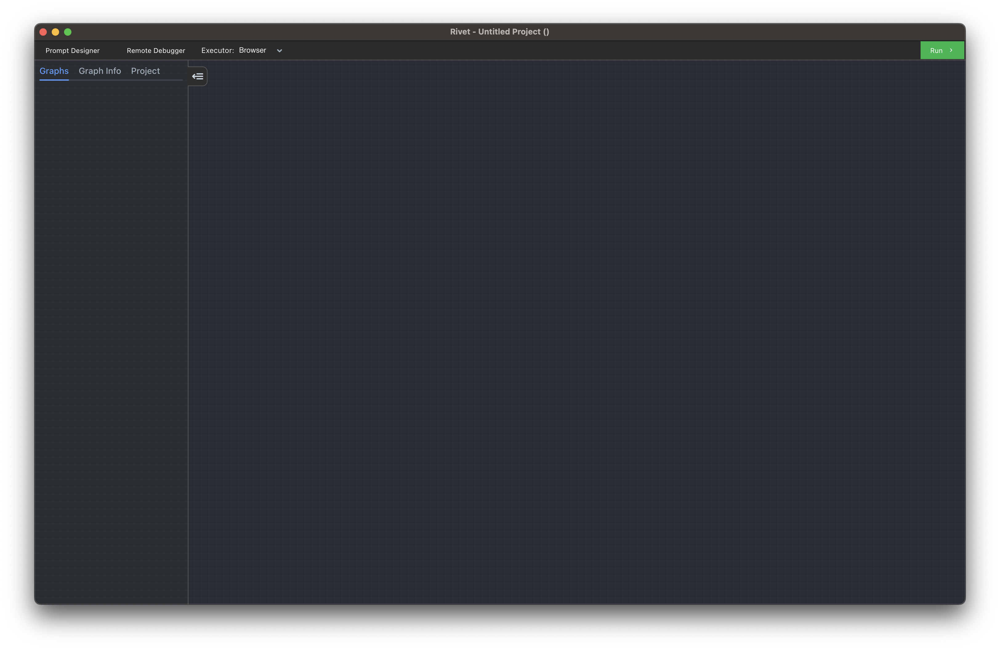
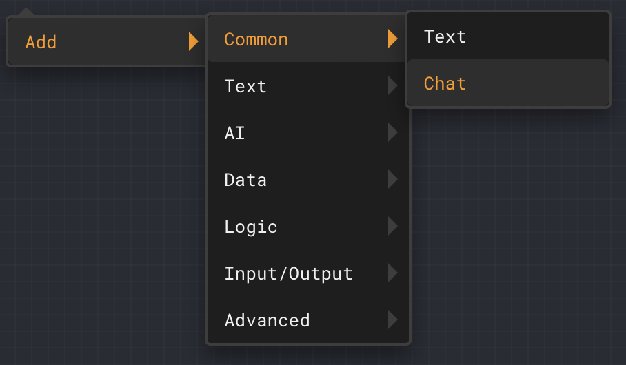
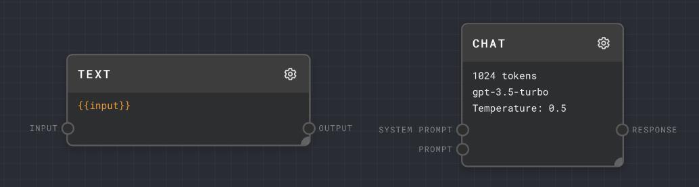
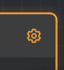
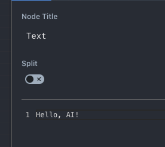

When you first open Rivet you are presented with a blank canvas. This is where you can create your first AI agent.

Right click (or press space!) to open the **Add** menu, go into **Common**, and select a [Chat Node](../node-reference/chat). This will create a new Chat node where you right clicked. You can also type "chat" into the search bar to find the Chat node.

 .

Do the same thing again, but now create a [Text Node](../node-reference/text) (in Common or Text) to the left of the Chat node.

Drag from the **Output** port of the Text node to the **Prompt** port of the Chat node. This will connect the two nodes together.

.

Next, click the gear on the text node to edit its text.

In the editor, change the text to "Hello, AI!". You can then close the editor by clicking the close button in the top right, clicking on any blank space in the graph, or pressing Escape.

Finally, click the **Run** button in the top right of the Rivet window! The "Hello, AI" text will be sent to the Chat node, which will then send it to OpenAI to generate a response.

The response from the AI is visible under the Chat node's green bar. By hovering the mouse over the Chat node, you can expand the response.

If you click the Expand icon in the top right of the response area, you can expand the AI's response to a full screen view. Click outside of the full screen view to close it.

Congratulations! You've just created your first AI chain in Rivet! There is a lot more work to enable a full AI Agent, but this is a good start.

Next, you can go through the [tutorial](../tutorial) to learn more about what nodes are available and how to assemble them into a full AI Agent, or you can continue with the [user guide](../user-guide/overview-of-interface) to learn more about Rivet's features in depth.
