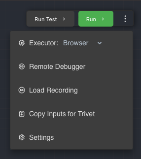
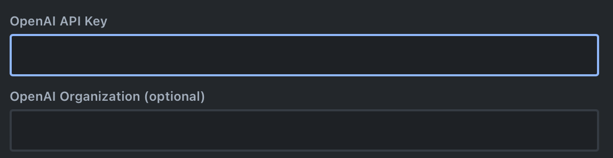

## Settings

Open the Settings pane in the Rivet menu (on Mac OS) or the Settings option in the `...` menu in Rivet.

 

### OpenAI

If you are using OpenAI's GPT for text generation, you must add your API key and optionally organization ID to Rivet in order to use it. OpenAI is used by the [Chat Node](../node-reference/chat.mdx) and [Get Embedding Node](../node-reference/get-embedding.mdx).

In the `OpenAI` page in Settings, you can set your OpenAI key and organization ID. Alternatively, you may set `OPENAI_API_KEY` and `OPENAI_ORG_ID` environment variables. If you change them, make sure to restart Rivet for the changes to take effect.

### Plugin Settings

When a plugin is enabled in a project (see [Plugins](../user-guide/plugins.md)), the Plugins page may be populated with additional settings to configure the plugin.If you enable a plugin, make sure to check the settings for any additional configuration that may be required. See the [Plugins](../user-guide/plugins.md) page and for more information about the supported plugins and how to configure them.
