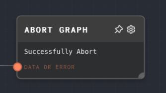

import Tabs from '@theme/Tabs';
import TabItem from '@theme/TabItem';

## Overview

The Abort Graph Node is used to stop the execution of the entire graph immediately. It can either "successfully" abort the graph (early-exit), or "error" abort the graph. This can be useful for stopping the graph under certain conditions, or for handling errors.

<Tabs
  defaultValue="inputs"
  values={[
    {label: 'Inputs', value: 'inputs'},
    {label: 'Outputs', value: 'outputs'},
    {label: 'Editor Settings', value: 'settings'},
  ]
}>

<TabItem value="inputs">

## Inputs

| Title         | Data Type | Description                                                                                                                              | Default Value | Notes                                                                                                                                      |
| ------------- | --------- | ---------------------------------------------------------------------------------------------------------------------------------------- | ------------- | ------------------------------------------------------------------------------------------------------------------------------------------ |
| Data or Error | `any`     | The data or error message to be used when aborting the graph. If it's a string, it will be used as the error message for error aborting. | N/A           | None                                                                                                                                       |
| Successfully  | `boolean` | Determines whether the graph should be aborted successfully or with an error.                                                            | true          | Only available if the "Successfully Abort" setting is toggled on in the node's settings. Otherwise, the node's setting value will be used. |

</TabItem>

<TabItem value="outputs">

## Outputs

This node does not have any outputs.

</TabItem>

<TabItem value="settings">

## Editor Settings

| Setting            | Description                                                                                                           | Default Value | Use Input Toggle |
| ------------------ | --------------------------------------------------------------------------------------------------------------------- | ------------- | ---------------- |
| Successfully Abort | Determines whether the graph should be aborted successfully or with an error.                                         | true          | Yes              |
| Error Message      | The error message to be used when aborting the graph with an error. Only used if "Successfully Abort" is not checked. | (Empty)       | No               |

</TabItem>

</Tabs>

### Example 1: Successfully aborting a graph

1. Add an Abort Graph node to your graph.
2. Make sure the "Successfully Abort" setting is checked.
3. Connect any node to the `Data or Error` input of the Abort Graph node. This could be a condition, a value, or anything else.
4. Run your graph. The graph will abort immediately after the Abort Graph node is processed, and no subsequent nodes will be executed.

### Example 2: Aborting a graph with an error

1. Add an Abort Graph node to your graph.
2. Uncheck the "Successfully Abort" setting.
3. Optionally, enter an error message in the "Error Message" setting. This message will be used as the error message when the graph is aborted.
4. Connect any node to the `Data or Error` input of the Abort Graph node. If this node outputs a string, it will be used as the error message when the graph is aborted.
5. Run your graph. The graph will abort immediately after the Abort Graph node is processed, and no subsequent nodes will be executed. An error message will be displayed, either the one from the `Data or Error` input or the one from the "Error Message" setting.

## Error Handling

The Abort Graph Node does not produce any errors itself. However, it causes the entire graph to stop executing when it is processed, either successfully or with an error.

## FAQ

**Q: What happens if I connect a non-string node to the `Data or Error` input?**

A: If the node outputs a string, it will be used as the error message when the graph is aborted. If it does not output a string, it will be coerced into a string.

**Q: What happens if I connect a node to the `Successfully` input but the "Successfully Abort" setting is not checked?**

A: The `Successfully` input will be ignored, and the graph will be aborted with an error.

**Q: What happens if I don't connect anything to the `Data or Error` input or leave the "Error Message" setting empty?**

A: The graph will be aborted with a default error message of "Graph aborted with error".

## See Also

- [If Node](./if.mdx)
- [If/Else Node](./if-else.mdx)
- [Race Inputs Node](./race-inputs.mdx)
