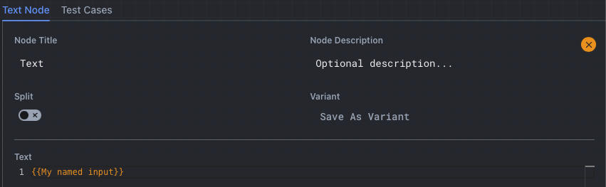
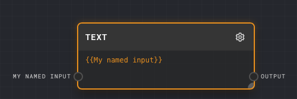

# All Nodes

## Named Inputs

For all nodes named inputs can be created by using the following syntax:

```
{{input_name}}
```

For example as shown in the image below, the `{{My named input}}` syntax is used to create a named input for the `Text` node.



Resulting in the following named input:




## Data Types