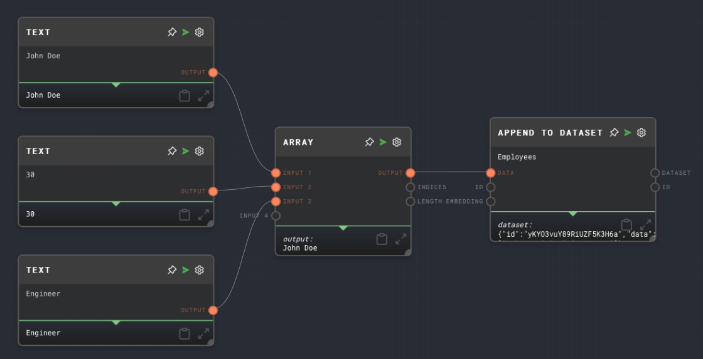
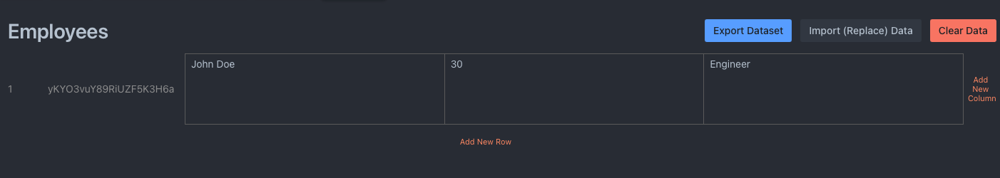

import Tabs from '@theme/Tabs';
import TabItem from '@theme/TabItem';

## Overview

The Append to Dataset Node is used to append a row of data to a specified dataset. This node is particularly useful when you want to add new data to an existing dataset for further processing or analysis.

The node requires a dataset provider to be available in the context when the graph is being run. The dataset provider is responsible for managing the storage and retrieval of datasets. In the Rivet application, the dataset provider is handled for you automatically.

For more information on datasets, see the [Data Studio](../user-guide/features/data-studio.md) section of the user guide.

<Tabs
  defaultValue="inputs"
  values={[
    {label: 'Inputs', value: 'inputs'},
    {label: 'Outputs', value: 'outputs'},
    {label: 'Editor Settings', value: 'settings'},
  ]
}>

<TabItem value="inputs">

## Inputs

| Title      | Data Type              | Description                                                                                                            | Default Value                                               | Notes                                                                      |
| ---------- | ---------------------- | ---------------------------------------------------------------------------------------------------------------------- | ----------------------------------------------------------- | -------------------------------------------------------------------------- |
| Data       | `string` or `string[]` | The data to be appended to the dataset. Each entry in the array corresponds to a column in the new row in the dataset. | (required)                                                  | The input will be coerced into a string array if it is not a string array. |
| ID         | `string`               | The ID for the new row of data. If not provided, a new ID will be generated.                                           | (Automatically generated)                                   | The input will be coerced into a string if it is not a string.             |
| Embedding  | `vector`               | An optional vector that can be associated with the new row of data.                                                    | (empty)                                                     | The input will be coerced into a vector if it is not a vector.             |
| Dataset ID | `string`               | The ID of the dataset to append to. This input is only available if `Use Dataset ID Input` is enabled.                 | (required if if the input toggle for Dataset ID is enabled) | The input will be coerced into a string if it is not a string.             |

</TabItem>

<TabItem value="outputs">

## Outputs

| Title   | Data Type | Description                                           | Notes                                                                                            |
| ------- | --------- | ----------------------------------------------------- | ------------------------------------------------------------------------------------------------ |
| Dataset | `object`  | The new row of data that was appended to the dataset. | The output will be an object containing the ID, data, and embedding of the new row.              |
| ID      | `string`  | The ID of the dataset that the data was appended to.  | The output will be the same as the Dataset ID input or the Dataset ID specified in the settings. |

</TabItem>

<TabItem value="settings">

## Editor Settings

| Setting              | Description                                                               | Default Value | Use Input Toggle | Input Data Type |
| -------------------- | ------------------------------------------------------------------------- | ------------- | ---------------- | --------------- |
| Dataset              | The ID of the dataset to append to.                                       | (required)    | Yes              | `string`        |
| Use Dataset ID Input | If enabled, the Dataset ID can be provided via the Dataset ID input port. | False         | No               | N/A             |

</TabItem>

</Tabs>

## Example 1: Append data to a dataset

1. Create an [Array Node](./array.mdx) and set the values to `["John Doe", "30", "Engineer"]`.
2. In the [Data Studio](../user-guide/features/data-studio.md), create a new dataset with the ID `employees`.
3. Create an Append to Dataset Node and set the Dataset ID to `employees`.
4. Connect the Array Node to the `Data` input of the Append to Dataset Node.
5. Run the graph. The `Dataset` output of the Append to Dataset Node should contain the new row of data that was appended to the `employees` dataset.

## Error Handling

The Append to Dataset Node will error if the dataset provider is not available in the context when the graph is being run. It will also error if the `Data` input is not provided.

## FAQ

**Q: What is a dataset provider?**

A: A dataset provider is an object that is responsible for managing the storage and retrieval of datasets. It is passed to the context when the graph is being run. The dataset provider must implement the `DatasetProvider` interface, which includes methods for getting, putting, and deleting datasets. See the [API Reference](../api-reference.md) for more information.

**Q: Can I append data to multiple datasets at once?**

A: No, the Append to Dataset Node can only append data to one dataset at a time. If you want to append data to multiple datasets, you can use multiple Append to Dataset Nodes.

**Q: What happens if the dataset does not exist?**

A: If the dataset does not exist, the Append to Dataset Node will error.

## See Also

- [Load Dataset Node](./load-dataset.mdx)
- [Create Dataset Node](./create-dataset.mdx)
- [Get All Datasets Node](./get-all-datasets.mdx)
- [KNN Dataset Node](./knn-dataset.mdx)
- [Get Dataset Row Node](./get-dataset-row.mdx)
