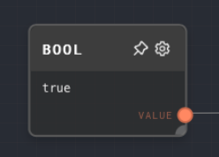

import Tabs from '@theme/Tabs';
import TabItem from '@theme/TabItem';

## Overview

The Bool Node is used to output a boolean constant or convert an input value into a boolean. This node can be useful when you need to create a boolean value for use in other nodes, such as the [If Node](./if.mdx) or [If/Else Node](./if-else.mdx).

The Bool Node can either output a constant boolean value that you set in the node's settings, or it can take an input and convert it into a boolean. The conversion follows JavaScript's rules for truthy and falsy values, with two exception:

- Empty arrays are considered falsey
- The string "false" is considered falsey.

If you need to treat empty arrays as truthy, or the string "false" as truthy, you can use the [Code Node](./code.mdx)

<Tabs
  defaultValue="inputs"
  values={[
    {label: 'Inputs', value: 'inputs'},
    {label: 'Outputs', value: 'outputs'},
    {label: 'Editor Settings', value: 'settings'},
  ]
}>

<TabItem value="inputs">

## Inputs

| Title | Data Type | Description                                                                                     | Default Value | Notes |
| ----- | --------- | ----------------------------------------------------------------------------------------------- | ------------- | ----- |
| Input | `any`     | The value to be converted to a boolean. This input is only available if `Use Input` is enabled. | N/A           |       |

</TabItem>

<TabItem value="outputs">

## Outputs

| Title | Data Type | Description                                                                                        | Notes |
| ----- | --------- | -------------------------------------------------------------------------------------------------- | ----- |
| Value | `boolean` | The boolean value. If `Use Input` is enabled, this will be the input value converted to a boolean. |       |

</TabItem>

<TabItem value="settings">

## Editor Settings

| Setting   | Description                                                                                                                | Default Value | Use Input Toggle | Input Data Type |
| --------- | -------------------------------------------------------------------------------------------------------------------------- | ------------- | ---------------- | --------------- |
| Value     | The constant boolean value to output. This setting is only available if `Use Input` is disabled.                           | `false`       | Yes              | `boolean`       |
| Use Input | If enabled, the node will convert an input value to a boolean. If disabled, the node will output a constant boolean value. | `false`       | No               | N/A             |

</TabItem>

</Tabs>

## Example 1: Using a Constant Boolean Value

1. Add a Bool Node to your graph.
2. Set the `Value` setting to `true`.
3. Run the graph. The `Value` output of the Bool Node will be `true`.

## Example 2: Converting an Input to a Boolean

1. Add a Bool Node to your graph.
2. Enable the `Use Input` setting.
3. Add a [Text Node](./text.mdx) to your graph and set the text to `"Hello"`.
4. Connect the output of the Text Node to the `Input` of the Bool Node.
5. Run the graph. The `Value` output of the Bool Node will be `true`, because the string `"Hello"` is a truthy value in JavaScript.

## Error Handling

The Bool Node cannot error under normal circumstances. If the `Use Input` setting is enabled and no input is connected, the node will output `false`.

## FAQ

**Q: What values are considered truthy and falsy in JavaScript?**

A: The following values are considered falsy:

- `false`
- `0`
- `''` (empty string)
- `null`
- `undefined`
- `NaN`
- **In Rivet, empty arrays are also considered falsy.**
- **In Rivet, the string "false" is also considered falsy.**

All other values are considered truthy.

**Q: Can I use the Bool Node to check if an array is empty?**

A: Yes, if you connect an array to the `Input` of a Bool Node, the `Value` output will be `false` if the array is empty. If the array is not empty, the `Value` output will be `true`.

**Q: Can I use the Bool Node to check if a string is empty?**

A: Yes, you can connect a [Text Node](./text.mdx) to the `Input` of a Bool Node. If the string is empty, the `Value` output of the Bool Node will be `false`. If the string is not empty, the `Value` output will be `true`.

**Q: Can I use the Bool Node to check if a number is zero?**

A: Yes, you can connect a [Number Node](./number.mdx) to the `Input` of a Bool Node. If the number is zero, the `Value` output of the Bool Node will be `false`. If the number is not zero, the `Value` output will be `true`.

## See Also

- [If Node](./if.mdx)
- [Match Node](./match.mdx)
- [Text Node](./text.mdx)
- [Array Node](./array.mdx)
- [Number Node](./number.mdx)
