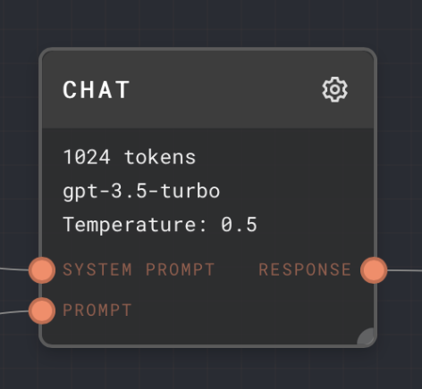

import Tabs from '@theme/Tabs';
import TabItem from '@theme/TabItem';

## Overview

The Chat Node send one or more messages to an LLM - OpenAI's GPT, or any API compatible with the OpenAI API. It then returns the response from the LLM.

You can use the Chat Node for local LLMs, as long as their API is compatible with the OpenAI API. For example, you can use the Chat Node with [LM Studio](https://lmstudio.ai/).

If you are looking for other language models that do not support the OpenAI API format, see the Plugins page for a list of available plugins that implement other language model nodes.

<Tabs
  defaultValue="inputs"
  values={[
    {label: 'Inputs', value: 'inputs'},
    {label: 'Outputs', value: 'outputs'},
    {label: 'Editor Settings', value: 'settings'},
  ]
}>

<TabItem value="inputs">

## Inputs

| Title         | Data Type                                                 | Description                                                                                          | Default Value | Notes                                                                                                                                                                                                            |
| ------------- | --------------------------------------------------------- | ---------------------------------------------------------------------------------------------------- | ------------- | ---------------------------------------------------------------------------------------------------------------------------------------------------------------------------------------------------------------- |
| System Prompt | `string` or `chat-message`                                | A convenience input that allows a system prompt to be prepended to the main prompt message/messages. | (None)        | If not connected, then no system prompt will be prepended. You can always include a system prompt in the main prompt input instead, if you like instead, using an [Assemble Prompt](./assemble-prompt.mdx) node. |
| Prompt        | `string` / `string[]` / `chat-message` / `chat-message[]` | The main prompt to send to the language model. Can be one or more strings or chat-messages.          | (Empty list)  | Strings will be converted into chat messages of type `user`, with no name.                                                                                                                                       |
| Functions     | `gpt-function` or `gpt-function[]`                        | Defines the available functions that GPT is allowed to call during its response.                     | (Required)    | Only enabled if the `Enable Function Use` setting is enabled.                                                                                                                                                    |

</TabItem>

<TabItem value="outputs">

## Outputs

| Title    | Data Type | Description            | Notes                                                                                                       |
| -------- | --------- | ---------------------- | ----------------------------------------------------------------------------------------------------------- |
| Response | string    | The response from GPT. | The response will be streamed in, but subsequent nodes will not be executed until the response is finished. |

</TabItem>

<TabItem value="settings">

## Editor Settings

| Setting                         | Description                                                                                                                                                                                                                                                                                             | Default Value                                                                                                               | Use Input Toggle | Input Data Type |
| ------------------------------- | ------------------------------------------------------------------------------------------------------------------------------------------------------------------------------------------------------------------------------------------------------------------------------------------------------- | --------------------------------------------------------------------------------------------------------------------------- | ---------------- | --------------- |
| Model                           | The GPT model to use for the request. If you are not using OpenAI's GPT, and you would like to set the `model` parameter, you can see the Custom Model setting below.                                                                                                                                   | `gpt-3.5-turbo`                                                                                                             | Yes              | `string`        |
| Temperature                     | The sampling temperature to use. Lower values are more deterministic. Higher values are more "creative".                                                                                                                                                                                                | 0.5                                                                                                                         | Yes              | `number`        |
| Top P                           | Alternate sampling mode using the top X% of values. 0.1 corresponds to the top 10%.                                                                                                                                                                                                                     | 1                                                                                                                           | Yes              | `number`        |
| Use Top P                       | Whether to use the Top P sampling mode.                                                                                                                                                                                                                                                                 | false                                                                                                                       | Yes              | `boolean`       |
| Max Tokens                      | The maximum number of tokens that GPT is allowed to return. When hitting the max tokens, the response will be cut off.                                                                                                                                                                                  | 1024                                                                                                                        | Yes              | `number`        |
| Stop                            | Comma separated list of stop tokens. If any stop token is encountered, the response will end immediately.                                                                                                                                                                                               | (None)                                                                                                                      | Yes              | `string[]`      |
| Presence Penalty                | Applies a penalty or bonus for tokens that have already been used. See the OpenAI documentation for more info.                                                                                                                                                                                          | 0                                                                                                                           | Yes              | `number`        |
| Frequency Penalty               | Applies a penalty or bonus for tokens based on how much they have been used. See the OpenAI documentation for more info.                                                                                                                                                                                | 0                                                                                                                           | Yes              | `number`        |
| User                            | Attaches a user field, for monitoring and detecting abuse. See the OpenAI documentation for more info.                                                                                                                                                                                                  | (Empty)                                                                                                                     | Yes              | `string`        |
| Number of Choices               | Allows the Chat Node to output a list of responses simultaneously if the value is greater than 1. Each response will have a unique set of text (assuming the temperature is more than 0)                                                                                                                | 1                                                                                                                           | Yes              | `number`        |
| Enable Function Use             | Allows the use of functions in the prompt. Enables the `Functions` input.                                                                                                                                                                                                                               | false                                                                                                                       | No               | N/A             |
| Cache                           | Caches the response locally in Rivet. If the chat node gets the exact same prompt again, it will return the cached response instead of making a new request to OpenAI.                                                                                                                                  | false                                                                                                                       | No               | N/A             |
| Use for subgraph partial output | If enabled, the Chat Node will be used to generate partial output for subgraphs. This is only visual - the chat node's partial output will appear as the subgraph's partial output. Only enable if the chat node will be running exclusively from other chat nodes at the same time, to avoid problems. | true                                                                                                                        | No               | N/A             |
| Endpoint                        | The endpoint to use for the request. For example, you can set the endpoint to `http://localhost:1234/v1/chat/completions` for LM Studio. You may also set a global Chat Node endpoint int the Rivet Settings page.                                                                                      | (empty string, uses the default endpoint configured in Settings, or OpenAI's chat completions endpoint if that is not set.) | No               | `string`        |
| Custom Model                    | If you are not using OpenAI's GPT, you can set the `model` parameter here, to a custom string. This parameter overrides the model defined above.                                                                                                                                                        | (None)                                                                                                                      | No               | `string`        |
| Headers                         | Allows you to set custom headers to send with the request.                                                                                                                                                                                                                                              | (None)                                                                                                                      | Yes              | `object`        |

For all settings, see the [OpenAI API documentation](https://platform.openai.com/docs/api-reference/chat/create) for more information.

</TabItem>

</Tabs>

### Example 1: Simple Response

1. Add a Chat node to your graph.
2. Add a text node and place your message to GPT inside the text node by opening its editor and replacing `{{input}}` with your message.
3. Connect the output of the text node to the `Prompt` input of the Chat node.
4. Run your graph. You will see the output of the Chat node at the bottom of the node.

### Example 2: Connecting to LM Studio

1. Add a Chat node to your graph.
2. Add a text node and place your message to GPT inside the text node by opening its editor and replacing `{{input}}` with your message.
3. Connect the output of the text node to the `Prompt` input of the Chat node.
4. Set the `Endpoint` setting to `http://localhost:1234/v1/chat/completions`.
5. Load your desired model into LM Studio.
6. Enable CORS in LM Studio Server Options.
7. Run your graph. You will see the output of the Chat node at the bottom of the node.

## Error Handling

If nothing is connected to the `Prompt` input, the Chat node will error.

If the request to OpenAI fails due to rate-limiting, the Chat node will retry the request using a jittered exponential backoff algorithm. This retry will
happen for up to 5 minutes. If the request still fails after 5 minutes, the Chat node will error.

:::caution

Be careful [splitting](../user-guide/splitting.md) a Chat node too much that you run into rate limiting issues.

:::

If OpenAI returns a 500-level error (due to being overloaded or downtime, etc), the Chat node will retry in a similar manner.

## FAQ

**Q: What if I connect a different data type to the prompt or system prompt input?**

A: The value will be attempted to be converted into a string, which will turn into a `user` type chat messages. So for example a number 5 will turn into a user message "5".
If the value cannot be converted to a string, then it will be ignored for the list of prompt messages.

**Q: What if an input is toggled on, but not connected?**

A: The value configured in the UI will be used instead.

**Q: What if the system prompt is connected, but the prompt is not?**

A: The Chat Node will error. The prompt input is required. To send only a system prompt, you can use a [Prompt](./prompt.mdx) node to create a system-type prompt, and connect it to the `Prompt` input.

**Q: What if the system prompt is connected, and the prompt also contains a system prompt?**

A: Both system prompts will be sent. System prompts that are not the first message in a chain are undefined behavior in GPT. It may work, or it may act strangely. It may follow one or both of the system prompts.

## See Also

- [Assemble Prompt Node](./assemble-prompt.mdx)
- [Prompt Node](./prompt.mdx)
- [Text Node](./text.mdx)
- [OpenAI API Documentation](https://platform.openai.com/docs/api-reference/chat/create)
