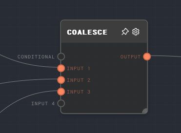

import Tabs from '@theme/Tabs';
import TabItem from '@theme/TabItem';

## Overview

The Coalesce Node works like the `COALESCE` function in SQL - it returns the first non-null value from a list of inputs.

In Rivet, "null" includes values that show as "Not Ran" in the UI - nodes that have been excluded from the run due to control flow processing.
The Coalesce node excels at taking a set of nodes, one of which will be run, and returning the output of the first one that actually runs. See
the examples section for more information on using this with a [Match Node](./match.mdx).

<Tabs
  defaultValue="inputs"
  values={[
    {label: 'Inputs', value: 'inputs'},
    {label: 'Outputs', value: 'outputs'},
    {label: 'Editor Settings', value: 'settings'},
  ]
}>

<TabItem value="inputs">

## Inputs

| Title       | Data Type | Description                                                                                                                        | Default Value | Notes                                                                                                                                                                                      |
| ----------- | --------- | ---------------------------------------------------------------------------------------------------------------------------------- | ------------- | ------------------------------------------------------------------------------------------------------------------------------------------------------------------------------------------ |
| Conditional | `boolean` | If connected, this can be used so that the coalesce node itself is only run conditionally.                                         | N/A           | Otherwise, the input is treated as any of the other inputs, so if you want to run the coalesce node conditionally, you must connect to this specific port with e.g. an [If Node](./if.mdx) |
| Input X     | Any       | One of the inputs to check for nullness. The first one of these inputs that is non-null will be passed through to the output port. | N/A           | Dynamic number of inputs based on how many are connected.                                                                                                                                  |

</TabItem>

<TabItem value="outputs">

## Outputs

| Title  | Data Type | Description                            | Notes                                                   |
| ------ | --------- | -------------------------------------- | ------------------------------------------------------- |
| Output | Any       | The value of the first non-null input. | If no inputs are null, then the output will not be ran. |

</TabItem>

<TabItem value="settings">

## Editor Settings

This node has no configurable editor settings.

</TabItem>

</Tabs>

## Example 1: Default Values / Null Checks

You can use a Coalesce Node in order to do null checks and set default values for a parameter.

1. Create an If node but do not connect to the input, so that it wil not be ran.
2. Connect the output of the If node to the Coalesce node.
3. Connect a Text node with a hardcoded value to the 2nd input of the Coalesce node.
4. Run the graph. Note that the output of the Coalesce node will be the value of the Text node, since the If node was not ran.

## Example 2: Getting a single value from a Match node

1. Create a [Match Node](./match.mdx) with a few different cases, say `1`, `2`, and `3`.
2. For each of the cases, use an [If Node](./if.mdx) to transform each of the cases into a unique value, say `A`, `B`, and `C`. You can use a [Text Node](./text.mdx) connected to the `value` port of the If Nodes to set the value passed through for each of the cases.
3. Connect the outputs of each of the If nodes to one of the inputs on a Coalesce node.
4. Connect an input to the Match node so that only one of the cases will be ran.
5. Run the graph. Note that the output of the Coalesce node will be the value of the If node that was ran.

The above is a common pattern for working with a Match node - you can get a unique value for each case using an If node, which is not dependent on the value passed into the Match node itself.

## Error Handling

The coalesce node cannot error in normal operation.

## FAQ

**Q: Will an empty string be passed over?**

A: No, an empty string is not considered nullable for the Coalesce Node. If you would like to skip over empty strings, you can use an If Node to check for empty strings and return null if the string is empty.

## See Also

- [Match Node](./match.mdx)
- [If Node](./if.mdx)
- [If/Else Node](./if-else.mdx)
