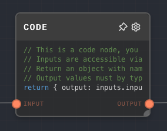
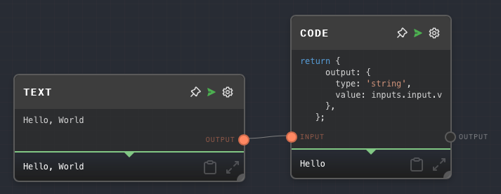
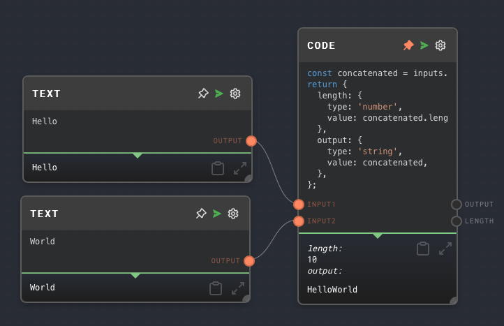

import Tabs from '@theme/Tabs';
import TabItem from '@theme/TabItem';



## Overview

The Code Node allows you to run arbitrary JavaScript code during your graph's execution. This can be useful for a variety of purposes, such as:

- Performing complex calculations
- Custom, domain-specific logic that is complex to represent in Rivet nodes alone
- Using JavaScript functions that are not available in other nodes

### Code Inputs

The inputs to the code node are accessible in the special variable `inputs`. To access the input named `foo`, it is accessible on `inputs.foo`.

All inputs have the following structure:

```ts
{
  type: string;
  value: any;
}
```

The `type` of each input corresponds to a [Data Type](../user-guide/data-types.md). The `value` is the actual value of the input.

For example, if you have an input named `myNumber` that is a number, you can access it in the code node like this:

```js
const foo = inputs.myNumber.value; // inputs.myNumber.type === 'number'
```

### Code Outputs

The code node **must** `return` an object containing the output values. Each property of the output object must correspond to one of the configured output names in the editor.

Each of the values of the properties must be an object with the `{type: DataType; value: any}` structure described above.

For example, if you have an output named `myNumber` that is a number, you can return it like this:

```js
return {
  myNumber: {
    type: 'number',
    value: 123,
  },
};
```

<Tabs
  defaultValue="inputs"
  values={[
    {label: 'Inputs', value: 'inputs'},
    {label: 'Outputs', value: 'outputs'},
    {label: 'Editor Settings', value: 'settings'},
  ]
}>

<TabItem value="inputs">

## Inputs

| Title          | Data Type | Description                                                                                           | Default Value | Notes                         |
| -------------- | --------- | ----------------------------------------------------------------------------------------------------- | ------------- | ----------------------------- |
| (custom names) | Any       | The input values passed into the code function. Dynamic based on the inputs configured in the editor. | `undefined`   | Always accepts any data type. |

</TabItem>

<TabItem value="outputs">

## Outputs

| Title          | Data Type | Description                                                           | Notes |
| -------------- | --------- | --------------------------------------------------------------------- | ----- |
| (custom names) | Any       | The outputs from the execution of the code node. Dynamic based on the | NOTES |

</TabItem>

<TabItem value="settings">

## Editor Settings

| Setting | Description                                                                                                                                                                                                                                 | Default Value                  | Use Input Toggle | Input Data Type |
| ------- | ------------------------------------------------------------------------------------------------------------------------------------------------------------------------------------------------------------------------------------------- | ------------------------------ | ---------------- | --------------- |
| Inputs  | The names of the inputs that can be accessible inside the code node. The names of the inputs configured here correspond with the properties of the provided `inputs` variable. Each input creates a corresponding input port on the node.   | A single input named `input`   | No               | N/A             |
| Outputs | The names of the outputs that the code node will return. The names of the outputs configured here must correspond with the properties of the object returned by the Code node. Each output creates a corresponding output port on the node. | A single output named `output` | No               | N/A             |

</TabItem>

</Tabs>

## Example 1: Use `.slice` to get a substring

1. Create a Code Node with the following code:

   ```js
   return {
     output: {
       type: 'string',
       value: inputs.input.value.slice(0, 5),
     },
   };
   ```

2. Create a Text node, give it the value `Hello World`, and connect it to the Code Node's `input` port.
3. Run the graph. Note that the Code Node's output is `Hello`.



## Example 2: Concatenate two strings, and output the length and the string.

1. Create a Code Node with the following code:

   ```js
   const concatenated = inputs.input1.value + inputs.input2.value;
   return {
     length: {
       type: 'number',
       value: concatenated.length,
     },
     output: {
       type: 'string',
       value: concatenated,
     },
   };
   ```

2. Rename the existing input of the Code node to `input1`, and add a 2nd input to `input2`. Add a 2nd output named `length`.
3. Create two Text nodes, give them the values `Hello` and `World`, and connect them to the Code Node's `input1` and `input2` ports, respectively.
4. Run the graph. Note that the Code Node outputs `HelloWorld` and `10`.



## Error Handling

If any error happens during the execution of the Code Node, then the node will error.

If you are unsure of the type of value passed into the code node, for example when reusing it in multiple places, you can and should check the `type` of the input before using it. For example:

```js
if (inputs.input.type === 'string') {
  // Do something with inputs.input.value
}
```

If you throw an `Error` in the code node, then it will error.

## FAQ

**Q: How is the code node implemented?**

A: The Code Node is implemented using a [Function constructor](https://developer.mozilla.org/en-US/docs/Web/JavaScript/Reference/Global_Objects/Function/Function) with, as of right now, only one argument passed in to it - `inputs`. This is the same as if you were to write the following code:

```js
function codeNode(inputs) {
  // Code here
}
```

**Q: Can I use `require` or `import` in the code node?**

A: No. The code node is executed in a sandboxed environment, and does not have access to the `require` or `import` functions. If you need to `require` or `import`, [use an External Call Node](./external-call.mdx) instead, or [create a Rivet plugin](../user-guide/plugins/creating-plugins.md).

**Q: Can I use `async`/`await` in the code node?**

A: No. The code node is executed synchronously, and does not support `async`/`await`. As you cannot use external libraries in a Code node, there is no need for `async`/`await` support anyway. Use an [External Call Node](./external-call.mdx) instead.

**Q: Can I use external libraries in the code node?**

A: No. The code node is executed in a sandboxed environment, and does not have access to external libraries. Use an [External Call Node](./external-call.mdx) instead.

**Q: Can I use `console.log` in the code node?**

A: No, the `console` variable is not available in a code node.

**Q: Can the code node function like an [If Node](./if.mdx)?**

A: Yes. If you return the special value `{ type: 'control-flow-excluded', value: undefined }` from the Code node, then the nodes after the Code node will be excluded from the graph's execution. This is useful if you want to conditionally execute a portion of the graph.

**Q: Is there any timeout? What if I create an infinite loop?**

A: There is no timeout. If you create an infinite loop, then the graph will hang indefinitely.

## See Also

- [External Call Node](./external-call.mdx)
