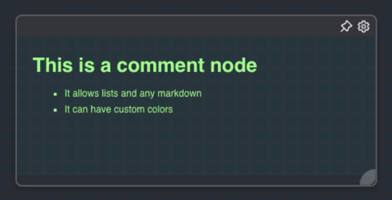

import Tabs from '@theme/Tabs';
import TabItem from '@theme/TabItem';

## Overview

The Comment Node is a special type of node that doesn't perform any operations but serves as a way to add notes or comments to a graph. It can be used to provide additional context or explanation for a group of nodes, making the graph easier to understand. The Comment Node is always rendered behind other nodes and has a distinct appearance with customizable colors.

A comment node is always rendered behind all other nodes in the graph.

<Tabs
  defaultValue="settings"
  values={[
    {label: 'Inputs', value: 'inputs'},
    {label: 'Outputs', value: 'outputs'},
    {label: 'Editor Settings', value: 'settings'},
  ]
}>

<TabItem value="inputs">

## Inputs

The Comment Node does not have any inputs.

</TabItem>

<TabItem value="outputs">

## Outputs

The Comment Node does not produce any outputs.

</TabItem>

<TabItem value="settings">

## Editor Settings

| Setting          | Description                                                                                                                       | Default Value         |
| ---------------- | --------------------------------------------------------------------------------------------------------------------------------- | --------------------- |
| Color            | The color of the text in the comment node.                                                                                        | `rgba(255,255,255,1)` |
| Background Color | The background color of the comment node.                                                                                         | `rgba(0,0,0,0.05)`    |
| Text             | The text content of the comment node. Supports Markdown syntax, allowing for rich text formatting including headings, lists, etc. | (Empty)               |

</TabItem>

</Tabs>

## Example Usage

The Comment Node can be used to add notes or comments to a graph. For example, if you have a group of nodes performing a specific operation, you can add a Comment Node behind them to provide a brief explanation of what they do.

Additionally, you can use different colors for the text and background of different Comment Nodes to visually distinguish between different sections of your graph.

## See Also

- [Markdown Guide](https://www.markdownguide.org/)
