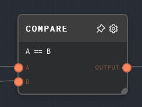
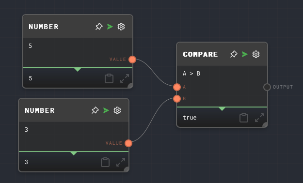

import Tabs from '@theme/Tabs';
import TabItem from '@theme/TabItem';

## Overview

The Compare Node allows you to perform a comparison operation between two input values. The node supports a variety of comparison functions including equality, inequality, less than, greater than, and logical operations such as AND, OR, XOR, NAND, NOR, and XNOR.

<Tabs
  defaultValue="inputs"
  values={[
    {label: 'Inputs', value: 'inputs'},
    {label: 'Outputs', value: 'outputs'},
    {label: 'Editor Settings', value: 'settings'},
  ]
}>

<TabItem value="inputs">

## Inputs

| Title | Data Type | Description                      | Default Value | Notes |
| ----- | --------- | -------------------------------- | ------------- | ----- |
| A     | `any`     | The first value for comparison.  | (Required)    | None  |
| B     | `any`     | The second value for comparison. | (Required)    | None  |

</TabItem>

<TabItem value="outputs">

## Outputs

| Title  | Data Type | Description                             | Notes |
| ------ | --------- | --------------------------------------- | ----- |
| Output | `boolean` | The result of the comparison operation. |       |

</TabItem>

<TabItem value="settings">

## Editor Settings

| Setting             | Description                                                                                                                       | Default Value | Use Input Toggle | Input Data Type |
| ------------------- | --------------------------------------------------------------------------------------------------------------------------------- | ------------- | ---------------- | --------------- |
| Comparison Function | The comparison function to be used for the operation. Available options are '==', '<', '>', '<=', '>=', '!=', 'and', 'or', 'xor'. | '=='          | Yes              | `string`        |

</TabItem>

</Tabs>

## Example 1: Compare two numbers

1. Create a Compare Node and set the `Comparison Function` to `>`.
2. Create two [Number Nodes](./number.mdx), one with the value `5` and the other with the value `3`.
3. Connect the Number Nodes to the `A` and `B` inputs of the Compare Node respectively.
4. Run the graph. Note that the output of the Compare Node is `true`, because 5 is greater than 3.

## Error Handling

The Compare Node does not have any specific error handling. If the inputs are not of the same type, the node will attempt to coerce the second input (`B`) to the type of the first input (`A`).

## FAQ

**Q: What happens if the inputs are not of the same type?**

A: If the inputs are not of the same type, the node will attempt to coerce the second input (`B`) to the type of the first input (`A`). If the coercion is not possible, the comparison will be performed with the original values.

**Q: Can I use the Compare Node to compare arrays or objects?**

A: Yes, you can use the Compare Node to compare arrays or objects. However, the comparison will be performed using JavaScript's strict equality (`===`), which may not give the expected results for arrays or objects. For a deep comparison of arrays or objects, consider using a [Code Node](./code.mdx).

## See Also

- [If Node](./if.mdx)
- [Match Node](./match.mdx)
- [Code Node](./code.mdx)
