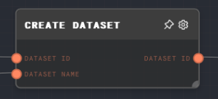
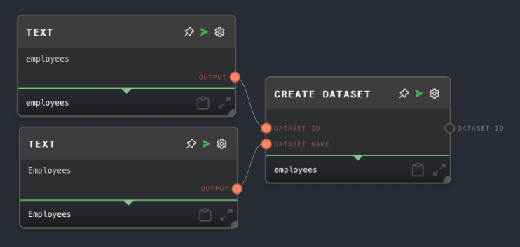

import Tabs from '@theme/Tabs';
import TabItem from '@theme/TabItem';

## Overview

The Create Dataset Node is used to create a new dataset with a specified ID and name. If a dataset with the specified ID already exists, the node does nothing. This node is particularly useful when you want to create a new dataset for storing or processing data.

Multiple datasets can have the same name, but IDs are unique across all datasets. The ID is used to identify the dataset when loading, appending, or deleting data. If the `Dataset ID` input is not provided, the node will automatically generate an ID for the dataset.

If the `Dataset Name` input is not provided, the node will use the `Dataset ID` as the name.

The node requires a dataset provider to be available in the context when the graph is being run. The dataset provider is responsible for managing the storage and retrieval of datasets. In the Rivet application, the dataset provider is handled for you automatically.

For more information on datasets, see the [Data Studio](../user-guide/features/data-studio.md) section of the user guide.

<Tabs
  defaultValue="inputs"
  values={[
    {label: 'Inputs', value: 'inputs'},
    {label: 'Outputs', value: 'outputs'},
    {label: 'Editor Settings', value: 'settings'},
  ]
}>

<TabItem value="inputs">

## Inputs

| Title        | Data Type | Description                                                                                      | Default Value             | Notes                                                          |
| ------------ | --------- | ------------------------------------------------------------------------------------------------ | ------------------------- | -------------------------------------------------------------- |
| Dataset ID   | `string`  | The ID of the dataset to be created.                                                             | (automatically generated) | The input will be coerced into a string if it is not a string. |
| Dataset Name | `string`  | The name of the dataset to be created. If not provided, the Dataset ID will be used as the name. | (dataset ID)              | The input will be coerced into a string if it is not a string. |

</TabItem>

<TabItem value="outputs">

## Outputs

| Title      | Data Type | Description                             | Notes                                                                                                                  |
| ---------- | --------- | --------------------------------------- | ---------------------------------------------------------------------------------------------------------------------- |
| Dataset ID | `string`  | The ID of the dataset that was created. | The output will be the same as the Dataset ID input, or the automatically-generated ID if the input was not connected. |

</TabItem>

<TabItem value="settings">

## Editor Settings

This node has no configurable editor settings.

</TabItem>

</Tabs>

## Example 1: Create a new dataset

1. Create a [Text Node](./text.mdx) and set the text to `employees`.
2. Create another Text Node and set the text to `Employees`.
3. Create a Create Dataset Node and connect the first Text Node to the `Dataset ID` input, and the second Text Node to the `Dataset Name` input.
4. Run the graph. The `Dataset ID` output of the Create Dataset Node should contain the ID of the new dataset that was created.

## Error Handling

The Create Dataset Node will error if the dataset provider is not available in the context when the graph is being run. It will also error if the `Dataset ID` input is not provided.

## FAQ

**Q: What is a dataset provider?**

A: A dataset provider is an object that is responsible for managing the storage and retrieval of datasets. It is passed to the context when the graph is being run. The dataset provider must implement the `DatasetProvider` interface, which includes methods for getting, putting, and deleting datasets. See the [API Reference](../api-reference.md) for more information.

**Q: Can I create multiple datasets at once?**

A: No, the Create Dataset Node can only create one dataset at a time. If you want to create multiple datasets, you can use multiple Create Dataset Nodes.

**Q: What happens if the dataset already exists?**

A: If the dataset already exists, the Create Dataset Node will do nothing and the graph will continue to run. The dataset's ID will be outputted from the node. This is useful for ensuring that a dataset exists before loading or appending data to it.

## See Also

- [Append to Dataset Node](./append-to-dataset.mdx)
- [Load Dataset Node](./load-dataset.mdx)
- [Get All Datasets Node](./get-all-datasets.mdx)
- [KNN Dataset Node](./knn-dataset.mdx)
- [Get Dataset Row Node](./get-dataset-row.mdx)
