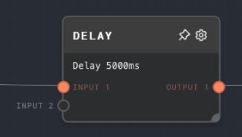
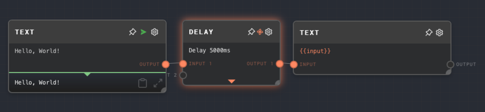

import Tabs from '@theme/Tabs';
import TabItem from '@theme/TabItem';

## Overview

The Delay Node is used to introduce a delay in the execution of the graph. It takes any number of inputs and after a specified delay, passes the input values to the outputs without any modifications. This node is useful when you need to control the timing of your graph's execution.

<Tabs
  defaultValue="inputs"
  values={[
    {label: 'Inputs', value: 'inputs'},
    {label: 'Outputs', value: 'outputs'},
    {label: 'Editor Settings', value: 'settings'},
  ]
}>

<TabItem value="inputs">

## Inputs

| Title     | Data Type | Description                                  | Default Value | Notes                                                                     |
| --------- | --------- | -------------------------------------------- | ------------- | ------------------------------------------------------------------------- |
| Delay     | `number`  | The delay time in milliseconds.              | 0             | This input is only available if the "Use Delay Input" setting is enabled. |
| Input [i] | `any`     | The ith input that will be passed to output. | N/A           | Dynamic number of inputs based on how many connections there are.         |

</TabItem>

<TabItem value="outputs">

## Outputs

| Title     | Data Type | Description                                          | Notes                                                                             |
| --------- | --------- | ---------------------------------------------------- | --------------------------------------------------------------------------------- |
| Output[i] | `any`     | The ith output from the execution of the delay node. | The output will be the same as the corresponding input after the specified delay. |

</TabItem>

<TabItem value="settings">

## Editor Settings

| Setting          | Description                                                                                                                                                              | Default Value | Use Input Toggle | Input Data Type |
| ---------------- | ------------------------------------------------------------------------------------------------------------------------------------------------------------------------ | ------------- | ---------------- | --------------- |
| Function Name    | The delay time in milliseconds. If the "Use Delay Input" setting is not enabled, this value will be used as the delay.                                                   | 0             | Yes              | `number`        |
| Use Error Output | If enabled, then the Delay node will use the "Delay" input as the delay time in milliseconds. If disabled, the delay time specified in the "Delay" setting will be used. | False         | No               | N/A             |

</TabItem>

</Tabs>

## Example 1: Delaying a Message

1. Create a Text node and set its value to "Hello, World!".
2. Create a Delay node and set its "Delay" setting to 5000 (5 seconds).
3. Connect the output of the Text node to the first input of the Delay node.
4. Run the graph. Note that the output of the Delay node is not displayed until after 5 seconds.

## Error Handling

The Delay node cannot error under normal circumstances. If the delay time is negative, it will be treated as zero.

## FAQ

**Q: What happens if I set the delay time to zero?**

A: The Delay node will pass the input to the output immediately, effectively acting as a pass-through node.

**Q: Can I use the Delay node to throttle API calls?**

A: Yes, you can use the Delay node to throttle API calls. For example, if you have a graph that makes an API call every time it is run, you can use the Delay node to ensure that the API call is not made more than once every 5 seconds.

## See Also

- [Passthrough Node](./passthrough.mdx)
- [Race Inputs Node](./race-inputs.mdx)
