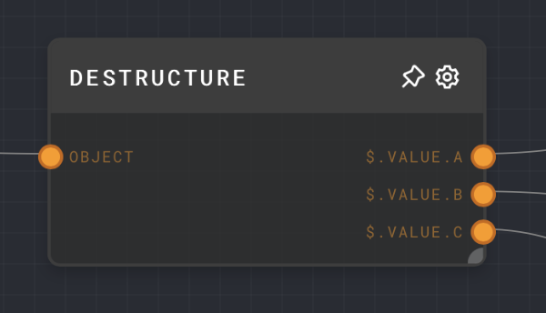
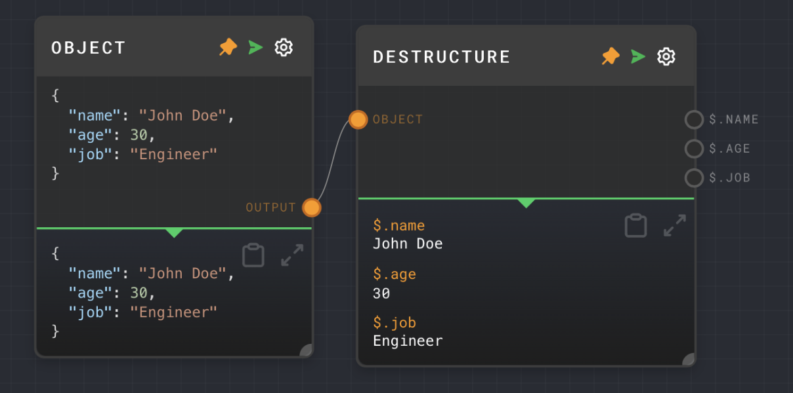

import Tabs from '@theme/Tabs';
import TabItem from '@theme/TabItem';



## Overview

The Destructure Node is used to extract multiple values from an object or array at once. It uses JSONPath notation to navigate through the input value and extract the values at the specified paths. This node is similar to the [Extract Object Path Node](./extract-object-path.mdx), but it allows you to specify multiple paths and extract multiple values at once, which can be more convenient than using multiple Extract Object Path nodes.

<Tabs
  defaultValue="inputs"
  values={[
    {label: 'Inputs', value: 'inputs'},
    {label: 'Outputs', value: 'outputs'},
    {label: 'Editor Settings', value: 'settings'},
  ]
}>

<TabItem value="inputs">

## Inputs

| Title  | Data Type | Description                        | Default Value | Notes |
| ------ | --------- | ---------------------------------- | ------------- | ----- |
| Object | `object`  | The object to extract values from. | (required)    |       |

</TabItem>

<TabItem value="outputs">

## Outputs

| Title      | Data Type | Description                                                    | Notes                                                                                                                                     |
| ---------- | --------- | -------------------------------------------------------------- | ----------------------------------------------------------------------------------------------------------------------------------------- |
| (JSONPath) | `any`     | The value extracted from the object at the corresponding path. | If the value is not found, this port is not ran. The number of outputs is dynamic based on the number of paths specified in the settings. |

</TabItem>

<TabItem value="settings">

## Editor Settings

| Setting | Description                                                                                      | Default Value | Use Input Toggle | Input Data Type |
| ------- | ------------------------------------------------------------------------------------------------ | ------------- | ---------------- | --------------- |
| Paths   | One or more JSONPath expressions. Each expression will correspond to an output port of the node. | `['$.value']` | No               | `string[]`      |

</TabItem>

</Tabs>

## Example 1: Extract multiple properties from an object

1. Create an [Object Node](./object.mdx) and set the value to the following:

   ```json
   {
     "name": "John Doe",
     "age": 30,
     "job": "Engineer"
   }
   ```

2. Create a Destructure Node and set the Paths to `$.name`, `$.age`, and `$.job`.
3. Connect the Object Node to the `Object` input of the Destructure Node.
4. Run the graph. The Destructure Node should have three outputs: `$.name` with the value `John Doe`, `$.age` with the value `30`, and `$.job` with the value `Engineer`.



## Error Handling

If a path is invalid or does not exist in the input object, the corresponding output port will not be run.

## FAQ

**Q: How is the Destructure Node different from the Extract Object Path Node?**

A: The Destructure Node is similar to the Extract Object Path Node, but it allows you to specify multiple paths and extract multiple values at once. This can be more convenient than using multiple Extract Object Path nodes to extract multiple paths. The Destructure Node does not allow you specify a path and extract every value at that path, which is possible with the Extract Object Path Node.

**Q: Can I use the Destructure Node to extract array values?**

A: Yes, you can use the Destructure Node to extract array values, but only with a known length. You can use paths such as `$[0]`, `$[1]`, etc. to extract values from an array. However, you cannot use paths such as `$[*]` or `$[?]` to extract all values from an array.

**Q: What happens if a path does not exist in the input object?**

A: If a path does not exist in the input object, the corresponding output port will not be run.

## See Also

- [Extract Object Path Node](./extract-object-path.mdx)
- [Object Node](./object.mdx)
- [Array Node](./array.mdx)
- [Data Types](../user-guide/data-types.md)
