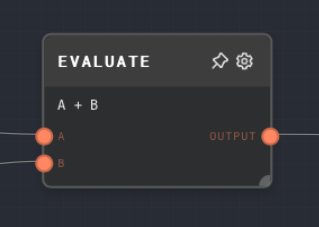
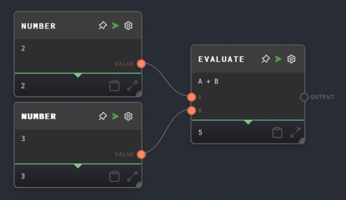

import Tabs from '@theme/Tabs';
import TabItem from '@theme/TabItem';

## Overview

The Evaluate Node performs a mathematical operation on the input values and outputs the result. It supports a variety of operations including addition, subtraction, multiplication, division, exponentiation, modulus, absolute value, and negation.

<Tabs
  defaultValue="inputs"
  values={[
    {label: 'Inputs', value: 'inputs'},
    {label: 'Outputs', value: 'outputs'},
    {label: 'Editor Settings', value: 'settings'},
  ]
}>

<TabItem value="inputs">

## Inputs

| Title | Data Type | Description                           | Default Value                   | Notes                                                          |
| ----- | --------- | ------------------------------------- | ------------------------------- | -------------------------------------------------------------- |
| A     | `number`  | The first operand for the operation.  | (Required)                      | The input will be coerced into a number if it is not a number. |
| B     | `number`  | The second operand for the operation. | (Required for binary operators) | The input will be coerced into a number if it is not a number. |

</TabItem>

<TabItem value="outputs">

## Outputs

| Title  | Data Type | Description                  | Notes |
| ------ | --------- | ---------------------------- | ----- |
| Output | `number`  | The result of the operation. |       |

</TabItem>

<TabItem value="settings">

## Editor Settings

| Setting   | Description                                                                                                      | Default Value | Use Input Toggle | Input Data Type |
| --------- | ---------------------------------------------------------------------------------------------------------------- | ------------- | ---------------- | --------------- |
| Operation | The operation to perform on the input values. Options include `+`, `-`, `*`, `/`, `^`, `%`, `abs`, and `negate`. | `+`           | Yes              | `string`        |

</TabItem>

</Tabs>

## Example 1: Performing a simple addition

1. Create an Evaluate Node and set the `Operation` to `+`.
2. Create two Number nodes, set their values to `2` and `3` respectively.
3. Connect the Number nodes to the `A` and `B` inputs of the Evaluate Node.
4. Run the graph. The output of the Evaluate Node should be `5`.

## Error Handling

If the operation fails (for example, if you try to divide by zero), the Evaluate node will error.

## FAQ

**Q: What if I want to perform a different operation based on the input?**

A: You can use the `Operation` input port to dynamically change the operation based on the input. The input will be coerced into a string and must match one of the supported operations.

## See Also

- [Number Node](./number.mdx)
- [Code Node](./code.mdx)
- [Compare Node](./compare.mdx)
