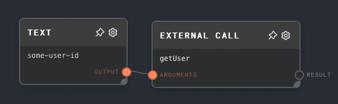

import Tabs from '@theme/Tabs';
import TabItem from '@theme/TabItem';


## Overview

When Rivet is running from a host application running `@ironclad/rivet-core` or `@ironclad/rivet-node`, then you can attach "External Functions" when running graphs or creating a GraphProcessor. The following external function `sum` will sum all of its arguments:

```ts
import { runGraphInFile } from '@ironclad/rivet-node';

await runGraphInFile({
  ...etc,
  externalFunctions: {
    sum: (...args) => {
      return {
        type: 'number',
        value: args.reduce((acc, curr) => acc + curr, 0);
      }
    }
  }
})
```

You can then call these external functions from within a graph using the `External Call` node. The function to call is configured in the editor for the External Call node, and must match the name of the function you passed to `externalFunctions` when running the graph.

External functions are useful for many use-cases, they can do things like:

- Get data from your database
- Call web APIs
- Get user information about who is running the graph
- Anything else you can think of!

External functions are extremely powerful. They can only be used when running Rivet from a host application, and are not available when running Rivet in the Rivet applicaton. The external function nodes will error when running in the Rivet application. Use [Remote Debugging](../user-guide/remote-debugging.md) to run External Call nodes in the Rivet application.

<Tabs
  defaultValue="inputs"
  values={[
    {label: 'Inputs', value: 'inputs'},
    {label: 'Outputs', value: 'outputs'},
    {label: 'Editor Settings', value: 'settings'},
  ]
}>

<TabItem value="inputs">

## Inputs

| Title     | Data Type        | Description                                   | Default Value | Notes                                                                                                                          |
| --------- | ---------------- | --------------------------------------------- | ------------- | ------------------------------------------------------------------------------------------------------------------------------ |
| Arguments | `any` or `any[]` | The arguments to pass into the external call. | (empty array) | To pass in multiple arguments, they must be an array. You can use an [Array Node](./array.mdx) to create an array of any data. |

</TabItem>

<TabItem value="outputs">

## Outputs

| Title  | Data Type | Description                                                            | Notes                                                                                                              |
| ------ | --------- | ---------------------------------------------------------------------- | ------------------------------------------------------------------------------------------------------------------ |
| Result | (any)     | The value returned from the external call.                             | Can be any data type, make sure you're returning what you expect!                                                  |
| Error  | `string`  | If the external call errors, will be populated with the error message. | Only enabled if `Use Error Output` is turned on. If `Use Error Output` is turned off, the node will error instead. |

</TabItem>

<TabItem value="settings">

## Editor Settings

| Setting          | Description                                                                                                                                                                                                | Default Value  | Use Input Toggle | Input Data Type |
| ---------------- | ---------------------------------------------------------------------------------------------------------------------------------------------------------------------------------------------------------- | -------------- | ---------------- | --------------- |
| Function Name    | The name of the external function as defined in `externalFunctions`. Must match the function name defined in your code.                                                                                    | (empty string) | Yes              | `string`        |
| Use Error Output | If enabled, then the External Call node will not fail, but instead any error will appear in the `Error` output port of the node. If disabled, the entire External Call node will error if the call errors. | False          | No               | N/A             |

</TabItem>

</Tabs>

## Example 1: Make a database call from a graph

In this example, we'll create a graph that makes a database call to get metadata about a single user. First, we'll define the external function that will make the database call:

```ts
import { runGraphInFile } from '@ironclad/rivet-node';

const db = {
  async getUser(id: string) {
    return {
      name: 'test user',
    };
  },
};

await runGraphInFile({
  ...etc,
  externalFunctions: {
    getUser: async (userId: string) => {
      const user = await db.getUser(userId);
      return {
        type: 'object',
        value: user,
      };
    },
  },
});
```

Then, in your graph, create an External Call Node, and set the `Function Name` to `getUser`. Create a [Text Node](./text.mdx) and set the text to the user's ID. Connect the Text Node to the External Call Node. The graph should look like this:



Run your application, and connect the [Remote Debugger](../user-guide/remote-debugging.md) to it. Then, run the graph. You should see the object returned from the database call in the External Call node.

## Error Handling

If the external function errors, then the External Call node will error. If you want to handle errors in the graph, then you can enable the `Use Error Output` setting. This will cause the External Call node to not error, but instead pass the error message to the `Error` output port. If the `Error` port is populated, then the `Result` port will not be ran. You can use an [If Node](./if.mdx) to check if the `Error` port is populated, and handle the error accordingly.

## FAQ

**Q: Can I use external functions when running Rivet in the Rivet application?**

No, external functions are only available when running Rivet from a host application. Connect the [Remote Debugger](../user-guide/remote-debugging.md) to your host application to run external functions in the Rivet application.

**Q: What do I return from an external function?**

You must return a valid [Data Value](../api-reference/core/DataValue.mdx) with a valid [Data Type](../user-guide/data-types.md), for example to return a string:

```ts
{
  type: 'string',
  value: 'hello world',
}
```

**Q: Can I return a Promise from an external function?**

Yes, you can return a Promise from an external function. The External Call node will wait for the Promise to resolve before continuing.

**Q: How are external functions different from raising events?**

External functions are synchronous, and can return data. Raising events are asynchronous, and cannot return data. The Raise Event node will not wait for the event to be handled before continuing, while the External Call node will wait for the external function to return before continuing.

## See Also

- [Remote Debugging](../user-guide/remote-debugging.md)
- [Context Node](./context.mdx)
- [Raise Event Node](./raise-event.mdx)
