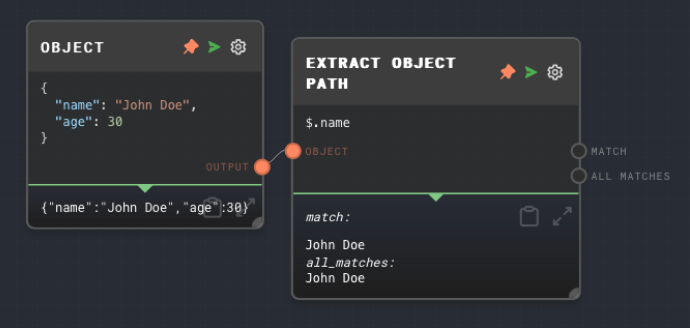
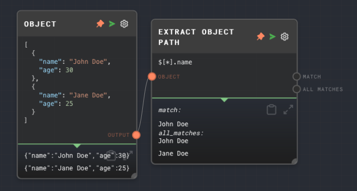
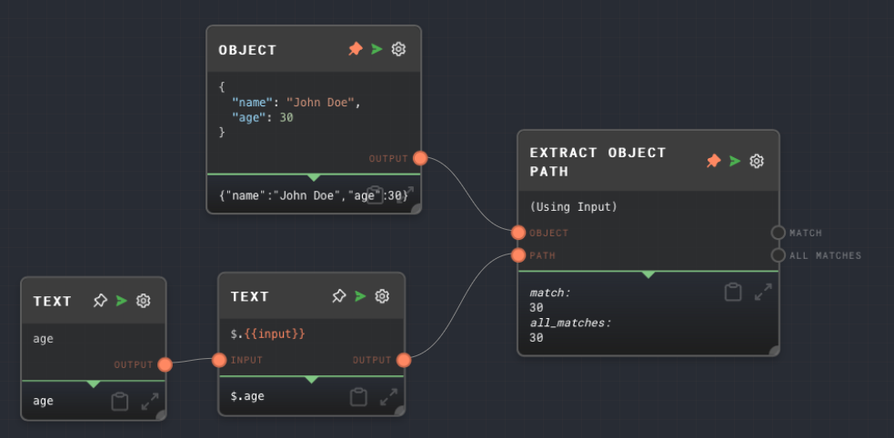

import Tabs from '@theme/Tabs';
import TabItem from '@theme/TabItem';


## Overview

The Extract Object Path Node allows you to run [jsonpath](https://www.npmjs.com/package/jsonpath-plus) queries on an object. This is useful for extracting data from a JSON object or array. Some use-cases include:

- Extracting data from a JSON object returned by an API
- Extracting properties from the result of an [Extract JSON](./extract-json.mdx) node or [Extract YAML](./extract-yaml.mdx) node
- Accessing individual elements of an array
- Complex queries such as `$.store.book[?(@.price < 10)]` to perform filtering

Any valid [`jsonpath-plus`](https://www.npmjs.com/package/jsonpath-plus) query can be used, but just be careful about complex queries.

The input to Extract Object path must be either an object, or an array of any data type. You can also query properties of non-object data types, such as strings, such as `$.length` to get the length of a string.

<Tabs
  defaultValue="inputs"
  values={[
    {label: 'Inputs', value: 'inputs'},
    {label: 'Outputs', value: 'outputs'},
    {label: 'Editor Settings', value: 'settings'},
  ]
}>

<TabItem value="inputs">

## Inputs

| Title  | Data Type                       | Description                         | Default Value | Notes |
| ------ | ------------------------------- | ----------------------------------- | ------------- | ----- |
| Object | `object` or `any[]` or `string` | The object to query using the path. | (required)    |       |

</TabItem>

<TabItem value="outputs">

## Outputs

| Title       | Data Type | Description                                                                                                               | Notes                                                              |
| ----------- | --------- | ------------------------------------------------------------------------------------------------------------------------- | ------------------------------------------------------------------ |
| Match       | `any`     | If the value is found in the object, the value matched.                                                                   | If the value is not found, this port is not ran.                   |
| All Matches | `any[]`   | When using a path that can match multiple times, such as `$.someArray[*]`, represents all paths of the object that match. | If the value is not found, this port will run with an empty array. |

</TabItem>

<TabItem value="settings">

## Editor Settings

| Setting | Description                                                           | Default Value | Use Input Toggle | Input Data Type |
| ------- | --------------------------------------------------------------------- | ------------- | ---------------- | --------------- |
| Path    | The jsonpath path to use to extract properties from the input object. | `$`           | Yes              | `string`        |

</TabItem>

</Tabs>

## Example 1: Extract a property from an object

1. Create an [Object Node](./object.mdx) and set the value to the following:

   ```json
   {
     "name": "John Doe",
     "age": 30
   }
   ```

2. Create an Extract Object Path Node and connect the Object Node to it. Set the `Path` of the Extract Object Path Node to:

   ```
   $.name
   ```

3. Run the graph. The Extract Object Path Node should output the value `John Doe`.



## Example 2: Extract properties from an array of objects

1. Create an [Object Node](./object.mdx) and set the value to the following:

   ```json
   [
     {
       "name": "John Doe",
       "age": 30
     },
     {
       "name": "Jane Doe",
       "age": 25
     }
   ]
   ```

2. Create an Extract Object Path Node and connect the Object Node to it. Set the `Path` of the Extract Object Path Node to:

   ```
    $[*].name
   ```

3. Run the graph. The Extract Object Path Node's `all_matches` output should have the value `John Doe` and `Jane Doe`. The `match` output contains the first match, which is `John Doe`.



## Example 3: Extract a dynamic property from an object

1. Create an [Object Node](./object.mdx) and set the value to the following:

   ```json
   {
     "name": "John Doe",
     "age": 30
   }
   ```

2. Create a Text node and set the value to `age`.
3. Create another Text node and set the value to `$.{{input}}`. Connect the first Text node to the second Text node.
4. Create an Extract Object Path node and enable the input port for the `Path` setting. Connect the second Text node to the Extract Object Path node's `Path` input port. Connect the Object Node to the Extract Object Path node.
5. Run the graph. Note that the path is constructed dynamicalled, and the `age` is extracted from the object.



## Error Handling

If the path is invalid, the Extract Object Path Node will throw an error. If the path is valid, but the value is not found, the `match` output will not run, and the `all_matches` output will run with an empty array.

## FAQs

**Q: Does the Extract Object Path Node only work with objects?**

A: No, it can also work with arrays and other JavaScript values that have properties, such as strings. For example, you can use `$.length` to get the length of a string.

**Q: Can I split the Extract Object Path Node in order to execute a command on an array of objects?**

A: It is recommended to simply use the `*` operator and the `All Matches` output, but there can be cases where splitting the node is appropriate. For example with an array of objects that themselves contain arrays, and you want to extract all sub-arrays, you can either to `$[*].someArray` or split the node and use `$.someArray` on the split node.

**Q: Can I use the Extract Object Path Node to extract data from a JSON object returned by an API?**

A: Yes, you can use the [HTTP Call Node](./http-call.mdx) to make an API request, and then use the Extract Object Path Node to extract data from the response.

## See Also

- [Code Node](./code.mdx)
- [Extract JSON Node](./extract-json.mdx)
- [Extract YAML Node](./extract-yaml.mdx)
- [Object Node](./object.mdx)
- [Array Node](./array.mdx)
- [Extract with Regex Node](./extract-with-regex.mdx)
- [Data Types](../user-guide/data-types.md)
