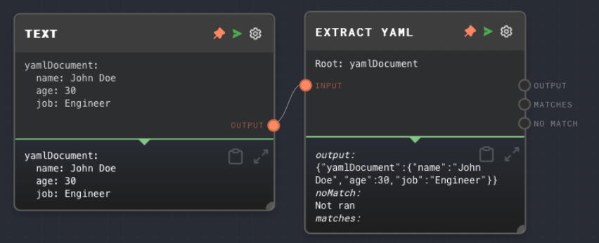
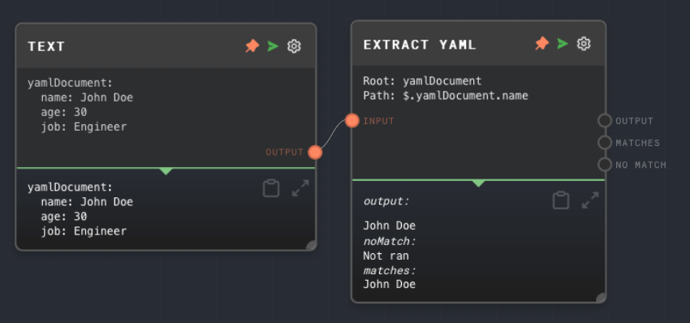

import Tabs from '@theme/Tabs';
import TabItem from '@theme/TabItem';


## Overview

The Extract YAML Node is used to parse a YAML object from a string. It is particularly useful when you want to extract structured data from a text string that includes a YAML object.

The node looks for a predefined root property name in the input text and considers all indented text after that as part of the YAML object. By default, the root property name is set to `yamlDocument`, but it can be configured in the node settings or via an input port.

You may also specify a path to a specific property in the YAML object using a [JSONPath](https://goessner.net/articles/JsonPath/) expression. The node will then extract the value of that property from the YAML object. This is a shorthand for using the [Extract Object Path Node](./extract-object-path.mdx) after the Extract YAML Node.

Note that the entire document includes the root property name. For example, if the root property name is set to `yamlDocument`, then the object path `$.yamlDocument` will return the entire document.

The Extract YAML Node can only extract a single YAML object from a string. If you want to extract multiple YAML objects from a string, you may want to use the [Code Node](./code.mdx) or [External Call Node](./external-call.mdx) to do more advanced text extraction.

Text outside of the YAML object will be ignored. If you want to extract text outside of the YAML object, you can use the [Extract with Regex Node](./extract-with-regex.mdx) instead.

<Tabs
  defaultValue="inputs"
  values={[
    {label: 'Inputs', value: 'inputs'},
    {label: 'Outputs', value: 'outputs'},
    {label: 'Editor Settings', value: 'settings'},
  ]
}>

<TabItem value="inputs">

## Inputs

| Title              | Data Type | Description                                                          | Default Value | Notes                                                                                                                        |
| ------------------ | --------- | -------------------------------------------------------------------- | ------------- | ---------------------------------------------------------------------------------------------------------------------------- |
| Input              | `string`  | The string that contains the YAML object.                            | (required)    | The input will be coerced into a string if it is not a string.                                                               |
| Root Property Name | `string`  | The root property name of the YAML object in the input string.       | (optional)    | The input will be coerced into a string if it is not a string. This input is only available if enabled in the node settings. |
| Object Path        | `string`  | The JSONPath expression to extract data from the parsed YAML object. | (optional)    | The input will be coerced into a string if it is not a string. This input is only available if enabled in the node settings. |

</TabItem>

<TabItem value="outputs">

## Outputs

| Title    | Data Type | Description                                                                                                    | Notes                                                                                 |
| -------- | --------- | -------------------------------------------------------------------------------------------------------------- | ------------------------------------------------------------------------------------- |
| Output   | `object`  | The parsed YAML object or the value extracted from the object using the JSONPath expression.                   | If the YAML object or the value is not found, this port will not be ran.              |
| Matches  | `any[]`   | When using a JSONPath expression that can match multiple times, represents all paths of the object that match. | If the YAML object or the value is not found, this port will run with an empty array. |
| No Match | `string`  | If no YAML object is found in the input text, this port will run, with the full contents of the input string.  | If a YAML object is found in the input string, this port will not be ran.             |

</TabItem>

<TabItem value="settings">

## Editor Settings

| Setting            | Description                                                          | Default Value  | Use Input Toggle | Input Data Type |
| ------------------ | -------------------------------------------------------------------- | -------------- | ---------------- | --------------- |
| Root Property Name | The root property name of the YAML object in the input string.       | `yamlDocument` | Yes              | `string`        |
| Object Path        | The JSONPath expression to extract data from the parsed YAML object. | (empty)        | Yes              | `string`        |

</TabItem>

</Tabs>

## Example 1: Extract a YAML object from a string

1. Create a [Text Node](./text.mdx) and set the text to the following:

   ```
   yamlDocument:
     name: John Doe
     age: 30
     job: Engineer
   ```

2. Create an Extract YAML Node and connect the Text Node to its `Input` input.
3. Run the graph. The `Output` of the Extract YAML Node should contain the parsed YAML object.



## Example 2: Extract a property from a YAML object

1. Create a [Text Node](./text.mdx) and set the text to the following:

   ```
   yamlDocument:
     name: John Doe
     age: 30
     job: Engineer
   ```

2. Create an Extract YAML Node and connect the Text Node to its `Input` input.
3. Set the `Object Path` of the Extract YAML Node to `$.yamlDocument.name`.
4. Run the graph. The `Output` of the Extract YAML Node should contain the value `John Doe`.



## Error Handling

If the JSONPath expression is invalid, the Extract YAML Node will error. If the YAML object or the value is not found, the `Output` and `Matches` outputs will not be ran, and the `No Match` output will run with the full contents of the input string.

## FAQ

**Q: Can I use the Extract YAML Node to extract data from a JSON object?**

A: No, the Extract YAML Node is specifically designed to parse YAML objects. If you want to extract data from a JSON object, you can use the [Extract JSON Node](./extract-json.mdx) instead.

**Q: Can I use the Extract YAML Node to extract an array from a YAML object?**

A: Yes, you can use the Extract YAML Node to extract any valid YAML structure, including arrays. You can use a JSONPath expression to specify the path to the array in the YAML object. Alternatively you can specify a multi-match such as `$.yamlDocument.someArray[*]` and use the `Matches` output to get all the matches.

## See Also

- [Extract JSON Node](./extract-json.mdx)
- [Extract Object Path Node](./extract-object-path.mdx)
- [Object Node](./object.mdx)
- [Array Node](./array.mdx)
- [Extract with Regex Node](./extract-with-regex.mdx)
- [Data Types](../user-guide/data-types.md)
