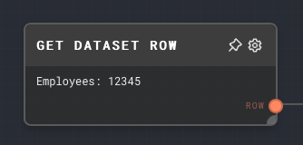
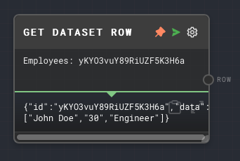
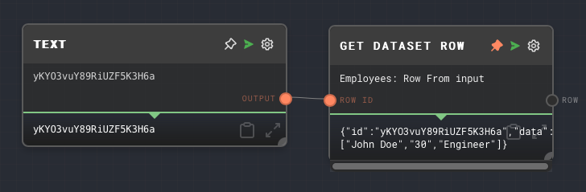

import Tabs from '@theme/Tabs';
import TabItem from '@theme/TabItem';

## Overview

The Get Dataset Row Node allows you to retrieve a specific row from a dataset by providing the dataset ID and the row ID. This node is particularly useful when you want to access and process specific rows of data in a dataset by their ID.

The node requires a dataset provider to be available in the context when the graph is being run. The dataset provider is responsible for managing the storage and retrieval of datasets. In the Rivet application, the dataset provider is handled for you automatically.

For more information on datasets, see the [Data Studio](../user-guide/features/data-studio.md) section of the user guide.

<Tabs
  defaultValue="inputs"
  values={[
    {label: 'Inputs', value: 'inputs'},
    {label: 'Outputs', value: 'outputs'},
    {label: 'Editor Settings', value: 'settings'},
  ]
}>

<TabItem value="inputs">

## Inputs

| Title      | Data Type | Description                                                                                                        | Default Value                                               | Notes                                                          |
| ---------- | --------- | ------------------------------------------------------------------------------------------------------------------ | ----------------------------------------------------------- | -------------------------------------------------------------- |
| Row ID     | `string`  | The ID of the row to retrieve.                                                                                     | (required if if the input toggle for Row ID is enabled)     | The input will be coerced into a string if it is not a string. |
| Dataset ID | `string`  | The ID of the dataset to retrieve the row from. This input is only available if `Use Dataset ID Input` is enabled. | (required if if the input toggle for Dataset ID is enabled) | The input will be coerced into a string if it is not a string. |

</TabItem>

<TabItem value="outputs">

## Outputs

| Title | Data Type | Description                                 | Notes                                               |
| ----- | --------- | ------------------------------------------- | --------------------------------------------------- |
| Row   | `object`  | The row of data retrieved from the dataset. | If the row is not found, this port will not be ran. |

</TabItem>

<TabItem value="settings">

## Editor Settings

| Setting | Description                                     | Default Value | Use Input Toggle | Input Data Type |
| ------- | ----------------------------------------------- | ------------- | ---------------- | --------------- |
| Dataset | The ID of the dataset to retrieve the row from. | (required)    | Yes              | `string`        |
| Row ID  | The ID of the row to retrieve.                  | (required)    | Yes              | `string`        |

</TabItem>

</Tabs>

## Example 1: Retrieve a row from a dataset

1. In the [Data Studio](../user-guide/features/data-studio.md), create a new dataset with the name `Employees` and add a few rows of data.
2. Create a Get Dataset Row Node and set the Dataset to `Employees` and the Row ID to the ID of one of the rows you added to the dataset. You can see the IDs as the first column in the Data Studio.
3. Run the graph. The `Row` output of the Get Dataset Row Node should contain the data of the row you specified.

## Example 2: Retrieve a dynamic row from a dataset

1. In the [Data Studio](../user-guide/features/data-studio.md), create a new dataset with the name `Employees` and add a few rows of data.
2. Create a Get Dataset Row Node and set the Dataset to `Employees` and enable the input toggle for Row ID.
3. Create a [Text Node](./text.mdx) and set the text to the ID of one of the rows you added to the dataset. Connect the Text Node to the Row ID input of the Get Dataset Row Node.
4. Run the graph. The `Row` output of the Get Dataset Row Node should contain the data of the row you specified.

## Error Handling

The Get Dataset Row Node will error if the dataset provider is not available in the context when the graph is being run. It will also error if the Dataset ID or Row ID is not provided. If the specified row does not exist in the dataset, the `Row` output will not be ran.

## FAQ

**Q: What is a dataset provider?**

A: A dataset provider is an object that is responsible for managing the storage and retrieval of datasets. It is passed to the context when the graph is being run. The dataset provider must implement the `DatasetProvider` interface, which includes methods for getting, putting, and deleting datasets. See the [API Reference](../api-reference.md) for more information.

**Q: Can I retrieve multiple rows at once?**

A: No, the Get Dataset Row Node can only retrieve one row at a time. If you want to retrieve multiple rows, you can use multiple Get Dataset Row Nodes, or consider [splitting](../user-guide/splitting.md) the Get Dataset Row Node.

**Q: What happens if the row does not exist?**

A: If the row does not exist, the `Row` output will not be ran. No error will be thrown. You can use an [If Node](./if.mdx) to check if the `Row` output was ran.

## See Also

- [Load Dataset Node](./load-dataset.mdx)
- [Create Dataset Node](./create-dataset.mdx)
- [Get All Datasets Node](./get-all-datasets.mdx)
- [KNN Dataset Node](./knn-dataset.mdx)
- [Append To Dataset Node](./append-to-dataset.mdx)
