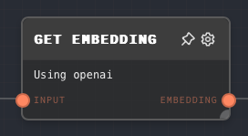

import Tabs from '@theme/Tabs';
import TabItem from '@theme/TabItem';

## Overview

The Get Embedding Node is used to generate a vector embedding for a given input text. This node is particularly useful when you want to convert text into a numerical representation that can K-nearest neighbor search, and more.

The node requires an integration to be available in the context when the graph is being run. The integration is responsible for generating the embedding. Currently, the only supported integration is OpenAI. However, when running Rivet in a parent application, you can register custom integrations.

<Tabs
  defaultValue="inputs"
  values={[
    {label: 'Inputs', value: 'inputs'},
    {label: 'Outputs', value: 'outputs'},
    {label: 'Editor Settings', value: 'settings'},
  ]
}>

<TabItem value="inputs">

## Inputs

| Title       | Data Type | Description                                                      | Default Value                                             | Notes                                                          |
| ----------- | --------- | ---------------------------------------------------------------- | --------------------------------------------------------- | -------------------------------------------------------------- |
| Input       | `string`  | The text for which the embedding should be generated.            | (required)                                                | The input will be coerced into a string if it is not a string. |
| Integration | `string`  | The name of the integration to use for generating the embedding. | (required if the input toggle for Integration is enabled) | The input will be coerced into a string if it is not a string. |

</TabItem>

<TabItem value="outputs">

## Outputs

| Title     | Data Type | Description                                        | Notes                                                                                  |
| --------- | --------- | -------------------------------------------------- | -------------------------------------------------------------------------------------- |
| Embedding | `vector`  | The vector embedding generated for the input text. | The output will be a vector containing the numerical representation of the input text. |

</TabItem>

<TabItem value="settings">

## Editor Settings

| Setting     | Description                                                      | Default Value | Use Input Toggle | Input Data Type |
| ----------- | ---------------------------------------------------------------- | ------------- | ---------------- | --------------- |
| Integration | The name of the integration to use for generating the embedding. | `openai`      | Yes              | `string`        |

</TabItem>

</Tabs>

## Example 1: Generate an embedding for a text

1. Create a [Text Node](./text.mdx) and set the text to `"Hello, world!"`.
2. Create a Get Embedding Node and connect the Text Node to its `Input` input.
3. Run the graph. The `Embedding` output of the Get Embedding Node should contain the vector embedding for the input text.

## Error Handling

The Get Embedding Node will error if the integration is not available in the context when the graph is being run. It will also error if the `Input` input is not provided.

## FAQ

**Q: What is an embedding?**

A: An embedding is a numerical representation of a piece of text. Embeddings are useful for performing K-nearest neighbor search, which is a common operation in AI applications.

**Q: Can I use my own integration?**

A: Yes, you can use your own integration by passing it to the context when the graph is being run. The integration must implement the `EmbeddingGenerator` interface, which includes a method for generating an embedding.

## See Also

- [Vector Store Node](./vector-store.mdx)
- [Vector KNN Node](./vector-knn.mdx)
- [KNN Dataset Node](./knn-dataset.mdx)
- [Text Node](./text.mdx)
- [Array Node](./array.mdx)
- [Object Node](./object.mdx)
