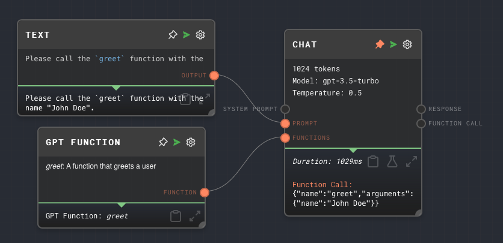

import Tabs from '@theme/Tabs';
import TabItem from '@theme/TabItem';


## Overview

The GPT Function Node allows you to define a function that can be called by OpenAI's GPT in its responses. This is part of GPT's "function-calling" capability. The function is defined using JSON Schema.

The output of the GPT Function Node can be passed into the "Function" port of the [Chat Node](./chat.mdx). To enable this, you must check the "Enable Function Calling" setting in the Chat Node.

If you want to pass multiple functions into a Chat Node, all of the functions should be passed into an [Array Node](./array.mdx), and the Array Node goes into the "Function" port of the Chat Node.

A function is defined using JSON Schema, which is a vocabulary that allows you to annotate and validate JSON documents. For more information on JSON Schema, see the [official website](https://json-schema.org/).

You may use interpolation values in the GPT Function schema the same way you can use them in the Text and Prompt nodes. Wrap your interpolation values in double curly braces, e.g. `{{value}}`.

<Tabs
  defaultValue="inputs"
  values={[
    {label: 'Inputs', value: 'inputs'},
    {label: 'Outputs', value: 'outputs'},
    {label: 'Editor Settings', value: 'settings'},
  ]
}>

<TabItem value="inputs">

| Title   | Data Type | Description                                                                                                   | Default Value  | Notes |
| ------- | --------- | ------------------------------------------------------------------------------------------------------------- | -------------- | ----- |
| Input N | `string`  | Variable number of inputs for interpolated values such as {{value}} inside the schema definition of the node. | (empty string) |       |

</TabItem>

<TabItem value="outputs">

## Outputs

| Title    | Data Type      | Description                                                                                                      | Notes |
| -------- | -------------- | ---------------------------------------------------------------------------------------------------------------- | ----- |
| Function | `gpt-function` | The function that was defined. This output can be connected to the "Function" port of a [Chat Node](./chat.mdx). |       |

</TabItem>

<TabItem value="settings">

## Editor Settings

| Setting     | Description                                                                                                         | Default Value | Use Input Toggle | Input Data Type |
| ----------- | ------------------------------------------------------------------------------------------------------------------- | ------------- | ---------------- | --------------- |
| Name        | The name of the function. This is the name that GPT will use to call the function in its responses.                 | `newFunction` | Yes              | `string`        |
| Description | A description of the function. This is used for documentation purposes and does not affect the function's behavior. | (empty)       | Yes              | `string`        |
| Schema      | The JSON Schema that defines the function's parameters.                                                             | (empty)       | Yes              | `object`        |

</TabItem>

</Tabs>

## Example 1: Define a function that takes a single string parameter

1. Create a GPT Function Node.
2. Set the `Name` to `greet`.
3. Set the `Description` to `A function that greets a user`.
4. Set the `Schema` to the following:

   ```json
   {
     "type": "object",
     "properties": {
       "name": {
         "type": "string",
         "description": "The name of the user"
       }
     },
     "required": ["name"]
   }
   ```

5. Create a [Chat Node](./chat.mdx) and enable the "Function" input port by checking the "Enable Function Calling" setting.
6. Connect the `Function` output of the GPT Function Node to the `Function` input of the Chat Node.
7. Set the `Prompt` of the Chat Node to the following, using a [Text Node](./text.mdx) or [Prompt Node](./prompt.mdx):

   ```
   Please call the `greet` function with the name "John Doe".
   ```

8. Run the graph. The Chat Node should output a call to the `greet` function with the parameter `name` set to `"John Doe"`.



## Error Handling

The GPT Function Node will error if the `Schema` is not a valid JSON string or if it does not represent a valid JSON Schema.

## FAQ

**Q: Can I define a function that takes multiple parameters?**

A: Yes, you can define a function that takes multiple parameters by adding more properties to the `Schema`. Each property represents a parameter of the function.

**Q: Can I define a function that takes an array or an object as a parameter?**

A: Yes, you can define a function that takes an array or an object as a parameter by setting the `type` of the property in the `Schema` to `array` or `object`.

**Q: Can I define a function that does not take any parameters?**

A: Yes, you can define a function that does not take any parameters by setting the `Schema` to an empty object (`{}`).

**Q: Can I use the GPT Function Node to define a function that returns a value?**

A: No, the GPT Function Node only defines the function's name and parameters. The function's behavior is determined by the rest of the graph.

**Q: How can I connect multiple functions to a Chat Node?**

A: You can connect multiple functions to a Chat Node by passing all of the functions into an [Array Node](./array.mdx), and then connecting the Array Node to the Chat Node.

## See Also

- [Chat Node](./chat.mdx)
- [Array Node](./array.mdx)
- [JSON Schema](https://json-schema.org/)
- [Function Calling Documentation](https://platform.openai.com/docs/guides/gpt/function-calling)
