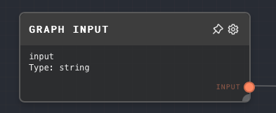
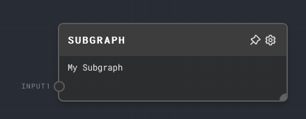

import Tabs from '@theme/Tabs';
import TabItem from '@theme/TabItem';

## Overview

The Graph Input Node is used to define an input for a graph. This input can be passed in when the graph is called using the SDK, or defines one of the input ports when the graph is used as a subgraph.

The Graph Input Node is particularly useful for creating reusable subgraphs that can accept different inputs each time they are used. For example, you could create a subgraph that accepts a `string` input and outputs a `string` value with the input value appended to it. You could then use this subgraph in multiple places in your graph, passing in different values each time.

<Tabs
  defaultValue="inputs"
  values={[
    {label: 'Inputs', value: 'inputs'},
    {label: 'Outputs', value: 'outputs'},
    {label: 'Editor Settings', value: 'settings'},
  ]
}>

<TabItem value="inputs">

## Inputs

| Title         | Data Type | Description                                                                       | Default Value | Notes                                                                                                                                                            |
| ------------- | --------- | --------------------------------------------------------------------------------- | ------------- | ---------------------------------------------------------------------------------------------------------------------------------------------------------------- |
| Default Value | Any       | The default value for the input if no value is provided when the graph is called. | (optional)    | The input will be coerced into the data type specified in the Editor Settings. This input is only available if the `Use Default Value Input` setting is enabled. |

</TabItem>

<TabItem value="outputs">

## Outputs

| Title | Data Type | Description                                                                                                                     | Notes                                                                                           |
| ----- | --------- | ------------------------------------------------------------------------------------------------------------------------------- | ----------------------------------------------------------------------------------------------- |
| Data  | Any       | The value of the input. This will be the value provided when the graph is called, or the default value if no value is provided. | The data type of the output will be the same as the data type specified in the Editor Settings. |

</TabItem>

<TabItem value="settings">

## Editor Settings

| Setting                 | Description                                                                                                                         | Default Value | Use Input Toggle | Input Data Type |
| ----------------------- | ----------------------------------------------------------------------------------------------------------------------------------- | ------------- | ---------------- | --------------- |
| ID                      | The ID of the input. This will be used to identify the input when the graph is called, and defines the name of the input in the UI. | (required)    | No               | `string`        |
| Data Type               | The data type of the input.                                                                                                         | `string`      | No               | N/A             |
| Default Value           | The default value for the input if no value is provided when the graph is called.                                                   | (empty)       | Yes              | Any             |
| Use Default Value Input | If enabled, the default value can be provided via the Default Value input port.                                                     | False         | No               | N/A             |

</TabItem>

</Tabs>

## Example 1: Define an input for a graph

1. Create a Graph Input Node.
2. In the Editor Settings, set the ID to `input1` and the Data Type to `string`. Set the Default Value to `Hello World`.
3. Run the graph. The Graph Input Node will output the default value, `Hello World`.

## Example 2: Use a Graph Input Node in a subgraph

1. Create a new graph and add a Graph Input Node to it.
2. In the Editor Settings, set the ID to `input1` and the Data Type to `string`.
3. Add a [Text Node](./text.mdx) to the graph and connect the Graph Input Node to it.
4. Save the graph and go back to the main graph.
5. Add a [Subgraph Node](./subgraph.mdx) to the main graph and select the graph you just created.
6. You will see that the Subgraph Node has an input port named `input1`. This is the input defined by the Graph Input Node in the subgraph.

## Error Handling

The Graph Input Node will error if the input value cannot be coerced into the specified data type.

## FAQ

**Q: Can I use the Graph Input Node to define multiple inputs for a graph?**

A: Yes, you can add multiple Graph Input Nodes to a graph to define multiple inputs. Each Graph Input Node will define a separate input for the graph.

**Q: What happens if I don't provide a value for an input when calling a graph?**

A: If you don't provide a value for an input when calling a graph, the Graph Input Node will use the default value specified in the Editor Settings. If the `Use Default Value Input` setting is enabled, the node will use the value provided to the Default Value input port.

**Q: Can I use the Graph Input Node in the main graph?**

A: Yes, you can use the Graph Input Node in the main graph to define inputs for the graph. These inputs can be provided when calling the graph using the SDK. See the [RunGraphOptions](../api-reference/node/RunGraphOptions) documentation for more info.

## See Also

- [Graph Output Node](./graph-output.mdx)
- [Subgraph Node](./subgraph.mdx)
- [Data Types](../user-guide/data-types.md)
- [RunGraphOptions](../api-reference/node/RunGraphOptions)
