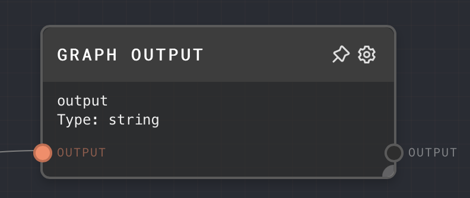
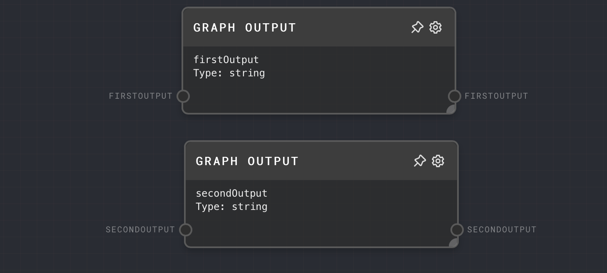
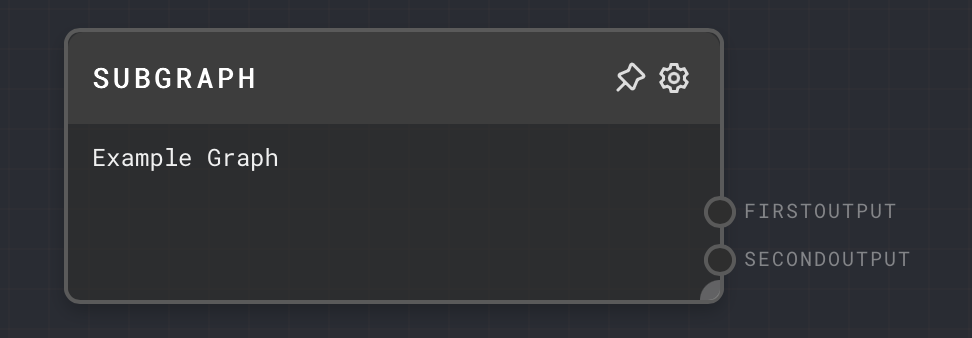

import Tabs from '@theme/Tabs';
import TabItem from '@theme/TabItem';

## Overview

The Graph Output Node is used to define the outputs of a graph. Each instance of this node represents an individual output of the graph. The value passed into this node becomes part of the overall output of the graph.

When a graph is used as a subgraph, each Graph Output Node in the graph turns into an output port on the subgraph node.

<Tabs
  defaultValue="inputs"
  values={[
    {label: 'Inputs', value: 'inputs'},
    {label: 'Outputs', value: 'outputs'},
    {label: 'Editor Settings', value: 'settings'},
  ]
}>

<TabItem value="inputs">

## Inputs

| Title | Data Type | Description                                                                                                                      | Default Value | Notes |
| ----- | --------- | -------------------------------------------------------------------------------------------------------------------------------- | ------------- | ----- |
| Value | `any`     | The value to be outputted from the graph. The data type of the value should match the data type configured in the node settings. | (required)    |       |

</TabItem>

<TabItem value="outputs">

## Outputs

| Title        | Data Type | Description                                                                                                                    | Notes |
| ------------ | --------- | ------------------------------------------------------------------------------------------------------------------------------ | ----- |
| Value Output | `any`     | The value that was passed into the node. The data type of the output will match the data type configured in the node settings. |       |

</TabItem>

<TabItem value="settings">

## Editor Settings

| Setting   | Description                                                                                                                                                                                                         | Default Value | Use Input Toggle | Input Data Type |
| --------- | ------------------------------------------------------------------------------------------------------------------------------------------------------------------------------------------------------------------- | ------------- | ---------------- | --------------- |
| ID        | The ID of the output. This will be used as the name and ID of the output port of the graph.                                                                                                                         | `output`      | No               | `string`        |
| Data Type | The data type of the value to be outputted from the graph. This should match the data type of the value passed into the node. If the data type of the input data does not match, it will be coerced into this type. | `string`      | No               | N/A             |

</TabItem>

</Tabs>

## Example 1: Define an output for a graph

1. Create a [Text Node](./text.mdx) and set the value to `Hello, world!`.
2. Create a Graph Output Node and set the ID to `greeting` and the Data Type to `String`.
3. Connect the Text Node to the `Value` input of the Graph Output Node.
4. Create another graph, and add a [Subgraph Node](./subgraph.mdx) to the graph. Set the Subgraph Node's Graph ID to the ID of the graph created in step 1.
5. Run the graph. You should see the `greeting` output of the subgraph is "Hello, world!"

## Error Handling

The Graph Output Node will error if the data type of the value passed into the node does not match the data type configured in the node settings.

## FAQ

**Q: Can I have multiple Graph Output Nodes in a graph?**

A: Yes, you can have multiple Graph Output Nodes in a graph. Each Graph Output Node represents an individual output of the graph. The ID of each Graph Output Node should be unique.

**Q: What happens if the ID of a Graph Output Node is not unique?**

A: If the ID of a Graph Output Node is not unique, the output of the graph will contain the value of the last Graph Output Node with that ID that was processed.

**Q: Can I use the Graph Output Node to output an array or an object?**

A: Yes, you can use the Graph Output Node to output any data type. The data type of the value passed into the node should match the data type configured in the node settings.

## See Also

- [Graph Input Node](./graph-input.mdx)
- [Subgraph Node](./subgraph.mdx)
- [Data Types](../user-guide/data-types.md)
