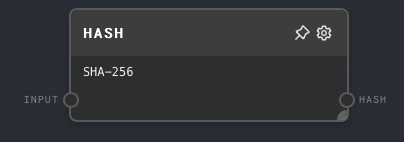
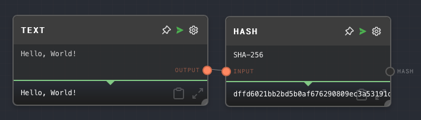

import Tabs from '@theme/Tabs';
import TabItem from '@theme/TabItem';

## Overview

The Hash Node computes a hash of the input value using the configured hash function. It supports MD5, SHA-1, SHA-256, and SHA-512 hash algorithms. This node can be useful for generating unique IDs, checksums, and other purposes.

<Tabs
  defaultValue="inputs"
  values={[
    {label: 'Inputs', value: 'inputs'},
    {label: 'Outputs', value: 'outputs'},
    {label: 'Editor Settings', value: 'settings'},
  ]
}>

<TabItem value="inputs">

## Inputs

| Title | Data Type | Description              | Default Value | Notes                                                          |
| ----- | --------- | ------------------------ | ------------- | -------------------------------------------------------------- |
| Input | `string`  | The string to be hashed. | (required)    | The input will be coerced into a string if it is not a string. |

</TabItem>

<TabItem value="outputs">

## Outputs

| Title | Data Type | Description                   | Notes |
| ----- | --------- | ----------------------------- | ----- |
| Hash  | `string`  | The hash of the input string. |       |

</TabItem>

<TabItem value="settings">

## Editor Settings

| Setting   | Description                                                              | Default Value | Use Input Toggle | Input Data Type |
| --------- | ------------------------------------------------------------------------ | ------------- | ---------------- | --------------- |
| Algorithm | The hash algorithm to use. Options are MD5, SHA-1, SHA-256, and SHA-512. | SHA-256       | No               | N/A             |

</TabItem>

</Tabs>

## Example 1: Hash a string

1. Create a [Text Node](./text.mdx) and set the value to `Hello, World!`.
2. Create a Hash Node and connect the Text Node to its `Input` port.
3. Run the graph. The `Hash` output of the Hash Node should contain the hash of the string `Hello, World!`.

## Error Handling

The Hash Node will error if the `Input` is not provided or if an unsupported hash algorithm is specified.

## FAQ

**Q: Can I use the Hash Node to hash a number or other non-string value?**

A: Yes, you can. The Hash Node will automatically convert non-string inputs into strings before hashing them.

**Q: Can I use the Hash Node to hash a password?**

A: It is not recommended to have passwords in Rivet. If you need to hash a password, you should do so outside of Rivet.

**Q: Can I use the Hash Node to generate a unique ID for a piece of data?**

A: Yes, you can use the Hash Node to generate a unique repeatable ID for a piece of data by hashing the data. This can be used with the [Vector Store Node](./vector-store.mdx) to store the data in a vector store with the ID as the key.

## See Also

- [Text Node](./text.mdx)
- [Number Node](./number.mdx)
- [Vector Store Node](./vector-store.mdx)
- [RNG Node](./rng.mdx)
