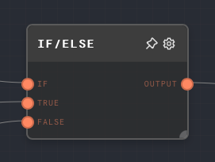
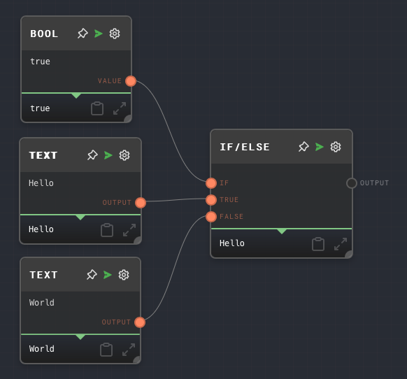

import Tabs from '@theme/Tabs';
import TabItem from '@theme/TabItem';

## Overview

The If/Else Node is a control flow node that allows you to choose between two different values based on a condition. It takes in three inputs: a condition, a true value, and a false value. If the condition is truthy, the true value is passed through the output port. If the condition is not truthy, the false value is passed through the output port.

This node can "consume" a `Not Ran` to continue a graph from that point. This means that if a `Not Ran` value is passed into the `If` port, the `False` value will be passed through instead. If the `False` value is not connected, then the result will again be `Not Ran`.

The If/Else node is particularly useful for always ensuring that a graph returns a value, and the outputs of the graph always run, or ensuring that a later node in the graph always receives a value, even if intermediate nodes do not run.

<Tabs
  defaultValue="inputs"
  values={[
    {label: 'Inputs', value: 'inputs'},
    {label: 'Outputs', value: 'outputs'},
    {label: 'Editor Settings', value: 'settings'},
  ]
}>

<TabItem value="inputs">

## Inputs

| Title | Data Type | Description                                                                  | Default Value | Notes                                                                                              |
| ----- | --------- | ---------------------------------------------------------------------------- | ------------- | -------------------------------------------------------------------------------------------------- |
| If    | `any`     | The condition to evaluate. If truthy, the true value is passed through.      | (required)    | The input will be coerced into a boolean if it is not a boolean.                                   |
| True  | `any`     | The value to pass through if the condition is truthy.                        | (empty)       | The input will be coerced into the same data type as the `False` input if it is not the same type. |
| False | `any`     | The value to pass through if the condition is not truthy or is not provided. | (empty)       | The input will be coerced into the same data type as the `True` input if it is not the same type.  |

</TabItem>

<TabItem value="outputs">

## Outputs

| Title  | Data Type | Description                                                                                     | Notes |
| ------ | --------- | ----------------------------------------------------------------------------------------------- | ----- |
| Output | `any`     | The value that was passed through based on the condition. Either the true value or false value. |       |

</TabItem>

<TabItem value="settings">

## Editor Settings

This node has no configurable editor settings.

</TabItem>

</Tabs>

## Example 1: Choose between two values based on a condition

1. Create a [Bool Node](./bool.mdx). Set the value of the Bool Node to `true`.
2. Create two [Text Nodes](./text.mdx). Set the text of one node to `Hello` and the other to `World`.
3. Create an If/Else Node. Connect the Bool Node to the `If` input of the If/Else Node. Connect the Text Node with the text `Hello` to the `True` input of the If/Else Node. Connect the Text Node with the text `World` to the `False` input of the If/Else Node.
4. Run the graph. The output of the If/Else Node should be `Hello`.
5. Try changing the value of the Bool Node to `false`. Run the graph again. The output of the If/Else Node should now be `World`.

## Example 2: Provide a default value for a missing input

1. Create an [If Node](./if.mdx) but do not connect anything to its `If` input.
2. Create two [Text Nodes](./text.mdx). Set the text of one node to `Hello` and the other to `World`.
3. Connect the Hello Text Node to the `Value` input of the If Node.
4. Create an If/Else Node. Connect the If Node to the `If` and `True` inputs of the If/Else Node. Connect the Text Node with the text `World` to the `False` input of the If/Else Node.
5. Run the graph. The output of the If/Else Node should be `World`.

## Error Handling

The If/Else node will not throw an error under normal circumstances.

## FAQ

**Q: What is considered truthy in Rivet?**

A: Any value that is considered truthy in JavaScript, plus any non-empty Array, is considered truthy in Rivet. This includes:

- `true`
- Any non-zero number
- Any non-empty string
- Any non-empty Array
- Any object
- Any function

All other values are considered falsy, including the string value `"false"`.

**Q: What happens if the `If` input is `Not Ran`?**

A: If the `If` input is `Not Ran`, the `False` value will be passed through instead. If the `False` value is not connected, then the result will again be `Not Ran`.

**Q: What happens if the `True` or `False` inputs are not provided?**

A: If the `True` or `False` inputs are not provided, they will default to `Not Ran`.

**Q: Can I use the If/Else Node to choose between two different types of values?**

A: Yes, you can use the If/Else Node to choose between two different types of values. For example, you can use it to choose between a string and a number based on a condition. However, keep in mind that the output of the If/Else Node will be of the same type as the value that was passed through.

## See Also

- [If Node](./if.mdx)
- [Match Node](./match.mdx)
- [Coalesce Node](./coalesce.mdx)
- [Control Flow](../user-guide/control-flow.md)
