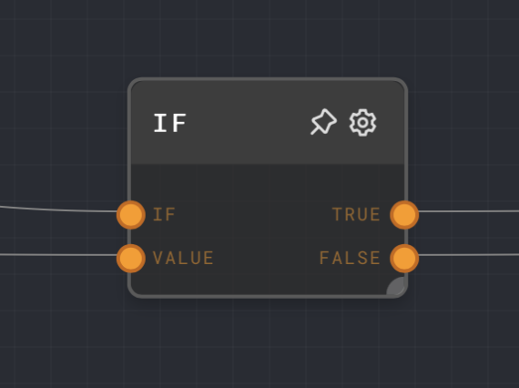
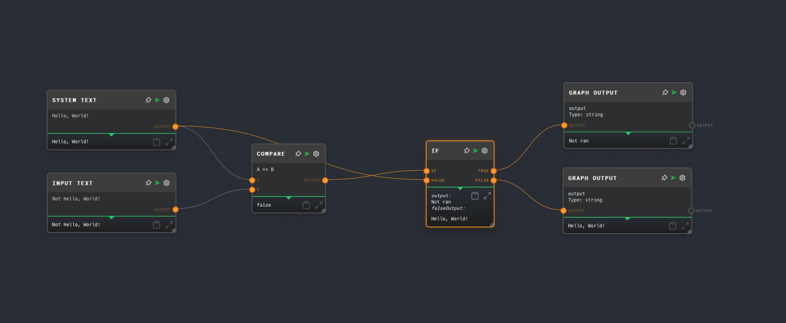

import Tabs from '@theme/Tabs';
import TabItem from '@theme/TabItem';

## Overview

Takes in a condition and a value. If the condition is truthy, the value is passed through the True port, and the False port is not ran.
If the condition is falsy, the value is passed through the False port, and the True port is not ran.




<Tabs
  defaultValue="inputs"
  values={[
    {label: 'Inputs', value: 'inputs'},
    {label: 'Outputs', value: 'outputs'},
    {label: 'Editor Settings', value: 'settings'},
  ]
}>

<TabItem value="inputs">

## Inputs

| Title  | Data Type   | Description                                                  | Required |                                                                                                                                                                |
| ------ | ----------- | -----------------------------------------------------------  | -------- |
| If     | conditional | The condition you would like to check.                       | True     |
| Value  | any         | The value passed through either True or False ports.         | True     |
</TabItem>

<TabItem value="outputs">

## Outputs

| Title    | Data Type        | Description                                       |
| -------- | ---------------- | ------------------------------------------------- |
| True     | type of `Value`  | Returns the Value if the condition is True.       |
| False    | type of `Value`  | Returns the Value if the condition is False.      |

</TabItem>

<TabItem value="settings">

## Editor Settings

This node does not have any specific settings.

</TabItem>

</Tabs>

### Example 1: Simple `string` comparison

- Let's say we're trying to build a simple string comparison. The code for which in Typscript would look something like below:
```
if('Hello, World!' === 'Not Hello, World!')
```
- Similarly in Rivet we can make the following graph to perform a similar comparison. 



1. Create the following nodes in your graph:
    - An `If` node 
    - A `Compare` node
    - Two `Input Text` nodes: System Text and Input Text
    - Two `Graph Output` nodes: True Output and False Output
2. Connect the following nodes:
    - System Text `Output` to `A` of the Compare node and `Value` of the If node
    - Input Text `Output` to `B` of the Compare node
      - Make sure the Compare condition is set at `==`
    - If Node `True` to True Output
    - If Node `False` to False Output
3. You are ready to run the graph
4. Results: You'll see that based on the Input Text, and the comparison we've supplied to the If node, the graph output execution changes. 
If the If condition supplied to the node is true, the true port receives the value but if its false, the false port receives the values.