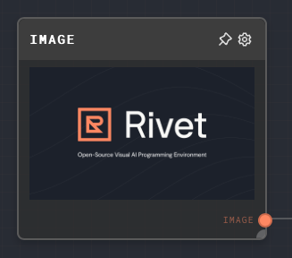
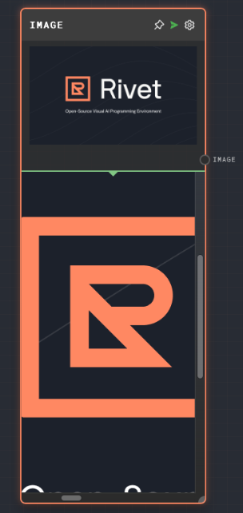

import Tabs from '@theme/Tabs';
import TabItem from '@theme/TabItem';

## Overview

The Image Node is used to define a static image for use with other nodes. It can convert a binary type into an image type. The node requires a media type (PNG, JPEG, or GIF) and a data input.

The data input can be provided in two ways:

- Directly in the node's editor settings, using the image browser.
- Dynamically, by connecting another node to the Image Node's `Data` input port.

The media type can also be provided in two ways:

- Directly in the node's editor settings, using the dropdown menu.
- Dynamically, by connecting another node to the Image Node's `Media Type` input port.

<Tabs
  defaultValue="inputs"
  values={[
    {label: 'Inputs', value: 'inputs'},
    {label: 'Outputs', value: 'outputs'},
    {label: 'Editor Settings', value: 'settings'},
  ]
}>

<TabItem value="inputs">

## Inputs

| Title      | Data Type | Description                                      | Default Value                                               | Notes                                                                                                                                             |
| ---------- | --------- | ------------------------------------------------ | ----------------------------------------------------------- | ------------------------------------------------------------------------------------------------------------------------------------------------- |
| Data       | `string`  | The data to be converted into an image.          | (required if if the input toggle for Data is enabled)       | The input will be coerced into a string if it is not a string.                                                                                    |
| Media Type | `string`  | The media type of the image (PNG, JPEG, or GIF). | (required if if the input toggle for Media Type is enabled) | The input will be coerced into a string if it is not a string. The value must be one of the following: `image/png`, `image/jpeg`, or `image/gif`. |

</TabItem>

<TabItem value="outputs">

## Outputs

| Title | Data Type | Description                 | Notes |
| ----- | --------- | --------------------------- | ----- |
| Image | `image`   | The image that was created. | None  |

</TabItem>

<TabItem value="settings">

## Editor Settings

| Setting    | Description                                      | Default Value | Use Input Toggle | Input Data Type |
| ---------- | ------------------------------------------------ | ------------- | ---------------- | --------------- |
| Media Type | The media type of the image (PNG, JPEG, or GIF). | `image/png`   | Yes              | `string`        |
| Image      | The data to be converted into an image.          | (empty)       | Yes              | `string`        |

</TabItem>

</Tabs>

## Example 1: Create a static image

1. Create an Image Node.
2. In the node's editor settings, click on the `Pick Image` button. This will open the image browser.
3. Select an image from the image browser. The selected image will be displayed in the `Image` field.
4. Run the graph. The `Image` output of the Image Node should contain the selected image.

## Error Handling

The Image Node will error if the `Data` input or the `Media Type` input is not provided. It will also error if the `Data` input cannot be converted into an image.

## FAQ

**Q: Can I use the Image Node to display an image in the Rivet UI?**

A: Yes, the Image Node can be used to display an image in the Rivet UI. The image will be displayed in the node's output port when the graph is run.

**Q: Can I use the Image Node to convert a binary type into an image?**

A: Yes, you can use the Image Node to convert a binary type into an image. You will need to provide the binary data to the `Data` input of the Image Node and set the `Media Type` to the appropriate type for the image.

**Q: What image formats are supported by the Image Node?**

A: The Image Node supports PNG, JPEG, and GIF formats.

## See Also

- [Text Node](./text.mdx)
- [Audio Node](./audio.mdx)
- [Data Types](../user-guide/data-types.md)
