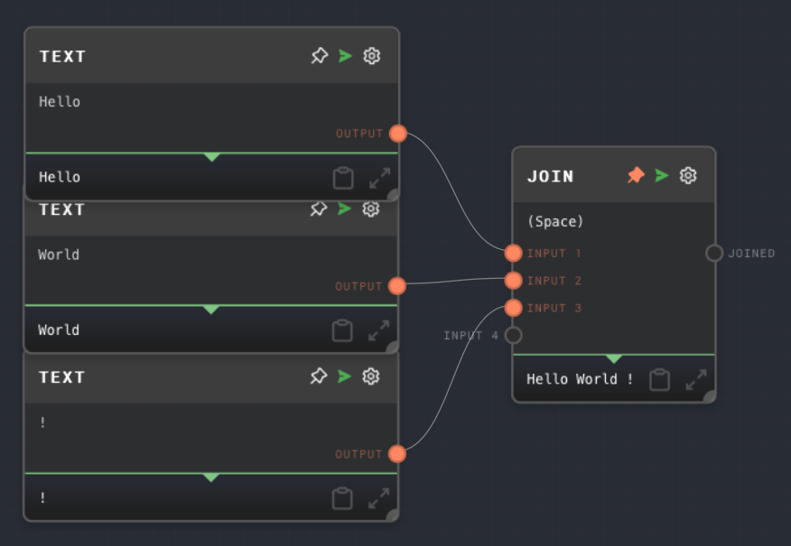

import Tabs from '@theme/Tabs';
import TabItem from '@theme/TabItem';


## Overview

The Join Node is used to concatenate an array of strings into a single string. The strings are joined using a specified delimiter.

The Join Node can be used to flatten arrays of strings into a single string. This is useful when you want to format a list of items in a specific way, such as creating a comma-separated list, or joining lines of text with newline characters.

The node also supports the use of special characters as delimiters, such as newline (`\n`), tab (`\t`), and space (` `). To use them, put the literal character in the Join String field in the settings. For example, to use a newline character, you need to press `Enter` in the Join String field.

Arrays that are input into the Join Node will be flattened before being joined. If you connect an array to Input 1 such as `["apple", "banana", "cherry"]`, and a single value into Input 2, such as `"orange"`, the output of the Join Node will be `apple, banana, cherry, orange`, if the delimiter is set to `, `.

Array items and inputs will be coerced into strings before joining.

<Tabs
  defaultValue="inputs"
  values={[
    {label: 'Inputs', value: 'inputs'},
    {label: 'Outputs', value: 'outputs'},
    {label: 'Editor Settings', value: 'settings'},
  ]
}>

<TabItem value="inputs">

## Inputs

| Title       | Data Type | Description                                                                                                            | Default Value | Notes                                                                                                                                   |
| ----------- | --------- | ---------------------------------------------------------------------------------------------------------------------- | ------------- | --------------------------------------------------------------------------------------------------------------------------------------- |
| Input [i]   | `string`  | The ith string to be joined.                                                                                           | N/A           | Dynamic number of inputs based on how many connections there are.                                                                       |
| Join String | `string`  | The string used as a delimiter to join the inputs. This input is only available if `Use Join String Input` is enabled. | N/A           | The input will be coerced into a string if it is not a string. If not provided, the Join String specified in the settings will be used. |

</TabItem>

<TabItem value="outputs">

## Outputs

| Title  | Data Type | Description        | Notes |
| ------ | --------- | ------------------ | ----- |
| Joined | `string`  | The joined string. |       |

</TabItem>

<TabItem value="settings">

## Editor Settings

| Setting               | Description                                                                 | Default Value | Use Input Toggle | Input Data Type |
| --------------------- | --------------------------------------------------------------------------- | ------------- | ---------------- | --------------- |
| Flatten               | If enabled, the node will flatten array inputs before joining them.         | True          | No               | N/A             |
| Join String           | The string used as a delimiter to join the inputs.                          | `\n`          | Yes              | `string`        |
| Use Join String Input | If enabled, the Join String can be provided via the Join String input port. | False         | No               | N/A             |

</TabItem>

</Tabs>

## Example 1: Join an array of strings with a newline

1. Create an [Array Node](./array.mdx) and set the values to `["apple", "banana", "cherry"]` with Text Nodes.
2. Create a Join Node and set the Join String to `\n` by deleting the current value and pressing `Enter` in the Join String field in the settings.
3. Connect the Array Node to the `Input 1` port of the Join Node.
4. Run the graph. The output of the Join Node should be:

   ```
   apple
   banana
   cherry
   ```


## Example 2: Join multiple inputs with a space

1. Create three [Text Nodes](./text.mdx) and set their values to `Hello`, `World`, and `!`, respectively.
2. Create a Join Node and set the Join String to ` ` (a space).
3. Connect the Text Nodes to the `Input 1`, `Input 2`, and `Input 3` ports of the Join Node, respectively.
4. Run the graph. The output of the Join Node should be `Hello World !`.



## Error Handling

The Join Node will not error under normal circumstances. If an input is not provided, the Join Node will output an empty string.

## FAQ

**Q: Can I use special characters as the Join String?**

A: Yes, you can use special characters such as newline (`\n`), tab (`\t`), and space (` `) as the Join String. To use these characters, you need to enter them literally in the Join String field in the settings. For example, to use a newline character, you need to press `Enter` in the Join String field.

**Q: Can I join an array of numbers or other non-string values?**

A: Yes, you can join an array of any data type. The values will be coerced into strings before being joined.

**Q: Can I use a dynamic Join String?**

A: Yes, you can use a dynamic Join String by enabling the input port toggle for the join string setting. This will create a new `Join String` input port on the node, and you can connect another node to this port to provide the Join String.

## See Also

- [Split Text Node](./split-text.mdx)
- [Array Node](./array.mdx)
- [Text Node](./text.mdx)
- [Code Node](./code.mdx)
- [Data Types](../user-guide/data-types.md)
