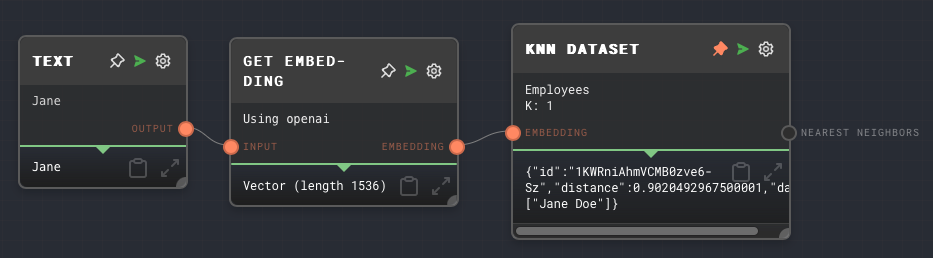

import Tabs from '@theme/Tabs';
import TabItem from '@theme/TabItem';

## Overview

The KNN (K-Nearest Neighbors) Dataset Node is used to find the k nearest neighbors in a dataset given an embedding. This node is particularly useful when you want to find the most similar items in a dataset to a given item.

The node requires a dataset provider to be available in the context when the graph is being run. The dataset provider is responsible for managing the storage and retrieval of datasets. In the Rivet application, the dataset provider is handled for you automatically.

For more information on datasets, see the [Data Studio](../user-guide/features/data-studio.md) section of the user guide.

<Tabs
  defaultValue="inputs"
  values={[
    {label: 'Inputs', value: 'inputs'},
    {label: 'Outputs', value: 'outputs'},
    {label: 'Editor Settings', value: 'settings'},
  ]
}>

<TabItem value="inputs">

## Inputs

| Title      | Data Type | Description                                                                                                                   | Default Value                                               | Notes                                                          |
| ---------- | --------- | ----------------------------------------------------------------------------------------------------------------------------- | ----------------------------------------------------------- | -------------------------------------------------------------- |
| Embedding  | `object`  | The embedding to use as the reference point for finding the nearest neighbors.                                                | (required)                                                  |                                                                |
| Dataset ID | `string`  | The ID of the dataset to search for the nearest neighbors. This input is only available if `Use Dataset ID Input` is enabled. | (required if if the input toggle for Dataset ID is enabled) | The input will be coerced into a string if it is not a string. |
| K          | `number`  | The number of nearest neighbors to find. This input is only available if `Use K Input` is enabled.                            | (required if if the input toggle for K is enabled)          | The input will be coerced into a number if it is not a number. |

</TabItem>

<TabItem value="outputs">

## Outputs

| Title             | Data Type  | Description                                                                                                      | Notes                                                                                                                              |
| ----------------- | ---------- | ---------------------------------------------------------------------------------------------------------------- | ---------------------------------------------------------------------------------------------------------------------------------- |
| Nearest Neighbors | `object[]` | An array of the k nearest neighbors. Each object in the array contains the ID, distance, and data of a neighbor. | The output will be an array of objects. Each object represents a neighbor and contains the ID, distance, and data of the neighbor. |

</TabItem>

<TabItem value="settings">

## Editor Settings

| Setting | Description                                                | Default Value | Use Input Toggle | Input Data Type |
| ------- | ---------------------------------------------------------- | ------------- | ---------------- | --------------- |
| Dataset | The ID of the dataset to search for the nearest neighbors. | (required)    | Yes              | `string`        |
| K       | The number of nearest neighbors to find.                   | 5             | Yes              | `number`        |

</TabItem>

</Tabs>

## Example 1: Find the nearest neighbors in a dataset

1. First, in the [Data Studio](../user-guide/features/data-studio.md), create a new dataset with the name `Employees`.
2. In a new graph, add an [Append to Dataset Node](./append-to-dataset.mdx) and set the Dataset ID to `Employees`.
3. Add a [Text Node](./text.mdx) and set the value to `John Doe`. We will be getting an embedding for this text node.
4. Add a [Get Embedding Node](./get-embedding.mdx) and connect the Text Node to it. Connect the `Embedding` output of the Get Embedding Node to the `Embedding` input of the Append to Dataset Node.
5. Connect the Text Node to the `Data` input of the Append to Dataset Node.
6. Run the graph. This will append "John Doe" and its embedding to the `Employees` dataset.
7. Change the value of the Text Node to `Jane Doe` and run the graph again. This will append "Jane Doe" and its embedding to the `Employees` dataset.

1. Next, create a new graph with a KNN Dataset Node and set the Dataset ID to `Employees` and K to 1.
2. Add a [Text Node](./text.mdx) and set the value to `Jane`. We will be finding the nearest neighbor to this text node.
3. Add a [Get Embedding Node](./get-embedding.mdx) and connect the Text Node to it. Connect the `Embedding` output of the Get Embedding Node to the `Embedding` input of the KNN Dataset Node.
4. Run the graph. This will find the nearest neighbor to "Jane" in the `Employees` dataset, which is "Jane Doe".

## Error Handling

The KNN Dataset Node will error if the dataset provider is not available in the context when the graph is being run. It will also error if the `Embedding` input is not provided.

## FAQ

**Q: What is a dataset provider?**

A: A dataset provider is an object that is responsible for managing the storage and retrieval of datasets. It is passed to the context when the graph is being run. The dataset provider must implement the `DatasetProvider` interface, which includes methods for getting, putting, and deleting datasets. See the [API Reference](../api-reference.md) for more information.

**Q: Is there any way to get the nearest neighbors without using a dataset?**

You can use the [Vector KNN Node](./vector-knn.mdx) to find the nearest neighbors using other integrations, such as Pinecone.

**Q: What happens if the dataset does not exist?**

A: If the dataset does not exist, the KNN Dataset Node will error.

## See Also

- [Load Dataset Node](./load-dataset.mdx)
- [Create Dataset Node](./create-dataset.mdx)
- [Get All Datasets Node](./get-all-datasets.mdx)
- [Append to Dataset Node](./append-to-dataset.mdx)
- [Get Dataset Row Node](./get-dataset-row.mdx)
- [Vector KNN Node](./vector-knn.mdx)
