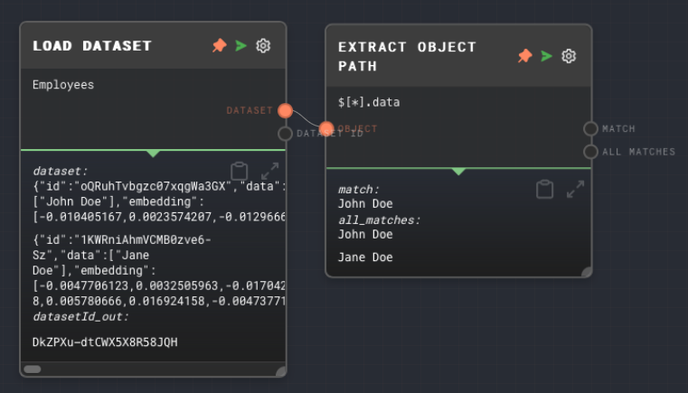

import Tabs from '@theme/Tabs';
import TabItem from '@theme/TabItem';


## Overview

The Load Dataset Node is used to load the entire contents of a dataset into a graph. The data can then be used in other nodes in the graph.

The Load Dataset node outputs an array of dataset rows. Each row has the following structure:

```json
{
  "id": "1", // The ID of the row
  "embedding": [], // The vector embedding of the row, if it has been saved with an embedding
  "data": [] // The data of the row, each element in the array corresponds to a column in the dataset
}
```

To access the data of a row, you can use the [Extract Object Path Node](./extract-object-path.mdx) to extract the `data` property from each row. If you use the jsonpath `$[*].data` in the Extract Object Path Node, you will get an array of arrays, where each inner array represents a row in the dataset.

You can extract a single row from the dataset by using `$[0].data` in the Extract Object Path Node. This will return an array of values, where each value corresponds to a column in the dataset.

You can extract a single column from the dataset by using `$[*].data[0]` in the Extract Object Path Node. This will return an array of values, where each value corresponds to a row in the dataset.

The node requires a dataset provider to be available in the context when the graph is being run. The dataset provider is responsible for managing the storage and retrieval of datasets. In the Rivet application, the dataset provider is handled for you automatically.

For more information on datasets, see the [Data Studio](../user-guide/features/data-studio.md) section of the user guide.

<Tabs
  defaultValue="inputs"
  values={[
    {label: 'Inputs', value: 'inputs'},
    {label: 'Outputs', value: 'outputs'},
    {label: 'Editor Settings', value: 'settings'},
  ]
}>

<TabItem value="inputs">

## Inputs

| Title      | Data Type | Description                                                                                                              | Default Value                                            | Notes                                                          |
| ---------- | --------- | ------------------------------------------------------------------------------------------------------------------------ | -------------------------------------------------------- | -------------------------------------------------------------- |
| Dataset ID | `string`  | The ID of the dataset to load. This input is only available if `Use Dataset ID Input` is enabled in the editor settings. | (required if the input toggle for Dataset ID is enabled) | The input will be coerced into a string if it is not a string. |

</TabItem>

<TabItem value="outputs">

## Outputs

| Title      | Data Type  | Description                                                                                                                              | Notes                                               |
| ---------- | ---------- | ---------------------------------------------------------------------------------------------------------------------------------------- | --------------------------------------------------- |
| Dataset    | `object[]` | The dataset that was loaded. Each object in the array represents a row in the dataset.                                                   | If the dataset does not exist, the node will error. |
| Dataset ID | `string`   | The ID of the dataset that was loaded. This output will be the same as the Dataset ID input or the Dataset ID specified in the settings. |                                                     |

</TabItem>

<TabItem value="settings">

## Editor Settings

| Setting | Description                    | Default Value | Use Input Toggle | Input Data Type |
| ------- | ------------------------------ | ------------- | ---------------- | --------------- |
| Dataset | The ID of the dataset to load. | (required)    | Yes              | `string`        |

</TabItem>

</Tabs>

## Example 1: Load a dataset

1. In the [Data Studio](../user-guide/features/data-studio.md), create a new dataset with the ID `employees`.
2. Create a Load Dataset Node and set the Dataset ID to `employees`.
3. Run the graph. The `Dataset` output of the Load Dataset Node should contain the entire `employees` dataset.



## Error Handling

The Load Dataset Node will error if the dataset provider is not available in the context when the graph is being run. It will also error if the Dataset ID input is not provided or if the dataset does not exist.

## FAQ

**Q: What is a dataset provider?**

A: A dataset provider is an object that is responsible for managing the storage and retrieval of datasets. It is passed to the context when the graph is being run. The dataset provider must implement the `DatasetProvider` interface, which includes methods for getting, putting, and deleting datasets. See the [API Reference](../api-reference.md) for more information.

**Q: Can I load multiple datasets at once?**

A: No, the Load Dataset Node can only load one dataset at a time. If you want to load multiple datasets, you can use multiple Load Dataset Nodes.

**Q: What happens if the dataset does not exist?**

A: If the dataset does not exist, the Load Dataset Node will error.

## See Also

- [Append to Dataset Node](./append-to-dataset.mdx)
- [Create Dataset Node](./create-dataset.mdx)
- [Get All Datasets Node](./get-all-datasets.mdx)
- [KNN Dataset Node](./knn-dataset.mdx)
- [Get Dataset Row Node](./get-dataset-row.mdx)
