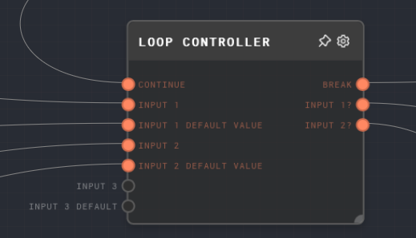

import Tabs from '@theme/Tabs';
import TabItem from '@theme/TabItem';

## Overview

The Loop Controller Node is a powerful node that allows you to create loops in your graph. It is the only node in Rivet that is allowed to contain cycles of nodes, including itself.

The Loop Controller Node maintains the state of the loop and controls the flow of values through the loop. All values that can change in a loop must flow through the Loop Controller Node itself.

The Loop Controller Node has a dynamic number of pairs of inputs. Each pair consists of an input and a default input. The default input is the initial state of the loop and the input is the value that changes in each iteration of the loop.

The Loop Controller Node also has a dynamic number of output ports. On the first iteration, the value of each output port is the value passed into the corresponding default input port. On subsequent iterations, the value of each output port is the value passed into the corresponding input port on the previous iteration.

The Loop Controller Node has a `Continue` input port. If the value passed into the `Continue` input port is truthy, the loop will continue executing. If the value is falsy, the loop will stop executing.

For more information on loops, see the [Loops](../user-guide/loops.md) section of the user guide.

<Tabs
  defaultValue="inputs"
  values={[
    {label: 'Inputs', value: 'inputs'},
    {label: 'Outputs', value: 'outputs'},
    {label: 'Editor Settings', value: 'settings'},
  ]
}>

<TabItem value="inputs">

## Inputs

| Title           | Data Type | Description                                                                                          | Default Value | Notes                                                                                                      |
| --------------- | --------- | ---------------------------------------------------------------------------------------------------- | ------------- | ---------------------------------------------------------------------------------------------------------- |
| Continue        | `any`     | If the value is truthy, the loop will continue executing. If the value is falsy, the loop will stop. | `undefined`   | The input will be coerced into a boolean. If the input is not provided, the loop will continue by default. |
| Input X         | `any`     | The value that changes in each iteration of the loop.                                                | (Required)    |                                                                                                            |
| Input X Default | `any`     | The initial value of the loop.                                                                       | (Required)    |                                                                                                            |

</TabItem>

<TabItem value="outputs">

## Outputs

| Title    | Data Type | Description                                                                                        | Notes                                                                                                                                                                                                                 |
| -------- | --------- | -------------------------------------------------------------------------------------------------- | --------------------------------------------------------------------------------------------------------------------------------------------------------------------------------------------------------------------- |
| Break    | `any`     | If the `Continue` input is falsy, this output port will run with an array of all the input values. | If the `Continue` input is truthy, this output port will not run.                                                                                                                                                     |
| Output X | `any`     | The value of the corresponding input or default input.                                             | On the first iteration, the value is the value passed into the corresponding default input port. On subsequent iterations, the value is the value passed into the corresponding input port on the previous iteration. |

</TabItem>

<TabItem value="settings">

## Editor Settings

| Setting        | Description                                                                                             | Default Value | Use Input Toggle | Input Data Type |
| -------------- | ------------------------------------------------------------------------------------------------------- | ------------- | ---------------- | --------------- |
| Max Iterations | The maximum number of iterations that the loop can run. If the loop exceeds this number, it will error. | 100           | No               | `number`        |

</TabItem>

</Tabs>

## Example 1: AI Chatting To Itself

The following example shows how you can use the Loop Controller Node to create a loop that will never break.

The AI is prompted with a single message, which is given into the Chat node. The existing message history and the AI's response are combined together to form the new message history, which feeds back into the loop controller. Effectively, the AI starts chatting with itself.

:::info

This loop will never break. If you run this graph, it will eventually fail after the default of 100 iterations.

:::

## Example 2: Iterating Over an Array

A common use-case is to iterate over an array. The following example shows how you can use the Loop Controller Node to iterate over an array, and return a new array containing ` Mapped` appended to each element.

In each iteration of the loop, we use a [Pop Node](./pop.mdx) to pop the first value off the array and append ` Mapped` to it. We then push the new value into the output array using an [Array Node](./array.mdx), which is a combination of the existing output array, and the new value. Once the input array is empty, the loop will break, using the [Compare Node](./compare.mdx).

The [Graph Output](./graph-output.mdx) node is connected to the `Break` output of the loop controller. It is given all of the inputs in an array, so the first array will be empty and the second array will contain the mapped values. You could use an [Extract Object Path Node](./extract-object-path.mdx) to extract the second array using `$[1]`.

## Error Handling

The Loop Controller Node will error if the loop exceeds the maximum number of iterations specified in the `Max Iterations` setting.

## FAQ

**Q: Why do I need to connect something to the Break output port?**

A: The graph needs to traverse from the output nodes of the graph to the input node due to how the processing works, so there needs to be a "leaf" node for the graph execution to start from. The "Break" output port is convenient to connect to, even if the loop never breaks.

**Q: Why does the my loop run forever?**

A: You may have not connected the "Continue" input port to anything. If the "Continue" input port is not connected to anything, it will default to `true`, which means the loop will never break.

If you have an output that is "Not Ran" connected to the input port, such as an [If Node](./if.mdx), the loop will never break because the "Not Ran" output will always be `true`.

**Q: What happens if I don't connect the default input port?**

A: Right now, this is undefined behavior, so try to connect all the defaults with something.

**Q: How can I remember the ports better?**

You can give the nodes connected to the input ports descriptive names, as the names of the nodes connected to the input ports are what show on the loop controller. Or, you could just remember that the loop controller's inputs are in "pairs" so try to group them that way.

**Q: Why does the loop controller have a maximum number of iterations?**

A: The maximum number of iterations is there to prevent accidental infinite loops. If you have a loop that is not breaking, it will eventually error after the maximum number of iterations. If you need an truly infinite loop, you can set the maximum number of iterations to an extremely high number.

## See Also

- [Loops](../user-guide/loops.md)
- [Control Flow](../user-guide/control-flow.md)
