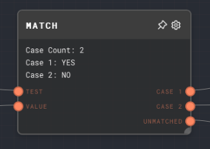

import Tabs from '@theme/Tabs';
import TabItem from '@theme/TabItem';

## Overview

The Match Node is used to match a string input against a series of regular expressions. Each regular expression corresponds to an output of the node.

The node can be configured to either run the _first_ matching output port, or to run _all_ matching output ports. If no match is found, the `Unmatched` output port will be executed.

This node is useful for routing control flow based on the content of a string. For example, you can use the Match Node to check if a user's message contains certain keywords and route the conversation accordingly.

If the `Value` input is provided, it will be passed through the corresponding output port if a match is found. If the `Value` input is not provided, the `Test` input will be passed through the corresponding output port if a match is found.

<Tabs
  defaultValue="inputs"
  values={[
    {label: 'Inputs', value: 'inputs'},
    {label: 'Outputs', value: 'outputs'},
    {label: 'Editor Settings', value: 'settings'},
  ]
}>

<TabItem value="inputs">

## Inputs

| Title | Data Type | Description                                                    | Default Value | Notes                                                          |
| ----- | --------- | -------------------------------------------------------------- | ------------- | -------------------------------------------------------------- |
| Test  | `string`  | The string to be tested against the regular expressions.       | (required)    | The input will be coerced into a string if it is not a string. |
| Value | `any`     | The value to be passed to the output port if a match is found. | (optional)    | If not provided, the `Test` input will be used as the value.   |

</TabItem>

<TabItem value="outputs">

## Outputs

| Title     | Data Type | Description                                                                 | Notes                                                                                        |
| --------- | --------- | --------------------------------------------------------------------------- | -------------------------------------------------------------------------------------------- |
| Case [i]  | `any`     | The output port corresponding to the ith regular expression.                | Dynamic number of outputs based on the number of regular expressions configured in the node. |
| Unmatched | `any`     | The output port that is executed if no match is found for the input string. | If a match is found for the input string, this output port will not be executed.             |

</TabItem>

<TabItem value="settings">

## Editor Settings

| Setting   | Description                                                                                                                                     | Default Value | Use Input Toggle | Input Data Type |
| --------- | ----------------------------------------------------------------------------------------------------------------------------------------------- | ------------- | ---------------- | --------------- |
| Exclusive | If enabled, then the _first_ matched case will be ran, and all other cases will not be ran. If disabled, then _all_ matching cases will be ran. | Off           | No               | N/A             |
| Cases     | The list of regular expression cases to match against.                                                                                          | `YES`, `NO`   | No               | N/A             |

</TabItem>

</Tabs>

## Example 1: Route control flow based on AI input

1. Create a [Chat Node](./chat.mdx) and set the `Prompt` to a question, such as:
   > Would you like to hear about information about cats or dogs first? Please only pick one! I will give you information on both, I just want to know what you'd like to hear first.
2. Create a Match Node and connect the `Message` output of the Chat Node to the `Test` input of the Match Node.
3. In the body of the Match Node, set the regular expressions to `cats` and `dogs`.
4. Add three pairs of [If Nodes](./if.mdx) and [Text Nodes](./text.mdx). Connect the `Case 1` output of the Match Node to the first If Node's `If` input, the `Case 2` output of the Match Node to the second If Node's `If` input, and the `Unmatched` output of the Match Node to the third If Node's `If` input. Connect the text nodes to the If Nodes' `Value` inputs.
5. The text of the three Text Nodes should be "You chose cats!", "You chose dogs!", and "Sorry, I didn't understand that. Please try again.", respectively.
6. Run the graph. Depending on the AI's response, the corresponding If Node will be executed, with the text the AI selected

## Error Handling

The Match Node will error if the `Test` input is not provided. If no match is found for the input string, the `Unmatched` output port will be executed.

## FAQ

**Q: Can multiple cases match at once?**

A: Yes, multiple cases can match at once. If multiple cases match, all of the corresponding output ports will be executed. This may become a toggleable option in the future, so that only the first matching case will be executed.

**Q: Can I use the Match Node to match against numbers?**

A: Yes, you can use the Match Node to match against numbers. However, the `Test` input will be coerced into a string for the matching.

**Q: Can I use the Match Node to match against a list of strings?**

A: Yes, you can use the Match Node to match against a list of strings. However, the `Test` input will be coerced into a string for the matching. The default coercion will put each string on its own line for testing against.

## See Also

- [If Node](./if.mdx)
- [If/Else Node](./if-else.mdx)
- [Loop Controller Node](./loop-controller.mdx)
- [Coalesce Node](./coalesce.mdx)
- [Control Flow](../user-guide/control-flow.md)
