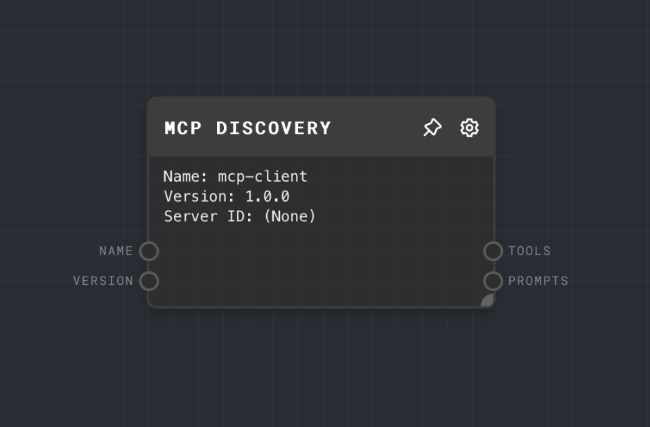

import Tabs from '@theme/Tabs';
import TabItem from '@theme/TabItem';



## Overview

The [Model Context Protocol (MCP)](https://modelcontextprotocol.io/introduction) enables communication with MCP-compliant servers through either HTTP or Stdio transports.

The MCP Discovery Node enables the ability to query an MCP servers and fetch Tools or Prompts in the server.

Currently, the MCP Discovery Node currently utilizes the following MCP request methods for a compliant server:

- [MCP Tools](https://modelcontextprotocol.io/docs/concepts/tools) : `tools/list`
- [MCP Prompts](https://modelcontextprotocol.io/docs/concepts/prompts): `prompts/list`

> MCP Discovery Node uses the official MCP Typescript SDK (`@modelcontextprotocol/sdk`) and requires a node executor when running the graph in the Rivet IDE.

The MCP Discovery Node supports two communication modes:

1. **HTTP Mode**: Uses Streamable HTTP Transport as default and a SSE Transport as a fallback for server communication.
2. **STDIO Mode**: Launches and communicates with local MCP servers using STIDO Transport.
   > For STDIO connections with local servers, add the MCP server config in `Project > Edit MCP Configuration`

<Tabs
  defaultValue="inputs"
  values={[
    {label: 'Inputs', value: 'inputs'},
    {label: 'Outputs', value: 'outputs'},
    {label: 'Editor Settings', value: 'settings'},
  ]
}>

<TabItem value="inputs">

## Inputs

| Title             | Data Type | Description                             | Default Value | Notes                                                             |
| ----------------- | --------- | --------------------------------------- | ------------- | ----------------------------------------------------------------- |
| Name              | `string`  | The name for the MCP Client instance    | mcp-client    | Standard required parameter for an MCP Client                     |
| Version           | `string`  | The version for the MCP Client instance | 1.0.0         | Standard required parameter for an MCP Client                     |
| Server URL (HTTP) | `string`  | The endpoint URL for the MCP server     | None          | Only available when using HTTP mode with Server URL Input enabled |

</TabItem>

<TabItem value="outputs">

## Outputs

| Title   | Data Type        | Description                            | Notes                                                                                |
| ------- | ---------------- | -------------------------------------- | ------------------------------------------------------------------------------------ |
| Tools   | `gpt-function[]` | MCP tools returned by the MCP server   | Returned from the `tools/list` method. Only availabe when Output Tools is enabled.   |
| Prompts | `object`         | MCP prompts returned by the MCP server | Returned from the `tools/list` method. Only availabe when Output Prompts is enabled. |

</TabItem>

<TabItem value="settings">

## Editor Settings

| Setting        | Description                                                   | Default Value             | Use Input Toggle | Input Data Type |
| -------------- | ------------------------------------------------------------- | ------------------------- | ---------------- | --------------- |
| Output Tools   | Whether to output tools                                       | True                      | No               | N/A             |
| Output Prompts | Whether to output prompts                                     | True                      | No               | N/A             |
| Name           | The name to use for the MCP Client instance                   | mcp-client                | Yes              | `string`        |
| Version        | The version to use for the MCP Client instance                | 1.0.0                     | Yes              | `string`        |
| Transport Type | The mode of communication with the MCP server (HTTP or STDIO) | STDIO                     | No               | N/A             |
| Server URL     | The endpoint URL for the MCP server (Only HTTP)               | http://localhost:8080/mcp | Yes              | `string`        |
| Server ID      | The MCP server ID from configuration (Only STDIO)             | (empty)                   | No               | N/A             |

</TabItem>

</Tabs>

## Configuration

### Setting up MCP Servers (for STDIO mode)

Add a JSON configuration in your Rivet project: `Project > MCP Configuration`

Your MCP Configuration is saved and associated with the Rivet project file. All available servers will be list in MCP Nodes.

Example configuration:

```json
{
  "mcpServers": {
    "mongodb": {
      "command": "/path/to/node",
      "args": ["-y", "/path/to/mcp-mongo-server/build/index.js", "mongodb://localhost:27017/your-database"]
    }
  }
}
```

## Example 1: Using HTTP Mode

1. Add an MCP Node to your graph
2. Set "Transport Type" to "HTTP"
3. Set "Server URL" to your MCP server URL (e.g., `http://localhost:8080/mcp`)
4. Make sure enable the Node Executor in Rivet (top-right menu)
5. Run the graph to see the response from the MCP server

## Example 2: Using STDIO Mode with an example

This example references the example: [Weather MCP Server](https://modelcontextprotocol.io/quickstart/server#node)

1. First, ensure you have set up the Weather MCP server and configured it in your `Project > MCP Configuration`

Example configuration:

```json
{
  "mcpServers": {
    "weather": {
      "command": "node",
      "args": ["/absolute-path/weather/build/index.js"]
    }
  }
}
```

2. Enable the Node Executor in Rivet (top-right menu)
3. Add an MCP Discovery Node to your graph
4. Set "Transport Type" to "STDIO"
5. Set "Server ID" to "weather"
6. Run the graph to see Tools and Prompts from the server

## Error Handling

The MCP Node provides detailed error handling with specific error types:

- `CONFIG_NOT_FOUND`: MCP configuration file not found
- `SERVER_NOT_FOUND`: Specified server ID not found in configuration
- `SERVER_COMMUNICATION_FAILED`: Failed to communicate with the server
- `INVALID_SCHEMA`: Invalid schema for input arguments

## Troubleshooting

**STDIO Server Not Found**

- Check your MCP Configuration in your Rivet Project tab
- Ensure absolute paths in configuration

**HTTP Connection Failed**

- Verify server URL
- Check CORS settings
- Confirm network connectivity

**Node Executor Issues**

- Enable Node executor in Rivet settings
- Verify Node.js installation
- Check server executable permissions

## FAQ

**Q: Can I use the MCP Node in the browser executor?**

A: No. All MCP nodes use the official MCP Node SDK and require the Node Executor to run locally.

**Q: How do I handle authentication with MCP servers?**

A:

For STDIO mode, authentication details should be included in your server configuration.
For HTTP mode, this will be a follow-up feature and not accessible at the moment.

**Q: Can I use multiple MCP servers in the same graph?**

A: Yes, you can add multiple MCP Nodes, each can be configured to communicate with a different server.

## See Also

- [MCP Tool Call Node](./mcp-tool-call.mdx)
- [MCP Get Prompt Node](./mcp-get-prompt.mdx)
- [Object Node](./object.mdx)
- [Text Node](./text.mdx)
- [To JSON Node](./to-json.mdx)
- [Extract JSON Node](./extract-json.mdx)
- [GPT Function](./gpt-function.mdx)
