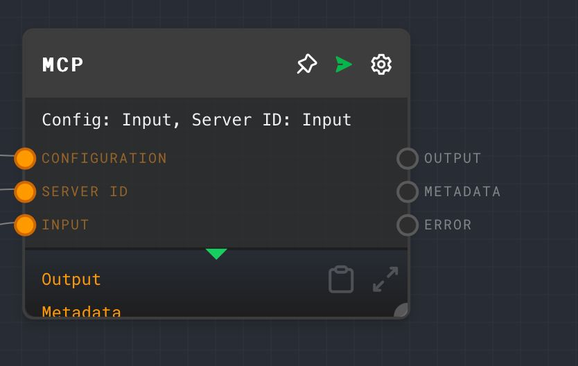

import Tabs from '@theme/Tabs';
import TabItem from '@theme/TabItem';



## Overview

The Model Context Protocol (MCP) Node enables communication with MCP-compliant servers through either HTTP or stdio interfaces. It allows you to send requests to external AI services or tools that implement the MCP protocol.

The MCP Node supports two communication modes:

1. **HTTP Mode**: Uses standard HTTP POST requests to communicate with MCP servers. Works in both browser and Node environments.
2. **STDIO Mode**: Launches and communicates with local MCP servers using standard input/output. **Requires Node Executor**.

<Tabs
  defaultValue="inputs"
  values={[
    {label: 'Inputs', value: 'inputs'},
    {label: 'Outputs', value: 'outputs'},
    {label: 'Editor Settings', value: 'settings'},
  ]
}>

<TabItem value="inputs">

## Inputs

| Title         | Data Type | Description                                | Default Value | Notes                                                                 |
| ------------- | --------- | ------------------------------------------ | ------------- | --------------------------------------------------------------------- |
| Input         | `object`  | The input object to send to the MCP server | None          | Required. Format depends on the MCP server's expected input format    |
| Configuration | `string`  | JSON configuration for the MCP server      | None          | Only available when using STDIO mode with Configuration Input enabled |
| Server ID     | `string`  | The MCP server ID from configuration       | None          | Only available when using STDIO mode with Configuration Input enabled |
| Endpoint      | `string`  | The endpoint URL for the MCP server        | None          | Only available when using HTTP mode with Endpoint Input enabled       |
| Headers       | `object`  | Headers to send with requests              | None          | Only available when using HTTP mode with Headers Input enabled        |

</TabItem>

<TabItem value="outputs">

## Outputs

| Title    | Data Type | Description                                      | Notes                                             |
| -------- | --------- | ------------------------------------------------ | ------------------------------------------------- |
| Output   | `string`  | The response from the MCP server as a string     | The primary output from the MCP server            |
| Metadata | `object`  | Additional metadata from the MCP server response | Contains metadata and available tools information |
| Error    | `string`  | Error message if the request fails               | Empty if the request succeeds                     |

</TabItem>

<TabItem value="settings">

## Editor Settings

| Setting                                | Description                                                   | Default Value         | Use Input Toggle | Input Data Type |
| -------------------------------------- | ------------------------------------------------------------- | --------------------- | ---------------- | --------------- |
| Communication Mode                     | The mode of communication with the MCP server (HTTP or STDIO) | HTTP                  | No               | N/A             |
| Endpoint                               | The endpoint URL for the MCP server                           | http://localhost:8080 | Yes              | `string`        |
| Headers                                | Headers to send with HTTP requests                            | []                    | Yes              | `object`        |
| Use Configuration and Server ID Inputs | Whether to use inputs for configuration and server ID         | False                 | No               | N/A             |
| Server ID                              | The MCP server ID from configuration                          | (empty)               | No               | N/A             |

</TabItem>

</Tabs>

## Configuration

### Setting up MCP Servers (for STDIO mode)

Create a configuration file in your OS-specific location:

- **MacOS**: `~/Library/Application Support/com.ironcladapp.rivet/mcp-config.json`
- **Windows**: `%APPDATA%/com.ironcladapp.rivet/mcp-config.json`
- **Linux**: `~/.local/share/com.ironcladapp.rivet/mcp-config.json`

Example configuration:

```json
{
  "mcpServers": {
    "mongodb": {
      "command": "/path/to/node",
      "args": [
        "--experimental-modules",
        "--es-module-specifier-resolution=node",
        "/path/to/mcp-mongo-server/build/index.js",
        "mongodb://localhost:27017/your-database"
      ]
    }
  }
}
```

## Example 1: Using SSE Mode

1. Add an MCP Node to your graph
2. Set "Communication Mode" to "HTTP"
3. Set "Endpoint" to your MCP server URL (e.g., `http://localhost:8080`)
4. Create an [Object Node](./object.mdx) with your input data:

```json
{
  "toolName": "your_tool",
  "args": {
    "param1": "value1",
    "param2": "value2"
  }
}
```

5. Connect the Object Node to the "Input" port of the MCP Node
6. Run the graph to see the response from the MCP server

## Example 2: Using STDIO Mode with MongoDB Server

1. First, ensure you have set up the MongoDB MCP server and configured it in `mcp-config.json`
2. Enable Node Executor in Rivet (top-right menu)
3. Add an MCP Node to your graph
4. Set "Communication Mode" to "STDIO"
5. Set "Server ID" to "mongodb" (or your configured server ID)
6. Create an [Object Node](./object.mdx) with a query:

```json
{
  "toolName": "query",
  "args": {
    "filter": {},
    "collection": "users"
  }
}
```

7. Connect the Object Node to the "Input" port of the MCP Node
8. Run the graph to see the query results

## Example 3: Using Configuration and Server ID Inputs

1. Enable Node Executor in Rivet
2. Add an MCP Node to your graph
3. Set "Communication Mode" to "STDIO"
4. Enable "Use Configuration and Server ID Inputs"
5. Create a [Text Node](./text.mdx) with your server ID (e.g., "mongodb")
6. Create another [Text Node](./text.mdx) with your configuration JSON:

```json
{
  "mcpServers": {
    "mongodb": {
      "command": "/path/to/node",
      "args": ["/path/to/mcp-mongo-server/build/index.js", "mongodb://localhost:27017/your-database"]
    }
  }
}
```

7. Create an [Object Node](./object.mdx) with your input data
8. Connect the nodes to the appropriate inputs of the MCP Node
9. Run the graph to see the response

## Tool Discovery

When using STDIO mode with Node Executor enabled, the MCP Node will automatically discover available tools from the server and display the number of available tools in the node.

To list available tools, send this input:

```json
{
  "toolName": "get_tools",
  "args": {}
}
```

## Error Handling

The MCP Node provides detailed error handling with specific error types:

- `CONFIG_NOT_FOUND`: MCP configuration file not found
- `SERVER_NOT_FOUND`: Specified server ID not found in configuration
- `SERVER_DISABLED`: Server is disabled in configuration
- `SERVER_START_FAILED`: Failed to start the server process
- `SERVER_COMMUNICATION_FAILED`: Failed to communicate with the server
- `INVALID_RESPONSE`: Invalid response from the server
- `HTTP_ERROR`: HTTP error when making a request
- `UNKNOWN_ERROR`: Unknown error occurred

## Troubleshooting

**STDIO Server Not Found**

- Check `mcp-config.json` location and format
- Verify file permissions
- Ensure absolute paths in configuration

**HTTP Connection Failed**

- Verify server URL
- Check CORS settings
- Confirm network connectivity

**Node Executor Issues**

- Enable Node executor in Rivet settings
- Verify Node.js installation
- Check server executable permissions

## FAQ

**Q: Can I use the MCP Node in the browser executor?**

A: Yes, but only in HTTP mode. STDIO mode requires the Node Executor.

**Q: How do I handle authentication with MCP servers?**

A: For HTTP mode, you can add authentication headers. For STDIO mode, authentication details should be included in your server configuration.

**Q: Can I use multiple MCP servers in the same graph?**

A: Yes, you can add multiple MCP Nodes, each configured to communicate with a different server.

**Q: What is the format of the input expected by the MCP Node?**

A: The input should be an object with at least a `toolName` property and an `args` property containing the arguments for the tool.

## See Also

- [HTTP Call Node](./http-call.mdx)
- [Object Node](./object.mdx)
- [Text Node](./text.mdx)
- [To JSON Node](./to-json.mdx)
- [Extract JSON Node](./extract-json.mdx)
