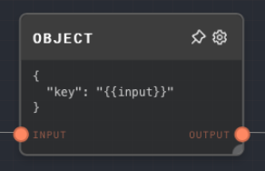
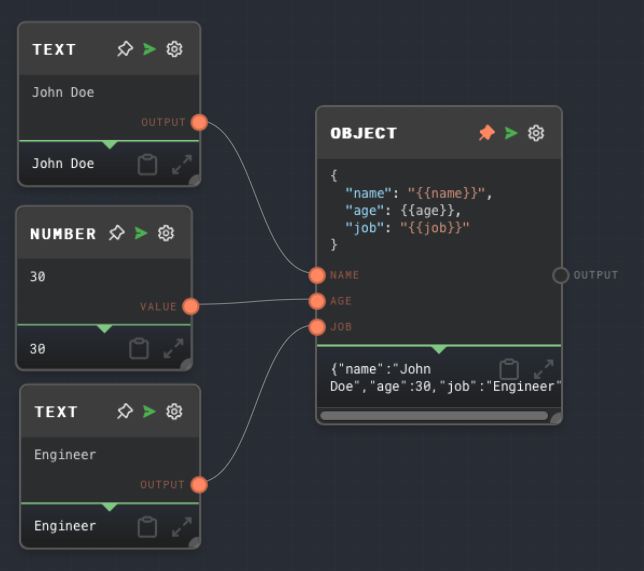

import Tabs from '@theme/Tabs';
import TabItem from '@theme/TabItem';



## Overview

The Object Node allows you to create an object from input values and a JSON template. The node automatically escapes the input values and inserts them into the template.

This node is particularly useful for creating objects from multiple inputs. It supports any data type as input and outputs an object.

<Tabs
  defaultValue="inputs"
  values={[
    {label: 'Inputs', value: 'inputs'},
    {label: 'Outputs', value: 'outputs'},
    {label: 'Editor Settings', value: 'settings'},
  ]
}>

<TabItem value="inputs">

## Inputs

| Title     | Data Type | Description                                                                                        | Default Value | Notes                                                                                                                |
| --------- | --------- | -------------------------------------------------------------------------------------------------- | ------------- | -------------------------------------------------------------------------------------------------------------------- |
| (Dynamic) | `any`     | The input values to be inserted into the JSON template. The input names are dynamically generated. | N/A           | The input will be coerced into a string if it is not a string. The input names are extracted from the JSON template. |

</TabItem>

<TabItem value="outputs">

## Outputs

| Title  | Data Type | Description                                                     | Notes |
| ------ | --------- | --------------------------------------------------------------- | ----- |
| Output | `object`  | The object created from the input values and the JSON template. |       |

</TabItem>

<TabItem value="settings">

## Editor Settings

| Setting       | Description                                                                                         | Default Value            | Use Input Toggle | Input Data Type |
| ------------- | --------------------------------------------------------------------------------------------------- | ------------------------ | ---------------- | --------------- |
| JSON Template | The JSON template to be used for creating the object. Input values are inserted into this template. | `{ "key": "{{input}}" }` | No               | `string`        |

</TabItem>

</Tabs>

## Example 1: Creating an object from multiple inputs

1. Create an Object Node and set the JSON Template to the following:

   ```json
   {
     "name": "{{name}}",
     "age": {{age}},
     "job": "{{job}}"
   }
   ```

2. Create two Text Nodes and set their values to `John Doe` and `Engineer` respectively. Connect them to the `name` and `job` inputs of the Object Node.
3. Create a Number Node and set its value to `30`. Connect it to the `age` input of the Object Node.
4. Run the graph. The `Output` of the Object Node should be the following object:

   ```json
   {
     "name": "John Doe",
     "age": 30,
     "job": "Engineer"
   }
   ```



## Error Handling

The Object Node will error if the JSON Template is not a valid JSON string or if the interpolated JSON string (after inserting the input values) is not a valid JSON string.

## FAQ

**Q: Can I use the Object Node to create an array?**

A: Yes, you can use the Object Node to create an array by setting the JSON Template to a valid JSON array string. For example:

```json
["{{value1}}", "{{value2}}", "{{value3}}"]
```

**Q: How are the input values escaped?**

A: The input values are automatically escaped by the Object Node. If the input value is a string, it is escaped using `JSON.stringify()`. If the input value is not a string, it is first converted to a string using `JSON.stringify()` and then escaped.

## See Also

- [Array Node](./array.mdx)
- [Text Node](./text.mdx)
- [Extract Object Path Node](./extract-object-path.mdx)
- [Extract JSON Node](./extract-json.mdx)
- [Extract YAML Node](./extract-yaml.mdx)
- [To JSON Node](./to-json.mdx)
- [Code Node](./code.mdx)
