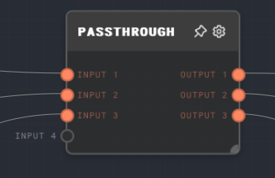

import Tabs from '@theme/Tabs';
import TabItem from '@theme/TabItem';

## Overview

The Passthrough Node is a simple node that passes the input value to the output without any modifications. This node can be useful in scenarios where you want to pass a value through a certain path in your graph without altering it, such as grouping together values from different branches of your graph, or controlling how wires flow through your graph.

<Tabs
  defaultValue="inputs"
  values={[
    {label: 'Inputs', value: 'inputs'},
    {label: 'Outputs', value: 'outputs'},
    {label: 'Editor Settings', value: 'settings'},
  ]
}>

<TabItem value="inputs">

## Inputs

| Title     | Data Type | Description                        | Default Value | Notes                                                            |
| --------- | --------- | ---------------------------------- | ------------- | ---------------------------------------------------------------- |
| Input [i] | `any`     | The ith input to be passed through | N/A           | Dynamic number of inputs based on how many connections there are |

</TabItem>

<TabItem value="outputs">

## Outputs

| Title      | Data Type | Description                         | Notes                                                             |
| ---------- | --------- | ----------------------------------- | ----------------------------------------------------------------- |
| Output [i] | `any`     | The ith output from the passthrough | Dynamic number of outputs based on how many connections there are |

</TabItem>

<TabItem value="settings">

## Editor Settings

This node does not have any specific settings.

</TabItem>

</Tabs>

## Error Handling

The Passthrough Node does not have any error handling. If an input is missing or null, the corresponding output will also be missing or null.

## FAQ

**Q: What happens if an input is missing or null?**

A: If an input is missing or null, the corresponding output will also be missing or null.

## See Also

- [If Node](./if.mdx)
- [Match Node](./match.mdx)
- [Coalesce Node](./coalesce.mdx)
- [Race Inputs Node](./race-inputs.mdx)
