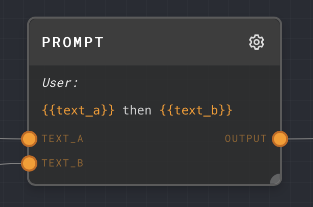
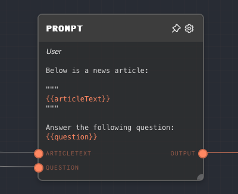

import Tabs from '@theme/Tabs';
import TabItem from '@theme/TabItem';

## Overview

The Prompt Node is used to create a chat message, which is a string of text with an attached "type" indicating who sent the message (User, Assistant, System) and optionally an attached "name".

The Prompt Node also provides the same interpolation capabilities as a [Text Node](./text.mdx), allowing you to dynamically insert values into the message.

This node can also compute a token count for the generated chat message, which can be useful for things like switching the LLM used based on the size of a message.

A useful pattern is to use the default message `{{input}}` to convert any text into a prompt message.

<Tabs
  defaultValue="inputs"
  values={[
    {label: 'Inputs', value: 'inputs'},
    {label: 'Outputs', value: 'outputs'},
    {label: 'Editor Settings', value: 'settings'},
  ]
}>

<TabItem value="inputs">

## Inputs

| Title          | Data Type | Description                                                                                                                       | Default Value | Notes                                                                                                                     |
| -------------- | --------- | --------------------------------------------------------------------------------------------------------------------------------- | ------------- | ------------------------------------------------------------------------------------------------------------------------- |
| Function Call  | `object`  | An optional input that can be used to attach a function call to the chat message.                                                 | (empty)       | This input is only available if `Enable Function Call` is enabled.                                                        |
| Type           | `string`  | The type of the chat message. This input is only available if `Use Type Input` is enabled.                                        | (empty)       | The input will be coerced into a string if it is not a string.                                                            |
| Name           | `string`  | The name to attach to the chat message. This input is only available if `Use Name Input` is enabled.                              | (empty)       | The input will be coerced into a string if it is not a string.                                                            |
| (custom names) | `string`  | The values to be interpolated into the prompt text. The names of these inputs are dynamically generated based on the prompt text. | (empty)       | The input will be coerced into a string if it is not a string. Each input creates a corresponding input port on the node. |

</TabItem>

<TabItem value="outputs">

## Outputs

| Title       | Data Type      | Description                                                                                                            | Notes                                                                                                       |
| ----------- | -------------- | ---------------------------------------------------------------------------------------------------------------------- | ----------------------------------------------------------------------------------------------------------- |
| Output      | `chat-message` | The generated chat message.                                                                                            | The output will be a chat message containing the interpolated prompt text, the type, and the optional name. |
| Token Count | `number`       | The number of tokens in the generated chat message. This output is only available if `Compute Token Count` is enabled. | The output will be a number representing the number of tokens in the chat message.                          |

</TabItem>

<TabItem value="settings">

## Editor Settings

| Setting              | Description                                                                                                                                                                                                                                 | Default Value | Use Input Toggle | Input Data Type |
| -------------------- | ------------------------------------------------------------------------------------------------------------------------------------------------------------------------------------------------------------------------------------------- | ------------- | ---------------- | --------------- |
| Type                 | The type of the chat message. Can be one of the following: `system`, `user`, `assistant`, `function`.                                                                                                                                       | `user`        | Yes              | `string`        |
| Name                 | The name to attach to the chat message.                                                                                                                                                                                                     | (empty)       | Yes              | `string`        |
| Enable Function Call | If enabled, a `Function Call` input port will be added to the node, allowing you to attach a function call to the chat message.                                                                                                             | False         | No               | N/A             |
| Compute Token Count  | If enabled, a `Token Count` output port will be added to the node, allowing you to compute the number of tokens in the chat message. This can be useful for keeping track of the total number of tokens used in a conversation with an LLM. | False         | No               | N/A             |
| Prompt Text          | The text of the chat message. You can use `{{input}}` to dynamically insert values into the message.                                                                                                                                        | `{{input}}`   | No               | `string`        |

</TabItem>

</Tabs>

## Example 1: Generate a chat message with interpolation

1. Create a Prompt Node.
2. Set the `Type` to `user`.
3. Set the `Prompt Text` to `Hello, {{name}}!`.
4. Create a Text Node and set the text to `John Doe`.
5. Connect the Text Node to the `name` input of the Prompt Node.
6. Run the graph. The `Output` of the Prompt Node should be a chat message with the type `user` and the message `Hello, John Doe!`.

## Example 2: Convert an LLM response into an Assistant message

1. Create a Prompt Node. Leave the content as the default `{{input}}`. Set the `Type` to `assistant`.
2. Create a Chat Node and connect its `Output` to the `input` of the Prompt Node.
3. Give the LLM a prompt text and run the graph. You should see the LLM response as an Assistant message in the Prompt Node.

## Error Handling

The Prompt Node will error if the `Prompt Text` is not provided or if the `Type` is not one of the allowed types (`system`, `user`, `assistant`, `function`).

## FAQ

**Q: Can I use the Prompt Node to generate a chat message with a function call?**

A: Yes, you can use the `Function Call` input to attach a function call to the chat message. This is useful for simulating function calls that the LLM has executed in the past. See the [GPT Function](./gpt-function.mdx) node for more information.

## See Also

- [Chat Node](./chat.mdx)
- [Text Node](./text.mdx)
- [GPT Function Node](./gpt-function.mdx)
