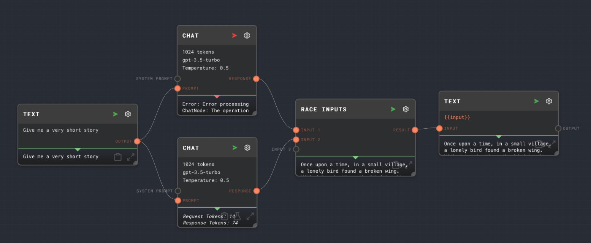

import Tabs from '@theme/Tabs';
import TabItem from '@theme/TabItem';

## Overview

The race inputs node takes two

<Tabs
  defaultValue="inputs"
  values={[
    {label: 'Inputs', value: 'inputs'},
    {label: 'Outputs', value: 'outputs'},
    {label: 'Editor Settings', value: 'settings'},
  ]
}>

<TabItem value="inputs">

## Inputs

| Title   | Data Type | Description                | Default Value | Notes                                                                                     |
| ------- | --------- | -------------------------- | ------------- | ----------------------------------------------------------------------------------------- |
| Input N | any       | One of the inputs to race. | N/A           | The number of inputs is dynamic, and is always 1 more than the number of connected wires. |

</TabItem>

<TabItem value="outputs">

## Outputs

| Title  | Data Type                          | Description                         | Notes |
| ------ | ---------------------------------- | ----------------------------------- | ----- |
| Output | The same as the winner of the race | The value of the winner of the race |       |

</TabItem>

<TabItem value="settings">

## Editor Settings

The race inputs node has no settings.

</TabItem>

</Tabs>

### Example 1: Fastest Story Wins

The following is a simple example of the Race Inputs Node - two Chat nodes are given the task to write a very short story. Once one of them passes its
story to race inputs, then the other branch will be canceled.

## See Also

- [Coalesce](./coalesce.mdx)
