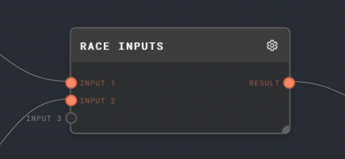
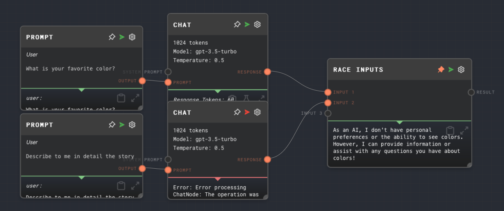

import Tabs from '@theme/Tabs';
import TabItem from '@theme/TabItem';

## Overview

The Race Inputs Node is used to handle multiple inputs and outputs the value of the first input to finish, force-cancelling the other inputs. This node is particularly useful when you have multiple operations such as [Chat Node](./chat.mdx) calls that can potentially fulfill the same requirement, and you want to use the result of the operation that finishes first.

<Tabs
  defaultValue="inputs"
  values={[
    {label: 'Inputs', value: 'inputs'},
    {label: 'Outputs', value: 'outputs'},
    {label: 'Editor Settings', value: 'settings'},
  ]
}>

<TabItem value="inputs">

## Inputs

| Title     | Data Type | Description                                                                                   | Default Value | Notes                                                            |
| --------- | --------- | --------------------------------------------------------------------------------------------- | ------------- | ---------------------------------------------------------------- |
| Input [i] | `any`     | The ith input to be raced. The number of inputs is dynamic based on the number of connections | N/A           | Dynamic number of inputs based on how many connections there are |

</TabItem>

<TabItem value="outputs">

## Outputs

| Title  | Data Type | Description                                                                  | Notes                                                                          |
| ------ | --------- | ---------------------------------------------------------------------------- | ------------------------------------------------------------------------------ |
| Result | `any`     | The value of the first input to finish. If no inputs finish, will not be ran | If no inputs finish, this output will not be ran, and the node will not error. |

</TabItem>

<TabItem value="settings">

## Editor Settings

This node has no configurable editor settings.

</TabItem>

</Tabs>

## Example 1: Race two Chats

1. Create a new graph, and add two [Chat Nodes](./chat.mdx) to the graph.
2. Create a [Prompt Node](./prompt.mdx), and give it a prompt message that will be answered in a short time, such as "What is your favorite color?". Connect it to the `Prompt` input of the first Chat Node.
3. Create another Prompt Node, and give it a prompt message that will take a much longer time, such as "Describe to me in detail the story of Hamlet." Connect it to the `Prompt` input of the second Chat Node.
4. Connect both outputs of the Chat Nodes to a Race Inputs node.
5. Run the graph. Notice that the first Chat finishes first, and the value of the Race Inputs node is the response from the first Chat Node. The other Chat Node gets canceled.

## Error Handling

The Race Inputs Node will not error if none of the inputs finish. Instead, the `Result` output will not be ran.

## FAQ

**Q: What happens if none of the inputs finish?**

A: If none of the inputs finish, the Race Inputs Node will not error. Instead, the `Result` output will not be ran.

**Q: Can I use the Race Inputs Node with inputs of different data types?**

A: Yes, the Race Inputs Node can handle inputs of any data type.

**Q: What happens if one of the inputs errors?**

A: If one of the inputs errors, the Race Inputs Node will not be affected. It will still output the value of the first input to finish, regardless of whether other inputs error.

## See Also

- [HTTP Call Node](./http-call.mdx)
- [If Node](./if.mdx)
- [Match Node](./match.mdx)
- [Coalesce Node](./coalesce.mdx)
