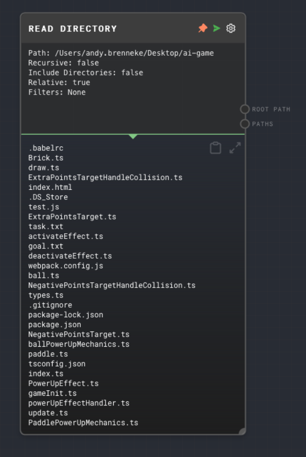

import Tabs from '@theme/Tabs';
import TabItem from '@theme/TabItem';

## Overview

The Read Directory Node reads the contents of a specified directory and outputs an array of filenames. The node can also be configured to read directories recursively, include directories in the output, filter the filenames, return relative paths, and ignore certain files or directories.

If you are using the Rivet SDK, this node requires a native API to be available in the context when the graph is being run. The native API is responsible for providing the functionality to read the contents of a directory.

<Tabs
  defaultValue="inputs"
  values={[
    {label: 'Inputs', value: 'inputs'},
    {label: 'Outputs', value: 'outputs'},
    {label: 'Editor Settings', value: 'settings'},
  ]
}>

<TabItem value="inputs">

## Inputs

The only inputs for the Read Directory node are toggleable Editor Settings. See that section for possible inputs.

</TabItem>

<TabItem value="outputs">

## Outputs

| Title     | Data Type  | Description                                       | Notes                                                                                                                                      |
| --------- | ---------- | ------------------------------------------------- | ------------------------------------------------------------------------------------------------------------------------------------------ |
| Paths     | `string[]` | An array of filenames in the specified directory. | If the directory does not exist or is not accessible, the output will be an array with one element containing the string `(no such path)`. |
| Root Path | `string`   | The path of the directory that was read.          | The output will be the same as the Path input or the Path specified in the settings.                                                       |

</TabItem>

<TabItem value="settings">

## Editor Settings

| Setting             | Description                                                                                                                                                      | Default Value | Use Input Toggle | Input Data Type |
| ------------------- | ---------------------------------------------------------------------------------------------------------------------------------------------------------------- | ------------- | ---------------- | --------------- |
| Path                | The path of the directory to read.                                                                                                                               | (required)    | Yes              | `string`        |
| Recursive           | If enabled, the node will read directories recursively.                                                                                                          | `false`       | Yes              | `boolean`       |
| Include Directories | If enabled, the node will include directories in the output.                                                                                                     | `false`       | Yes              | `boolean`       |
| Filter Globs        | An array of glob patterns to filter the filenames, comma-separated.                                                                                              | `[]`          | Yes              | `string[]`      |
| Relative            | If enabled, the node will return relative paths.                                                                                                                 | `false`       | Yes              | `boolean`       |
| Ignores             | An array of glob patterns to ignore certain files or directories, comma-separated. For example, to filter out `node_modules`, you can do `**/node_modules/**/*`. | `[]`          | Yes              | `string[]`      |

</TabItem>

</Tabs>

## Example 1: Read the contents of a directory

1. Create a Read Directory Node and set the `Path` to the directory you want to read.
2. Run the graph. The `Paths` output of the Read Directory Node should contain an array of filenames in the specified directory.

## Error Handling

The Read Directory Node will error if the native API is not available in the context when the graph is being run. It will also error if the `Path` input is not provided.

If the directory does not exist or is not accessible, the `Paths` output will be an array with one element containing the string `(no such path)`.

## FAQ

**Q: What is a native API?**

A: A native API is an object that is responsible for providing native functionality to nodes. It is passed to the context when the graph is being run. The native API must implement the `NativeApi` interface, which includes methods for reading directories, reading and writing files, and other native operations. See the [API Reference](../api-reference.md) for more information.

**Q: Can I read directories recursively?**

A: Yes, you can set the `Recursive` input or setting to `true` to read directories recursively.

**Q: What does it mean to include directories in the output?**

A: If the `Include Directories` input or setting is set to `true`, the `Paths` output will contain directory names in addition to filenames. For example, if the `Path` input is set to `/Users/username/Documents`, the `Paths` output will contain filenames like `file.txt` and directory names like `subdirectory` and `subdirectory2`.

**Q: How to I filter or ignore using globs?**

A: Glob patterns are a way to filter filenames using wildcards. For example, to filter out all `.txt` files, you can do `**/*.txt`. To filter out all files in a `node_modules` directory, you can do `**/node_modules/**/*`.

**Q: What does it mean to return relative paths?**

A: If the `Relative` input or setting is set to `true`, the `Paths` output will contain relative paths instead of absolute paths. For example, if the `Path` input is set to `/Users/username/Documents`, the `Paths` output will contain filenames like `file.txt` instead of `/Users/username/Documents/file.txt`.

## See Also

- [Read File Node](./read-file.mdx)
