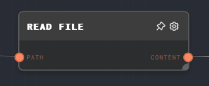
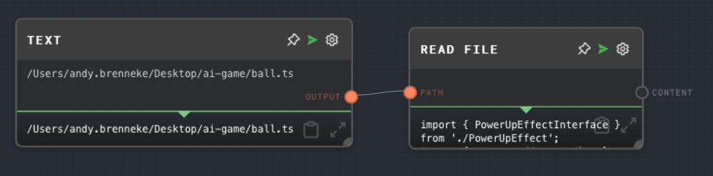

import Tabs from '@theme/Tabs';
import TabItem from '@theme/TabItem';

## Overview

The Read File Node is used to read the contents of a specified file from the file system and output it as a string.

If you are using the Rivet SDK, this node requires a native API to be available in the context when the graph is being run. The native API is responsible for providing the functionality to read the contents of a directory.

<Tabs
  defaultValue="inputs"
  values={[
    {label: 'Inputs', value: 'inputs'},
    {label: 'Outputs', value: 'outputs'},
    {label: 'Editor Settings', value: 'settings'},
  ]
}>

<TabItem value="inputs">

## Inputs

| Title | Data Type | Description                                                                                            | Default Value | Notes                                                          |
| ----- | --------- | ------------------------------------------------------------------------------------------------------ | ------------- | -------------------------------------------------------------- |
| Path  | `string`  | The path of the file to read. This input is only available if `Use Path Input` is enabled in settings. | N/A           | The input will be coerced into a string if it is not a string. |

</TabItem>

<TabItem value="outputs">

## Outputs

| Title   | Data Type | Description                                            | Notes                                                                                                    |
| ------- | --------- | ------------------------------------------------------ | -------------------------------------------------------------------------------------------------------- |
| Content | `string`  | The contents of the file read from the specified path. | If the file does not exist and `Error On Missing File` is disabled, this output will be an empty string. |

</TabItem>

<TabItem value="settings">

## Editor Settings

| Setting               | Description                                                                                                                               | Default Value | Use Input Toggle | Input Data Type |
| --------------------- | ----------------------------------------------------------------------------------------------------------------------------------------- | ------------- | ---------------- | --------------- |
| Path                  | The path of the file to read.                                                                                                             | (required)    | Yes              | `string`        |
| Use Path Input        | If enabled, the path can be provided via the Path input port.                                                                             | False         | No               | N/A             |
| Error On Missing File | If enabled, the node will error if the file does not exist. If disabled, the node will output an empty string if the file does not exist. | False         | No               | N/A             |

</TabItem>

</Tabs>

## Example 1: Read a file from a specified path

1. Create a Read File Node and set the `Path` to the path of the file you want to read.
2. Run the graph. The `Content` output of the Read File Node should contain the contents of the file.

## Example 2: Read a file from a dynamic path

1. Create a [Text Node](./text.mdx) and set the text to the path of the file you want to read.
2. Create a Read File Node and enable the `Use Path Input` setting.
3. Connect the Text Node to the `Path` input of the Read File Node.
4. Run the graph. The `Content` output of the Read File Node should contain the contents of the file.

## Error Handling

The Read File Node will error if the native API is not available in the context when the graph is being run. It will also error if the file does not exist and the `Error On Missing File` setting is enabled. If the file does not exist and the `Error On Missing File` setting is disabled, the node will output an empty string.

## FAQ

**Q: What is a native API?**

A: A native API is an object that is responsible for providing native functionality to nodes. It is passed to the context when the graph is being run. The native API must implement the `NativeApi` interface, which includes methods for reading directories, reading and writing files, and other native operations. See the [API Reference](../api-reference.md) for more information.

**Q: Can I read a file from a URL?**

A: No, the Read File Node can only read files from the local file system. If you want to read a file from a URL, you can use the [HTTP Call Node](./http-call.mdx) to make a GET request to the URL.

**Q: Can I read a file in a different format, like CSV or XML?**

A: The Read File Node will always output the contents of the file as a string. If you want to parse the contents of the file, you can use other nodes like the [Extract JSON](./extract-json.mdx), [Extract YAML](./extract-yaml.mdx), and the [Code Node](./code.mdx) to parse the contents of the file.

## See Also

- [HTTP Call Node](./http-call.mdx)
- [Text Node](./text.mdx)
