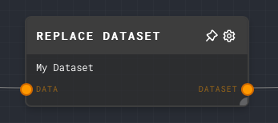
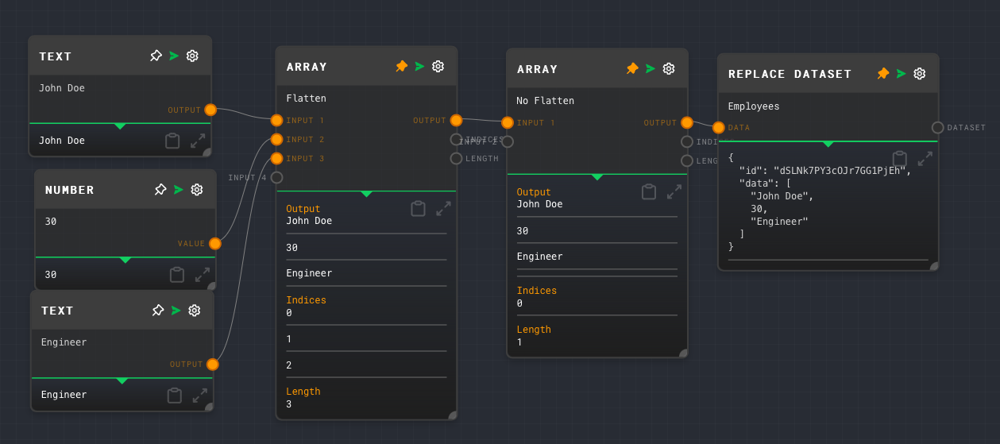

import Tabs from '@theme/Tabs';
import TabItem from '@theme/TabItem';

## Overview

The Replace Dataset Node is used to either replace all of the data in a dataset in with new data, or to clear the data in a dataset, during graph execution.

The node requires a dataset provider to be available in the context when the graph is being run. The dataset provider is responsible for managing the storage and retrieval of datasets. In the Rivet application, the dataset provider is handled for you automatically.

For more information on datasets, see the [Data Studio](../user-guide/features/data-studio.md) section of the user guide.

<Tabs
  defaultValue="inputs"
  values={[
    {label: 'Inputs', value: 'inputs'},
    {label: 'Outputs', value: 'outputs'},
    {label: 'Editor Settings', value: 'settings'},
  ]
}>

<TabItem value="inputs">

## Inputs

| Title      | Data Type  | Description                                                                                                                                                                                                      | Default Value                                               | Notes                                                                        |
| ---------- | ---------- | ---------------------------------------------------------------------------------------------------------------------------------------------------------------------------------------------------------------- | ----------------------------------------------------------- | ---------------------------------------------------------------------------- |
| Data       | `object[]` | The new data of the dataset. If empty, the dataset will be cleared. May be an array of array of strings, or an array of DatasetRow objects with { id, data } properties. If a string[][], IDs will be generated. | (empty)                                                     | The input will be coerced into an object array if it is not an object array. |
| Dataset ID | `string`   | The ID of the dataset to replace. This input is only available if `Use Dataset ID Input` is enabled.                                                                                                             | (required if if the input toggle for Dataset ID is enabled) | The input will be coerced into a string if it is not a string.               |

</TabItem>

<TabItem value="outputs">

## Outputs

| Title   | Data Type  | Description                                                                               | Notes                                                                               |
| ------- | ---------- | ----------------------------------------------------------------------------------------- | ----------------------------------------------------------------------------------- |
| Dataset | `object[]` | The new data of the dataset. An array of DatasetRow objects with { id, data } properties. | The output will be an object containing the ID, data, and embedding of the new row. |

</TabItem>

<TabItem value="settings">

## Editor Settings

| Setting | Description                       | Default Value | Use Input Toggle | Input Data Type |
| ------- | --------------------------------- | ------------- | ---------------- | --------------- |
| Dataset | The ID of the dataset to replace. | (required)    | Yes              | `string`        |

</TabItem>

</Tabs>

## Example 1: Replace data in a dataset

1. In the [Data Studio](../user-guide/features/data-studio.md), create a new dataset with the ID `employees` and add some data to it.
2. Create an [Array Node](./array.mdx) for the first row, and set the values to `["John Doe", "30", "Engineer"]`.
3. Create another Array Node, disable Flattening on it, and connect the first Array Node to it.
4. Create a Replace Dataset Node and set the Dataset to `Employees`.
5. Connect the Array Node to the `Data` input of the Replace Dataset Node.
6. Run the graph. The `Dataset` output of the Replace Dataset Node should contain the new data that replaced the existing data in the `employees` dataset.

## Error Handling

The Replace Dataset Node will error if the dataset provider is not available in the context when the graph is being run.

## FAQ

**Q: What is a dataset provider?**

A: A dataset provider is an object that is responsible for managing the storage and retrieval of datasets. It is passed to the context when the graph is being run. The dataset provider must implement the `DatasetProvider` interface, which includes methods for getting, putting, and deleting datasets. See the [API Reference](../api-reference.md) for more information.

**Q: What happens if the dataset does not exist?**

A: If the dataset does not exist, the Replace Dataset Node will error.

## See Also

- [Append to Dataset Node](./append-to-dataset.mdx)
- [Load Dataset Node](./load-dataset.mdx)
- [Create Dataset Node](./create-dataset.mdx)
- [Get All Datasets Node](./get-all-datasets.mdx)
- [KNN Dataset Node](./knn-dataset.mdx)
- [Get Dataset Row Node](./get-dataset-row.mdx)
