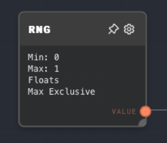
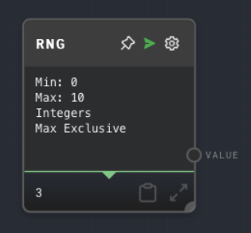
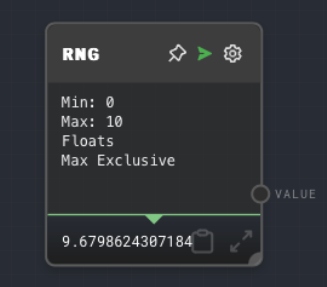

import Tabs from '@theme/Tabs';
import TabItem from '@theme/TabItem';

## Overview

The Random Number Node, also known as RNG, generates a random number within a specified range. This node is useful for creating randomized behavior in your graph.

The node can be configured to generate either integers or floating-point numbers. The range of the random number can be specified with a minimum and maximum value. The maximum value can be set to be either inclusive or exclusive.

<Tabs
  defaultValue="inputs"
  values={[
    {label: 'Inputs', value: 'inputs'},
    {label: 'Outputs', value: 'outputs'},
    {label: 'Editor Settings', value: 'settings'},
  ]
}>

<TabItem value="inputs">

## Inputs

| Title | Data Type | Description                                                                                                                | Default Value | Notes                                                          |
| ----- | --------- | -------------------------------------------------------------------------------------------------------------------------- | ------------- | -------------------------------------------------------------- |
| Min   | `number`  | The minimum value of the random number. This input is only available if `Use Min Input` is enabled in the editor settings. | (optional)    | The input will be coerced into a number if it is not a number. |
| Max   | `number`  | The maximum value of the random number. This input is only available if `Use Max Input` is enabled in the editor settings. | (optional)    | The input will be coerced into a number if it is not a number. |

</TabItem>

<TabItem value="outputs">

## Outputs

| Title | Data Type | Description                  | Notes |
| ----- | --------- | ---------------------------- | ----- |
| Value | `number`  | The generated random number. |       |

</TabItem>

<TabItem value="settings">

## Editor Settings

| Setting       | Description                                                                                                     | Default Value | Use Input Toggle | Input Data Type |
| ------------- | --------------------------------------------------------------------------------------------------------------- | ------------- | ---------------- | --------------- |
| Min           | The minimum value of the random number.                                                                         | 0             | Yes              | `number`        |
| Max           | The maximum value of the random number.                                                                         | 1             | Yes              | `number`        |
| Integers      | If enabled, the node will generate integer numbers. If disabled, the node will generate floating-point numbers. | False         | No               | N/A             |
| Max Inclusive | If enabled, the maximum value will be inclusive. If disabled, the maximum value will be exclusive.              | False         | No               | N/A             |

</TabItem>

</Tabs>

## Example 1: Generate a random integer

1. Create a Random Number Node.
2. Set the `Min` to `1` and the `Max` to `10`.
3. Enable the `Integers` setting.
4. Run the graph. The output of the Random Number Node should be a random integer between 1 and 10.

## Example 2: Generate a random floating-point number

1. Create a Random Number Node.
2. Set the `Min` to `0` and the `Max` to `1`.
3. Disable the `Integers` setting.
4. Run the graph. The output of the Random Number Node should be a random floating-point number between 0 and 1.

## Error Handling

The Random Number Node will error if the `Min` is greater than the `Max`. If the `Min` and `Max` are equal, the node will always output the `Min` value.

## FAQ

**Q: Can I use the Random Number Node to generate a random boolean value?**

A: Yes, you can use the Random Number Node to generate a random boolean value by setting the `Min` to `0`, the `Max` to `1`, and enabling the `Integers` setting. The node will then output either `0` or `1`, which can be interpreted as `false` and `true` by a [Bool Node](./bool.mdx).

**Q: Can I use the Random Number Node to generate a random string?**

A: No, the Random Number Node can only generate random numbers. If you want to generate a random string, you can use a [Code Node](./code.mdx) with a custom JavaScript function.

## See Also

- [Code Node](./code.mdx)
- [Number Node](./number.mdx)
- [Text Node](./text.mdx)
- [Shuffle Node](./shuffle.mdx)
