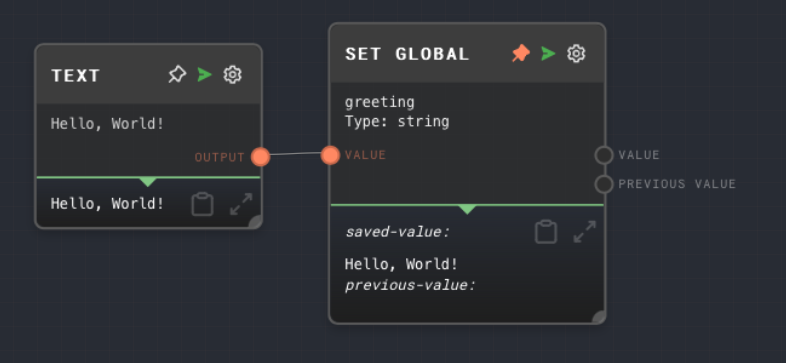

import Tabs from '@theme/Tabs';
import TabItem from '@theme/TabItem';

## Overview

The Set Global Node is used to set a global value that is shared across all graphs and subgraphs during an execution in Rivet. This can be useful for storing and retrieving values that need to be accessed by multiple graphs.

The Set Global Node allows you to specify the ID of the global value and the value itself. The ID can be either a static string or an input value. The value can be of any data type.

<Tabs
  defaultValue="inputs"
  values={[
    {label: 'Inputs', value: 'inputs'},
    {label: 'Outputs', value: 'outputs'},
    {label: 'Editor Settings', value: 'settings'},
  ]
}>

<TabItem value="inputs">

## Inputs

| Title       | Data Type | Description                                                                                          | Default Value | Notes                                                                                                |
| ----------- | --------- | ---------------------------------------------------------------------------------------------------- | ------------- | ---------------------------------------------------------------------------------------------------- |
| Value       | Any       | The value to be set as the global value.                                                             | (required)    | The input will be coerced into the data type specified in the node's settings.                       |
| Variable ID | `string`  | The ID of the global value to be set. This input is only available if `Use Variable ID Input` is on. | (optional)    | The input will be coerced into a string if it is not a string. The ID must be unique in the context. |

</TabItem>

<TabItem value="outputs">

## Outputs

| Title          | Data Type | Description                                                             | Notes                                                                                                                       |
| -------------- | --------- | ----------------------------------------------------------------------- | --------------------------------------------------------------------------------------------------------------------------- |
| Value          | Any       | The value that was set as the global value.                             | The output will be of the same data type as the `Value` input.                                                              |
| Previous Value | Any       | The previous value of the global variable before the new value was set. | The output will be of the same data type as the `Value` input. If there was no previous value, this output will not be ran. |

</TabItem>

<TabItem value="settings">

## Editor Settings

| Setting   | Description                                                                             | Default Value | Use Input Toggle | Input Data Type |
| --------- | --------------------------------------------------------------------------------------- | ------------- | ---------------- | --------------- |
| ID        | The ID of the global value to be set.                                                   | (required)    | Yes              | `string`        |
| Data Type | The data type of the value to be set. This determines how the `Value` input is coerced. | `string`      | No               | N/A             |

</TabItem>

</Tabs>

## Example 1: Set a global value

1. Create a [Text Node](./text.mdx) and set the value to `Hello, World!`.
2. Create a Set Global Node and set the ID to `greeting`.
3. Connect the Text Node to the `Value` input of the Set Global Node.
4. Run the graph. The `Value` output of the Set Global Node should contain the value `Hello, World!`.

## Error Handling

The Set Global Node will error if the `Value` input is not provided or if the ID of the global value is not provided or not unique.

## FAQ

**Q: Can I set a global value to an array or an object?**

A: Yes, you can set a global value to any data type, including arrays and objects. You can use an [Array Node](./array.mdx) or an [Object Node](./object.mdx) to create an array or an object, and then connect it to the `Value` input of the Set Global Node.

## See Also

- [Get Global Node](./get-global.mdx)
- [Text Node](./text.mdx)
- [Array Node](./array.mdx)
- [Object Node](./object.mdx)
