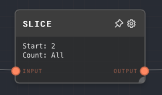
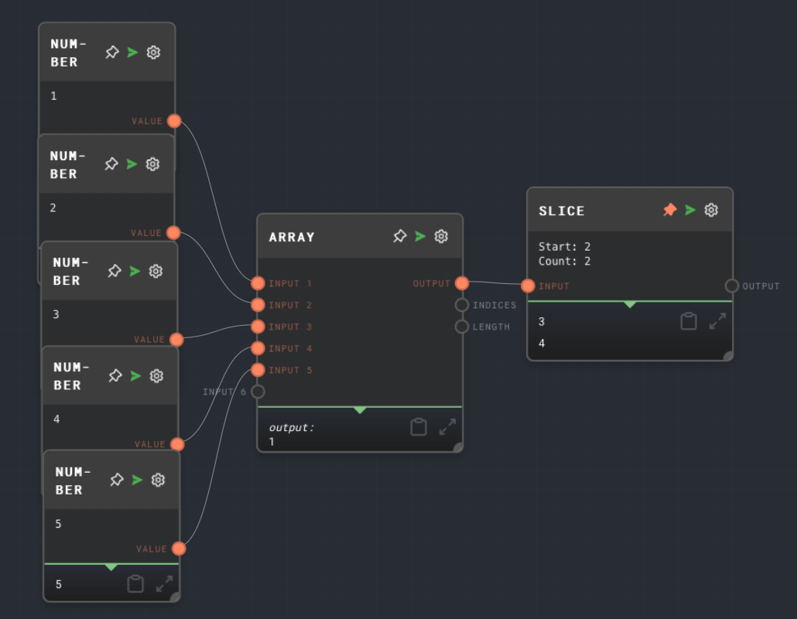

import Tabs from '@theme/Tabs';
import TabItem from '@theme/TabItem';

## Overview

The Slice Node is used to extract a portion of an array. It takes an array as input and outputs a new array that starts at a specified index and contains a specified number of elements.

This node is useful for manipulating arrays, such as extracting a subset of data from a larger dataset.

<Tabs
  defaultValue="inputs"
  values={[
    {label: 'Inputs', value: 'inputs'},
    {label: 'Outputs', value: 'outputs'},
    {label: 'Editor Settings', value: 'settings'},
  ]
}>

<TabItem value="inputs">

## Inputs

| Title | Data Type | Description                                                                                     | Default Value | Notes                                                                                  |
| ----- | --------- | ----------------------------------------------------------------------------------------------- | ------------- | -------------------------------------------------------------------------------------- |
| Input | `any[]`   | The array to be sliced.                                                                         | (required)    | The input will be coerced into an array if it is not an array.                         |
| Start | `number`  | The index at which to start the slice.                                                          | 0             | The input will be coerced into a number if it is not a number.                         |
| Count | `number`  | The number of elements to include in the slice. If not provided, all elements will be included. | (all)         | The input will be coerced into a number if it is not a number. This input is optional. |

</TabItem>

<TabItem value="outputs">

## Outputs

| Title  | Data Type | Description       | Notes                                                                            |
| ------ | --------- | ----------------- | -------------------------------------------------------------------------------- |
| Output | `any[]`   | The sliced array. | The output will be an array containing the sliced elements from the input array. |

</TabItem>

<TabItem value="settings">

## Editor Settings

| Setting | Description                                                                                     | Default Value | Use Input Toggle | Input Data Type |
| ------- | ----------------------------------------------------------------------------------------------- | ------------- | ---------------- | --------------- |
| Start   | The index at which to start the slice. If not provided, the slice will start at the beginning.  | 0             | Yes              | `number`        |
| Count   | The number of elements to include in the slice. If not provided, all elements will be included. | (all)         | Yes              | `number`        |

</TabItem>

</Tabs>

## Example 1: Slice an array

1. Create an [Array Node](./array.mdx) and set the values to `[1, 2, 3, 4, 5]`.
2. Create a Slice Node and set the `Start` to `2` and the `Count` to `2`.
3. Connect the Array Node to the `Input` of the Slice Node.
4. Run the graph. The `Output` of the Slice Node should be `[3, 4]`.

## Error Handling

The Slice Node will error if the `Input` is not provided or is not an array. It will also error if the `Start` or `Count` is not a number.

## FAQ

**Q: What happens if the `Start` is greater than the length of the array?**

A: The Slice Node will return an empty array.

**Q: What happens if the `Count` is greater than the number of elements in the array?**

A: The Slice Node will return all elements from the `Start` to the end of the array.

**Q: Can I use negative numbers for the `Start` and `Count`?**

A: Yes, you can use negative numbers for the `Start` to count from the end of the array. However, using a negative number for the `Count` will result in an error.

## See Also

- [Array Node](./array.mdx)
- [Extract Object Path Node](./extract-object-path.mdx)
- [Code Node](./code.mdx)
- [Split Text Node](./split-text.mdx)
- [Join Node](./join.mdx)
