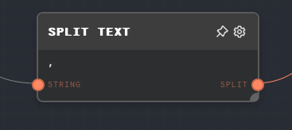
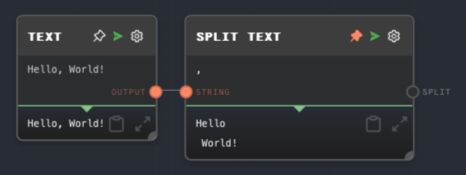
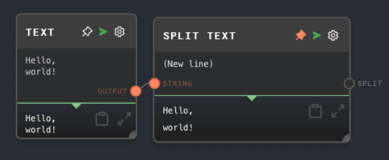

import Tabs from '@theme/Tabs';
import TabItem from '@theme/TabItem';



## Overview

The Split Text Node is used to split a string into an array of substrings based on a specified delimiter. This is useful when you want to separate a string into individual elements for further processing.

The node allows you to specify the delimiter either directly in the node settings or dynamically via an input port. The delimiter can be any string, including special characters like newline (`\n`), tab (`\t`), and space (` `).

When entering special characters such as a new line in the node settings, put the literal character, not the escape sequence. For example, to split a string by a new line, press the Enter key to insert a new line in the node settings.

<Tabs
  defaultValue="inputs"
  values={[
    {label: 'Inputs', value: 'inputs'},
    {label: 'Outputs', value: 'outputs'},
    {label: 'Editor Settings', value: 'settings'},
  ]
}>

<TabItem value="inputs">

## Inputs

| Title     | Data Type | Description                                                                                             | Default Value | Notes                                                          |
| --------- | --------- | ------------------------------------------------------------------------------------------------------- | ------------- | -------------------------------------------------------------- |
| String    | `string`  | The string that should be split.                                                                        | (required)    | The input will be coerced into a string if it is not a string. |
| Delimiter | `string`  | The delimiter to split the string by. This input is only available if `Use Delimiter Input` is enabled. | (empty)       | The input will be coerced into a string if it is not a string. |

</TabItem>

<TabItem value="outputs">

## Outputs

| Title        | Data Type  | Description                                                                                   | Notes |
| ------------ | ---------- | --------------------------------------------------------------------------------------------- | ----- |
| Split String | `string[]` | The array of substrings resulting from splitting the input string by the specified delimiter. |       |

</TabItem>

<TabItem value="settings">

## Editor Settings

| Setting             | Description                                                             | Default Value | Use Input Toggle | Input Data Type |
| ------------------- | ----------------------------------------------------------------------- | ------------- | ---------------- | --------------- |
| Delimiter           | The delimiter to split the string by.                                   | `,`           | Yes              | `string`        |
| Use Delimiter Input | If enabled, the delimiter can be provided via the Delimiter input port. | False         | No               | N/A             |

</TabItem>

</Tabs>

## Example 1: Split a string into words

1. Create a [Text Node](./text.mdx) and set the value to `Hello, world!`.
2. Create a Split Text Node and set the Delimiter to `,`.
3. Connect the Text Node to the `String` input of the Split Text Node.
4. Run the graph. The `Split` output of the Split Text Node should contain the array `["Hello", " world!"]`.



## Example 2: Split a string into lines

1. Create a [Text Node](./text.mdx) and set the value to:

   ```
   Hello,
   world!
   ```

2. Create a Split Text Node and set the Delimiter to `\n`.
3. Connect the Text Node to the `String` input of the Split Text Node.
4. Run the graph. The `Split` output of the Split Text Node should contain the array `["Hello,", "world!"]`.



## Error Handling

The Split Text Node will error if the `String` input is not provided. If the `Delimiter` input or setting is not provided, the node will not split the string and will output the original string as a single-element array.

## FAQ

**Q: Can I split a string by multiple delimiters?**

A: No, the Split Text Node can only split a string by a single delimiter. If you want to split a string by multiple delimiters, you can use multiple Split Text Nodes in sequence.

**Q: Can I split a string by a regular expression?**

A: No, the Split Text Node does not support splitting a string by a regular expression. You can use a [Code Node](./code.mdx) to split a string by a regular expression using JavaScript's `split()` method.

**Q: What happens if the delimiter is not found in the string?**

A: If the delimiter is not found in the string, the Split Text Node will output the original string as a single-element array.

## See Also

- [Join Node](./join.mdx)
- [Text Node](./text.mdx)
- [Code Node](./code.mdx)
- [Array Node](./array.mdx)
- [Extract with Regex Node](./extract-with-regex.mdx)
