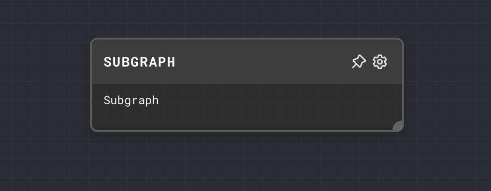
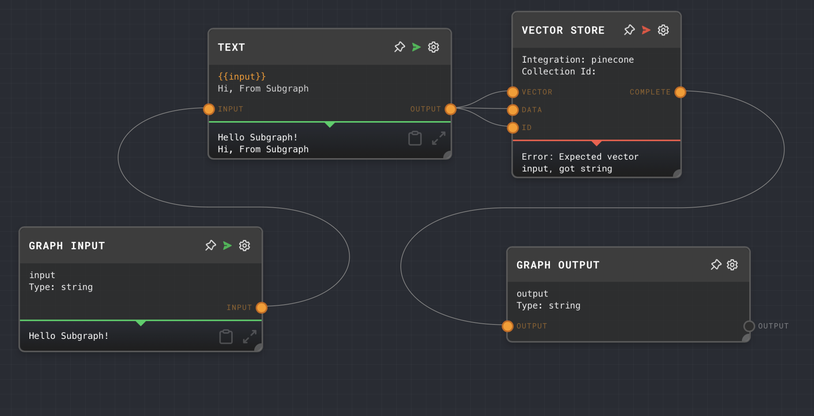
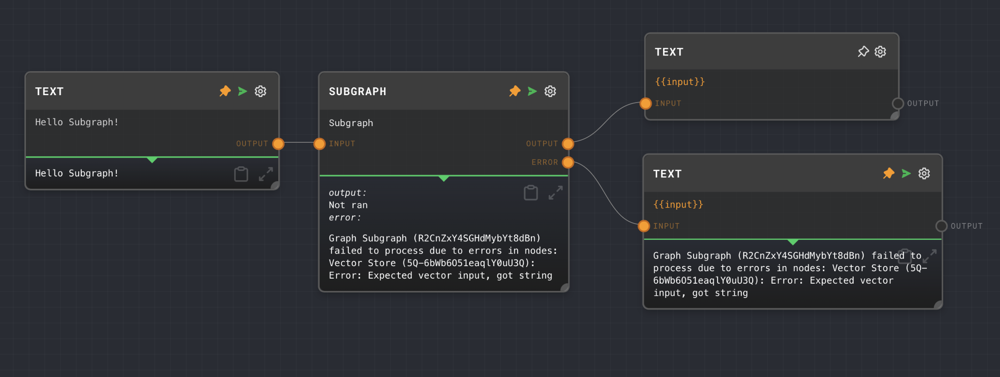

import Tabs from '@theme/Tabs';
import TabItem from '@theme/TabItem';

## Overview

The Subgraph Node allows you to execute another graph within the current graph. This is useful for reusing logic across multiple graphs, or for breaking down complex graphs into smaller, more manageable pieces.

The inputs and outputs of the Subgraph Node are defined by [Graph Input Nodes](./graph-input.mdx) and [Graph Output Nodes](./graph-output.mdx) within the subgraph. The Subgraph Node will automatically update its inputs and outputs to match those of the selected subgraph.

The Subgraph Node also has an optional error output. If enabled, any errors that occur while executing the subgraph will be caught and output from the error output port. If not enabled, errors will cause the entire graph to fail.

<Tabs
  defaultValue="inputs"
  values={[
    {label: 'Inputs', value: 'inputs'},
    {label: 'Outputs', value: 'outputs'},
    {label: 'Editor Settings', value: 'settings'},
  ]
}>

<TabItem value="inputs">

## Inputs

| Title          | Data Type | Description                                                                                        | Default Value | Notes                         |
| -------------- | --------- | -------------------------------------------------------------------------------------------------- | ------------- | ----------------------------- |
| (custom names) | Any       | The input values passed into the subgraph. Dynamic based on the inputs configured in the subgraph. | N/A           | Always accepts any data type. |

</TabItem>

<TabItem value="outputs">

## Outputs

| Title          | Data Type | Description                                                                                                    | Notes                                                                                                              |
| -------------- | --------- | -------------------------------------------------------------------------------------------------------------- | ------------------------------------------------------------------------------------------------------------------ |
| (custom names) | Any       | The output values from the execution of the subgraph. Dynamic based on the outputs configured in the subgraph. | Always accepts any data type.                                                                                      |
| Error          | `string`  | If the subgraph errors, will be populated with the error message.                                              | Only enabled if `Use Error Output` is turned on. If `Use Error Output` is turned off, the node will error instead. |

</TabItem>

<TabItem value="settings">

## Editor Settings

| Setting          | Description                                                                                                                                                                                      | Default Value | Use Input Toggle | Input Data Type |
| ---------------- | ------------------------------------------------------------------------------------------------------------------------------------------------------------------------------------------------ | ------------- | ---------------- | --------------- |
| Graph            | The graph to execute when this node is ran. Must be a graph in the same project.                                                                                                                 | (required)    | No               | N/A             |
| Use Error Output | If enabled, then the Subgraph node will not fail, but instead any error will appear in the `Error` output port of the node. If disabled, the entire Subgraph node will error if the call errors. | False         | No               | N/A             |

</TabItem>

</Tabs>

## Example 1: Reuse a graph in multiple places

1. Create a new graph in your project, and add a [Graph Input Node](./graph-input.mdx) and a [Graph Output Node](./graph-output.mdx) to it. Connect the Graph Input Node to a [Text Node](./text.mdx) and connect that node to Graph Output Node.
2. Update the Text node to have the text `{{input}}
Hi, From Subgraph`.
3. In your main graph, add a Subgraph Node. In the editor settings, set the `Graph` to the graph you created in step 1.
4. Connect a [Text Node](./text.mdx) to the input of the Subgraph Node.
5. Set the Text of the Text Node to `Hello Subgraph!`.
6. Run the graph. Note that the text is passed through the subgraph and back to the main graph with the text from the subgraph appended to it.

## Example 2: Handle errors in a subgraph

1. Using the same graphs from Example 1, in the subgraph add a vector store node.
2. Connect all the outputs from the text node to the vector store node.
3. This will cause the Vector Store Node to Error
4. In your main graph, add a Subgraph Node. In the editor settings enable `Use Error Output`.
5. Connect [Text Nodes](./text.mdx) to both outputs of the Subgraph Node.
6. Run the graph. Note that the error is output on the `Error` port of the Subgraph Node, and the `Output` port is not ran.

## Error Handling

If the subgraph errors, then the Subgraph Node will error. If you want to handle errors in the graph, then you can enable the `Use Error Output` setting. This will cause the Subgraph Node to not error, but instead pass the error message to the `Error` output port. If the `Error` port is populated, then the `Result` port will not be ran. You can use an [If Node](./if.mdx) to check if the `Error` port is populated, and handle the error accordingly.

## FAQ

**Q: Can I use the Subgraph Node to execute a graph in a different project?**

A: No, the Subgraph Node can only execute graphs within the same project.

**Q: Can I use the Subgraph Node to execute a graph in a loop?**

A: Yes, you can use a [Loop Controller Node](./loop-controller.mdx) to execute a Subgraph Node in a loop. Each iteration of the loop will execute the subgraph with the current loop value as an input.

**Q: Can I use the Subgraph Node to execute a graph conditionally?**

A: Yes, you can use an [If Node](./if.mdx) to conditionally execute a Subgraph Node. If the condition is false, the Subgraph Node will not be executed.

## See Also

- [Graph Input Node](./graph-input.mdx)
- [Graph Output Node](./graph-output.mdx)
- [If Node](./if.mdx)
- [Loop Controller Node](./loop-controller.mdx)
- [Text Node](./text.mdx)
