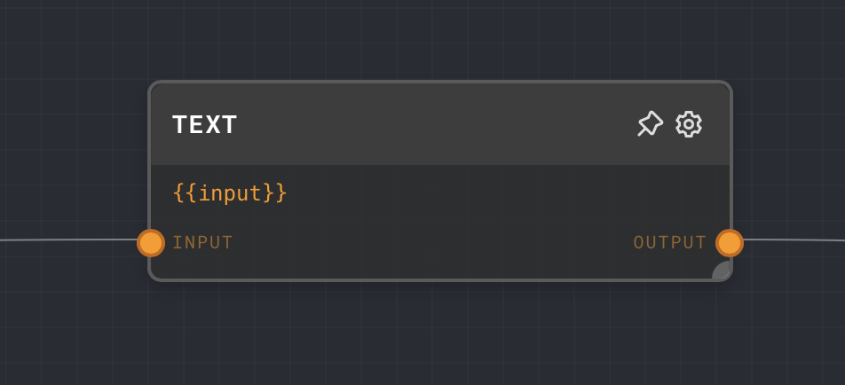
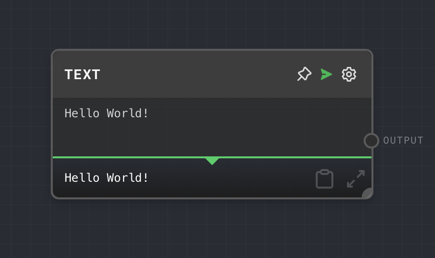
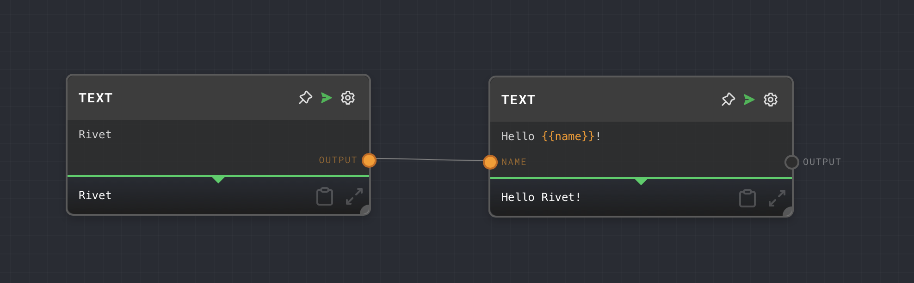

import Tabs from '@theme/Tabs';
import TabItem from '@theme/TabItem';

## Overview

The Text Node is used to output a string of text. It can also interpolate values using `{{tags}}` within the text. The inputs are dynamically generated based on the interpolation tags used in the text.

This node is particularly useful for creating dynamic text based on the inputs to the node. The Text Node supports markdown, so you can use it to create richly formatted text.

<Tabs
  defaultValue="inputs"
  values={[
    {label: 'Inputs', value: 'inputs'},
    {label: 'Outputs', value: 'outputs'},
    {label: 'Editor Settings', value: 'settings'},
  ]
}>

<TabItem value="inputs">

## Inputs

| Title      | Data Type | Description                                                                 | Default Value | Notes                                                                                     |
| ---------- | --------- | --------------------------------------------------------------------------- | ------------- | ----------------------------------------------------------------------------------------- |
| (dynamic)  | `string`  | The inputs are dynamically generated based on the interpolation tags used.  | N/A           | The input names are derived from the interpolation tags used in the text. For example, if the text contains `{{name}}`, then there will be an input named `name`. |

</TabItem>

<TabItem value="outputs">

## Outputs

| Title  | Data Type | Description                         | Notes |
| ------ | --------- | ----------------------------------- | ----- |
| Output | `string`  | The output text after interpolation |       |

</TabItem>

<TabItem value="settings">

## Editor Settings

| Setting | Description                                                                                                           | Default Value | Use Input Toggle | Input Data Type |
| ------- | --------------------------------------------------------------------------------------------------------------------- | ------------- | ---------------- | --------------- |
| Text    | The text to output. You can use interpolation tags in the format `{{tag}}` to insert the values of the inputs. | `{{input}}`   | No               | `string`        |

</TabItem>

</Tabs>

## Example 1: Simple Text Output

1. Create a Text Node.
2. Set the `Text` to `Hello World!`.
3. Run the graph. The output of the Text Node will be `Hello World`.

## Example 2: Interpolation

1. Create a Text Node.
2. Set the `Text` to `Hello, {{name}}!`.
3. Create a [Text Node](./text.mdx) and set the text to `Rivet`. Connect it to the `name` input of the Text Node.
4. Run the graph. The output of the Text Node will be `Hello, Rivet!`.

## Example 3: Using Markdown

1. Create a Text Node.
2. Set the `Text` to `# Hello, {{name}}!`.
3. Create a [Text Node](./text.mdx) and set the text to `Rivet`. Connect it to the `name` input of the Text Node.
4. Run the graph. The output of the Text Node will be `# Hello, Rivet!`.

## Error Handling

The Text Node does not have any notable error handling behavior. If an input is missing or null, the corresponding interpolation tag will be replaced with an empty string.

## FAQ

**Q: Can I use markdown in the Text Node?**

A: Yes, the Text Node supports markdown. You can use markdown syntax in the text to create richly formatted text.

**Q: Can I use the Text Node to create a template?**

A: Yes, you can use the Text Node to create a template by using interpolation tags. You can then connect other nodes to the inputs of the Text Node to fill in the values of the tags.

**Q: Can I use the Text Node to concatenate strings?**

A: Yes, you can use the Text Node to concatenate strings by using interpolation tags. For example, you can set the text to `{{string1}}{{string2}}` to concatenate the values of `string1` and `string2`.

## See Also

- [Code Node](./code.mdx)
- [Number Node](./number.mdx)
- [Boolean Node](./bool.mdx)
- [Object Node](./object.mdx)
- [Array Node](./array.mdx)
- [Extract Object Path Node](./extract-object-path.mdx)
- [Extract with Regex Node](./extract-with-regex.mdx)
- [Extract JSON Node](./extract-json.mdx)
- [Extract YAML Node](./extract-yaml.mdx)
- [To JSON Node](./to-json.mdx)
- [To YAML Node](./to-yaml.mdx)