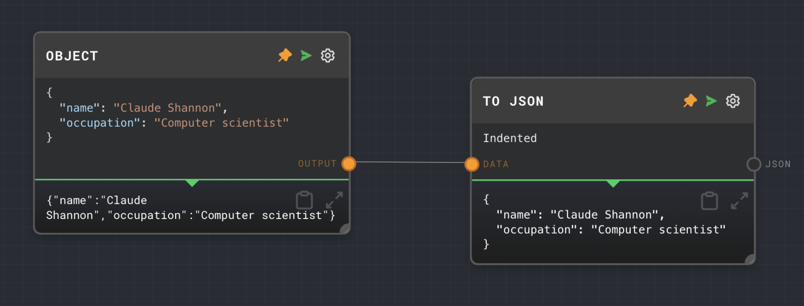

import Tabs from '@theme/Tabs';
import TabItem from '@theme/TabItem';


## Overview

The To JSON Node is used to convert a given input into its JSON equivalent, effectively stringifying the value. This can be useful when you need to serialize an object or array into a string format for further processing or storage.

The node provides an option to format the JSON output with indentation for easier reading.

<Tabs
  defaultValue="inputs"
  values={[
    {label: 'Inputs', value: 'inputs'},
    {label: 'Outputs', value: 'outputs'},
    {label: 'Editor Settings', value: 'settings'},
  ]
}>

<TabItem value="inputs">

## Inputs

| Title | Data Type | Description                         | Default Value | Notes |
| ----- | --------- | ----------------------------------- | ------------- | ----- |
| Data  | `any`     | The data to be converted to JSON.   | (required)    |       |

</TabItem>

<TabItem value="outputs">

## Outputs

| Title | Data Type | Description                        | Notes |
| ----- | --------- | ---------------------------------- | ----- |
| JSON  | `string`  | The JSON string representation.    |       |

</TabItem>

<TabItem value="settings">

## Editor Settings

| Setting  | Description                                                                 | Default Value | Use Input Toggle | Input Data Type |
| -------- | --------------------------------------------------------------------------- | ------------- | ---------------- | --------------- |
| Indented | If enabled, the JSON output will be formatted with indentation for readability. | True          | No               | N/A             |

</TabItem>

</Tabs>

## Example 1: Convert an object to JSON

1. Create an [Object Node](./object.mdx) and set the value to the following:

   ```json
   {
     "name": "Claude Shannon",
     "occupation": "Computer scientist"
   }
   ```

2. Create a To JSON Node and connect the Object Node to it.
3. Run the graph. The To JSON Node should output the JSON string representation of the object.



## Error Handling

The To JSON Node will throw an error if it fails to convert the input to a JSON string. This can happen if the input contains a value that is not serializable, such as a function or a circular reference.

## FAQ

**Q: Can I use the To JSON Node to convert a string to JSON?**

A: Yes, but the output will be a JSON string representation of the original string. If you want to parse a JSON string into an object or array, use the [Extract JSON Node](./extract-json.mdx) or the [Extract Object Path Node](./extract-object-path.mdx).

**Q: Can I use the To JSON Node to convert a number or boolean to JSON?**

A: Yes, the To JSON Node can convert any data type to a JSON string. For numbers and booleans, the output will be the string representation of the original value.

**Q: What does the "Indented" setting do?**

A: When the "Indented" setting is enabled, the JSON output will be formatted with indentation and line breaks for easier reading. This can be useful when you need to inspect the JSON output for debugging purposes.

## See Also

- [Extract JSON Node](./extract-json.mdx)
- [Extract Object Path Node](./extract-object-path.mdx)
- [Object Node](./object.mdx)
- [Array Node](./array.mdx)
- [Data Types](../user-guide/data-types.md)