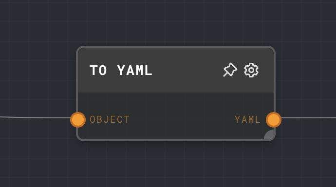

import Tabs from '@theme/Tabs';
import TabItem from '@theme/TabItem';



## Overview

The To YAML Node is used to convert an object into a YAML string. This can be useful when you need to output your data in a YAML format.

<Tabs
  defaultValue="inputs"
  values={[
    {label: 'Inputs', value: 'inputs'},
    {label: 'Outputs', value: 'outputs'},
    {label: 'Editor Settings', value: 'settings'},
  ]
}>

<TabItem value="inputs">

## Inputs

| Title  | Data Type | Description                     | Default Value | Notes |
| ------ | --------- | ------------------------------- | ------------- | ----- |
| Object | `object`  | The object to convert to YAML.  | (required)    |       |

</TabItem>

<TabItem value="outputs">

## Outputs

| Title | Data Type | Description                            | Notes |
| ----- | --------- | -------------------------------------- | ----- |
| YAML  | `string`  | The YAML string representation of the object. |       |

</TabItem>

<TabItem value="settings">

## Editor Settings

This node does not have any configurable editor settings.

</TabItem>

</Tabs>

## Example 1: Convert an object to YAML

1. Create an [Object Node](./object.mdx) and set the value to the following:

   ```json
   {
     "name": "Claude Shannon",
     "occupation": "Computer scientist"
   }
   ```

2. Create a To YAML Node and connect the Object Node to its `Object` input.
3. Run the graph. The To YAML Node should output the following YAML string:

   ```yaml
name: Claude Shannon
occupation: Computer scientist
   ```

   

## Error Handling

The To YAML Node will throw an error if the input is not an object.

## FAQ

**Q: Can I convert an array to YAML?**

A: Yes, you can convert an array to YAML. However, you must first convert the array to an object using the [Array Node](./array.mdx).

**Q: Can I convert a string to YAML?**

A: No, you cannot convert a string to YAML. The To YAML Node only accepts objects as input.

## See Also

- [To JSON Node](./to-json.mdx)
- [Extract JSON Node](./extract-json.mdx)
- [Extract YAML Node](./extract-yaml.mdx)
- [Object Node](./object.mdx)
- [Array Node](./array.mdx)